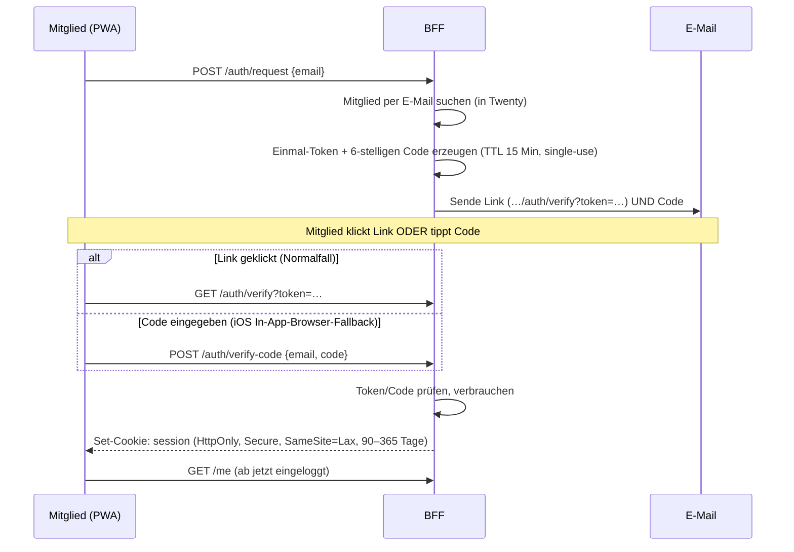

# Architektur & Design — LeonAid

> Maßgebliche Grundlage für die Umsetzung. Stand: 2026-05-29 (ergänzt um §6.4 Backend-Port,
> §9 DSGVO-Funktionen, §6.3 Sicherheits-Härtung, ADR #10/#11, §14 maicrm-Bewertung;
> §3-Diagramm auf Python/FastAPI korrigiert; §8 Hosting aktualisiert, Hetzner-Stand Mai 2026).
> Zielgruppe dieses Dokuments: das 2-köpfige Umsetzungsteam.

---

## 1. Kontext & Ziele

Der Lions Club führt Charity-Aktionen durch (z.B. **„Krapfentaxi"**: Mitglieder rufen
Sponsoren an und akquirieren Krapfen-Boxen). Die Akquise ist **verteilt** — jedes Mitglied
ruft seine eigenen Ansprechpartner an. Bisher: manuelle, schwer synchronisierbare
Excel-Listen.

**Ziele**

1. Eine gemeinsame, aktuelle Datenbasis statt verstreuter Excel-Dateien.
2. Jedes Mitglied sieht **seine** Anrufliste und hakt unterwegs am Handy ab.
3. Das Orga-Team behält den Überblick (wer ist erledigt, wie viele Boxen zugesagt).
4. **Mehrkampagnenfähig** — Krapfentaxi und andere Aktionen ohne Umbau.

**Randbedingungen**

- **Gemeinnützig, kein Budget** für SaaS-Lizenzen pro Nutzer.
- **Ältere, wenig IT-affine Mitglieder** → Bedienung muss schulungsfrei funktionieren.
- **Mobile ist Pflicht** für die Mitglieder.
- **DSGVO**: Es werden personenbezogene Sponsoren-Kontaktdaten verarbeitet → Datenhoheit
  gewünscht (EU-Hosting, kein US-SaaS).
- **Team = 2 Personen** mit Entwicklungs-Know-how (Mayflower-Umfeld).

---

## 2. Rollen

| Rolle | Anzahl | Zugang | Aufgaben |
|---|---|---|---|
| **Orga-Team / Admin** | 2 | Twenty Web-UI (Desktop) | Kampagnen anlegen, Excel importieren, Sponsoren zuweisen, auswerten, System betreiben |
| **Club-Mitglied** | ~10–50 | PWA (Handy-Homescreen) | Eigene Anrufliste abarbeiten, Status setzen, Notiz erfassen, neuen Kontakt anlegen |

Wichtig: **Mitglieder sind keine Twenty-Nutzer.** Sie existieren nur als Datensatz
(„Mitglied"-Objekt) und melden sich ausschließlich an der PWA an. Das hält Twentys
Nutzer-/Auth-System aus dem Spiel und vermeidet die kostenpflichtigen Row-Level-Permissions.

---

## 3. Architektur-Überblick

```
┌──────────────────────────── Hetzner VPS (EU, DSGVO-sauber) ────────────────────────────┐
│  Docker Compose                                                                         │
│                                                                                         │
│   Caddy (Reverse Proxy, TLS via Let's Encrypt)                                          │
│     │                                                                                   │
│     ├──►  Twenty: server + worker  ◄───────────────  Orga-Team (Desktop-Browser)        │
│     │        │                                         Admin · Import · Zuweisung       │
│     │        ├── PostgreSQL 16                                                           │
│     │        ├── Redis                                                                   │
│     │        └── Object Storage (lokal oder Hetzner S3)                                  │
│     │                                                                                    │
│     ├──►  BFF (Python/FastAPI)  ── hält den EINEN Twenty-API-Key, Magic-Link-Login,      │
│     │        │                    Session, erzwingt Owner-Scoping, kapselt Twenty-API    │
│     │        └──►  Twenty REST/GraphQL                                                    │
│     │                                                                                    │
│     └──►  PWA (statische Files)  ◄──────────────────  Club-Mitglieder (Handy)            │
│                                                         tel:-Anruf · abhaken · Notiz     │
└─────────────────────────────────────────────────────────────────────────────────────────┘

Datenfluss Mitglied:   PWA ──(Session-Cookie)──► BFF ──(API-Key)──► Twenty
                       Das BFF filtert JEDE Anfrage hart auf "Owner = eingeloggtes Mitglied".
```

### Kernentscheidung: BFF statt PWA-direkt-an-Twenty

Die PWA spricht **nie** direkt mit Twenty. Gründe:

1. **Sicherheit** — Twenty-API-Keys sind workspace-/rollenweit, nicht pro Nutzer. Ein Key
   im Browser wäre ein Vollzugriff für jeden. Der Key bleibt serverseitig im BFF.
2. **Senioren-Login** — Twenty kann kein Magic-Link (siehe §4). Das BFF bringt den
   einfachen Login selbst mit.
3. **Scoping** — „Mitglied A sieht nur seine Sponsoren" erzwingt das BFF per Filter. Das
   umgeht Twentys **kostenpflichtige** Row-Level-Permissions (nur Organization-Plan).
4. **Entkopplung** — Twentys API hat keine garantierte Backwards-Compat (v1→v2 brachte
   Auth-Breaking-Changes). Das BFF **kapselt** die Twenty-API; Änderungen schlagen nicht
   bis in die PWA durch.

---

## 4. Authentifizierung

### Befund: Twentys eigener Login passt nicht zur Zielgruppe

Aus dem Twenty-Code (`packages/twenty-server/src/engine/core-modules/auth`):

- Login-Strategien: **E-Mail+Passwort**, **Google-SSO**, **Microsoft-SSO**, **OIDC**, **SAML**.
- 2. Faktor: **TOTP** (Authenticator-App).
- **Kein** Magic-Link / passwortloser E-Mail-Login.

Passwort merken bzw. Authenticator-App ist für ältere Mitglieder der klassische
Abbruchgrund. → Mitglieder loggen sich **nur in die PWA** ein, mit eigenem Verfahren.

### Gewähltes Verfahren: Magic-Link + Code-Fallback



**Designregeln**

- **Lange Session**: HttpOnly-Cookie, 90–365 Tage, kein Auto-Logout.
- **iOS-Stolperstein**: Öffnet der Magic-Link in einem In-App-Browser (z.B. aus der
  Mail-App heraus), greift die PWA-Session nicht zuverlässig → deshalb der **6-stellige
  Code** als gleichwertiger Fallback.
- **PWA-Session-Persistenz iOS**: `navigator.storage.persist()` anfordern; Session als
  Cookie (nicht localStorage), damit der 7-Tage-Storage-Cap im Standalone-Modus nicht greift.
- **Token-Hygiene**: TTL 15 Min, single-use, über HTTPS, gehasht speichern.

---

## 5. Datenmodell in Twenty

Als **Custom Objects** anlegen (Twenty-Settings → Data Model). Direkt
mehrkampagnenfähig — so laufen künftige Aktionen ohne Umbau.

### Aktion (Kampagne)

| Feld | Typ | Notiz |
|---|---|---|
| Name | Text | z.B. „Krapfentaxi 2026" |
| Zeitraum | Date / Date | von–bis |
| Aktiv | Boolean | steuert, welche Liste die PWA zeigt |
| Boxen-Ziel | Number | optional, für Auswertung |

### Sponsor

| Feld | Typ | Notiz |
|---|---|---|
| Firma | Text | |
| Ansprechpartner | Text | |
| **Telefon** | Phone | → `tel:`-Button in der PWA |
| E-Mail | Email | optional |
| **Owner (Mitglied)** | Relation → Mitglied | wer ruft an |
| **Status** | Select | `offen · kontaktiert · zugesagt · abgelehnt · erledigt` |
| **Boxen zugesagt** | Number | |
| Letzter Kontakt | Date | |
| Notiz | Text (lang) | bzw. Twenty-Notes/Timeline |
| Aktion | Relation → Aktion | |

### Mitglied

| Feld | Typ | Notiz |
|---|---|---|
| Name | Text | |
| **E-Mail** | Email | = Login-Identität für den Magic-Link |
| Telefon | Phone | optional |

> **Alternative**: Statt eines Custom Objects „Sponsor" ließe sich Twentys Standard
> `Person` + `Company` nutzen. Für einen klar abgegrenzten Akquise-Workflow ist ein
> dediziertes „Sponsor"-Objekt aber übersichtlicher und entkoppelt von späteren
> CRM-Erweiterungen. **Entscheidung: eigenes Sponsor-Objekt** (siehe Entscheidungslog).

### Orga-Flow (Twenty Desktop)

1. Aktion anlegen, „Aktiv" setzen.
2. Bestehende **Excel-Liste per CSV/XLSX importieren** (Twenty kann Feld-Mapping + Relationen).
3. Owner je Zeile zuweisen (Massenbearbeitung) und mit der Aktion verknüpfen.
4. Fertig — die Mitglieder sehen ihre Liste sofort in der PWA.

---

## 6. BFF — API-Design

**Tech-Stack: Python / FastAPI.** Bewusste Wahl (siehe Entscheidungslog #8): das Team ist
Python-erfahren, und Python hält die Tür für spätere **agentische Funktionen** offen
(z.B. `deepagents` / LLM-Ökosystem, Anthropic-SDK — passt auch zur geparkten
Mayflower-Agentik, §14). Ein offizielles Python-Twenty-SDK gibt es nicht und wird nicht
gebraucht: Twenty spricht Standard-**REST** (`…/rest/<objekt>`, Bearer-API-Key) — diese
Aufrufe kapseln wir **nicht bloß in dünnen HTTP-Wrappern, sondern hinter einem Domänen-Port**
(`CrmBackend`), der das CRM selbst austauschbar macht (→ §6.4, ADR #9).

- **Framework**: FastAPI (async) · **HTTP-Client**: `httpx`. GraphQL nur bei Bedarf
  (Relationen in einem Call) via `gql`.
- **Tooling**: **`uv`** (Env/Dependencies/Lockfile), **`ruff`** (Lint + Format),
  **`mypy`** (statische Typen, strict), **`pytest`** (+ `pytest-asyncio`, Coverage-Ziel).
- **Qualität**: alles getestet (Unit + Integration, siehe §6.2) und abgesichert (§6.3);
  Durchsetzung in **CI** (GitHub Actions: `ruff` → `mypy` → `pytest` als Merge-Gate).

**Jede** Datenanfrage wird serverseitig auf das eingeloggte Mitglied (`Owner = me`) gefiltert.

### 6.1 Endpoints

| Methode | Pfad | Zweck |
|---|---|---|
| `POST` | `/auth/request` | `{email}` → Magic-Link + Code versenden |
| `GET`  | `/auth/verify?token=…` | Link-Login → Session-Cookie setzen |
| `POST` | `/auth/verify-code` | `{email, code}` → Session-Cookie setzen (Fallback) |
| `POST` | `/auth/logout` | Session beenden |
| `GET`  | `/me` | aktuelles Mitglied |
| `GET`  | `/campaigns/active` | aktive Aktion(en) |
| `GET`  | `/sponsors` | **meine** Sponsoren der aktiven Aktion |
| `GET`  | `/sponsors/:id` | Detail (nur wenn Owner = me) |
| `PATCH`| `/sponsors/:id` | `{status?, boxesCommitted?, lastContacted?}` |
| `POST` | `/sponsors/:id/notes` | `{text}` |
| `POST` | `/sponsors` | neuen Sponsor anlegen (Owner = me, Aktion = aktiv) |

### 6.2 Tests

Anspruch: **alles gut abgetestet** — Logik, die Datenschutz/Sicherheit betrifft, wird nicht
ungetestet gemergt.

- **Unit-Tests** (`pytest`): Owner-Scoping (Mitglied A darf B **nicht** sehen — der
  wichtigste Test überhaupt), Token-/Code-Erzeugung & -Ablauf, Session-Handling,
  Eingabe-Validierung.
- **Integrationstests**: BFF gegen eine echte Twenty-Instanz (Docker / Testcontainers oder
  dedizierter Test-Workspace) — Sponsoren lesen/patchen/anlegen, Filter greifen wirklich.
- **Auth-Flow-Tests**: Magic-Link- und Code-Pfad inkl. Negativfälle (abgelaufen, schon
  verbraucht, falsche E-Mail).
- **Coverage-Ziel** definieren; CI bricht bei Unterschreitung. Da die Twenty-API im BFF
  gekapselt ist, lässt sie sich mocken → schnelle, stabile Tests.

### 6.3 Sicherheit & Härtung

> **Leitsatz:** Der **eine** Twenty-API-Key des BFF ist faktisch *workspace-admin-äquivalent*
> (verifiziert am Code: API-Keys sind workspace-weit & rollenbasiert ohne Record-Scope;
> Row-Level-Permissions sind Enterprise-only und im OSS leer). Jeder Scoping-Fehler im BFF =
> potenzieller Vollabfluss. Sicherheit liegt damit **zur Gänze beim BFF und der Infrastruktur**
> — nicht bei Twenty.

**Mitglieder-Isolation (die zentrale Grenze — „Mitglied A sieht nie B's Daten"):**

- **Keine Client-Filter an Twenty durchreichen.** Das BFF baut jede Query selbst und injiziert
  serverseitig `owner = eingeloggtes Mitglied`. Vom Client nur **gewhitelistete** Parameter
  (aktive Kampagne, Pagination) — niemals beliebige `filter[...]`. (Verifiziert: Twenty wendet
  Filter serverseitig an, scoped aber **nicht** implizit auf den Aufrufer — ein durchgereichter
  Fremd-Filter lieferte fremde Records.)
- **IDOR zu auf jedem `/:id`-Zugriff.** Nie „per ID holen und zurückgeben", sondern
  `id == :id AND owner == me`; 0 Treffer → **404** (nicht 403, um Existenz nicht zu bestätigen).
  Twenty-IDs sind UUIDs → nicht erratbar, mit Ownership-Check ist Enumeration zu.
- **Defense-in-depth am Ausgang.** Vor dem Serialisieren jedes Records nochmal `owner == me`
  prüfen — billiges Fangnetz, falls ein Filter vergessen wird. Als **Contract-Test** gegen
  *jeden* `CrmBackend`-Adapter (§6.4): „Mitglied A bekommt B's Sponsor nie".
- **Schreibzugriffe serverseitig erzwingen.** `POST /sponsors` setzt `owner = me` und
  `aktion = aktiv` selbst; Client darf Owner/Kampagne nicht wählen, kein Reassign, kein
  Mitglieder-Listing.
- **Eingaben mit Pydantic** validieren; nur erlaubte Felder durchreichen (kein Pass-through auf
  beliebige Twenty-Felder).

**Key & Infrastruktur (Blast-Radius klein halten):**

- **Least-Privilege-Rolle für den BFF-Key.** Dem Key eine dedizierte Twenty-Rolle geben, die
  **nur** Sponsor/Aktion/Mitglied lesen/schreiben darf — kein Settings-/Admin-/Fremdobjekt-
  Zugriff. Begrenzt den Schaden bei Key-Leak *und* bei Scoping-Bug. (→ ADR #10)
- **Twenty-API nicht öffentlich.** Nur das BFF erreicht Twenty (internes Docker-Netz).
  Öffentlich: PWA, BFF, und die Twenty-UI nur für die 2 Orga-Leute.
- **Orga-Zugang härten:** Twenty-UI hinter IP-Allowlist/VPN + **TOTP-2FA erzwingen** (Twenty
  kann TOTP). Mitglieder berühren die UI nie. Ein gekaperter Orga-Account = Vollabfluss.
- Key/Secrets nur Server-Env/Secret-Store, **nie** in PWA, Logs oder Error-Responses; Rotation
  einplanen. **Logging-Hygiene:** keine PII, Tokens, File-URLs oder Keys in Logs.
- Postgres/Redis nicht exponiert, starke Credentials; **Backups verschlüsselt** (enthalten alle PII).
- **Dependency-Scanning** im CI (`uv`-Lockfile + `pip-audit`).

**Login & Sessions (Account-Übernahme = Zugriff auf die Daten dieses Mitglieds):**

- **6-stelliger Code** = nur 10⁶ → striktes Versuchslimit (z.B. 5, dann Token invalidieren),
  TTL 15 Min, single-use, **Per-E-Mail- und Per-IP-Rate-Limit** auf `/auth/request` und
  `/auth/verify-code`.
- **Keine E-Mail-Enumeration:** `/auth/request` antwortet **immer gleich** („Falls die Adresse
  registriert ist, kommt ein Link") — egal ob Mitglied oder nicht. (Twentys eigener
  `checkUserExists` leakt Mitgliedschaft; wir nutzen ihn nicht.)
- **Per-Mitglied-Rate-Limit am BFF** gegen „Abgrasen": Twentys Limit (100 req/min) gilt
  **workspace-weit** über den einen Key — kein Per-User-Schutz. Das BFF drosselt pro
  Session/Mitglied, deckelt Page-Sizes (Twenty-Max 200) und alarmiert bei auffälligem Massen-Paging.
- **Sessions widerrufbar:** lange Cookie-Laufzeit (90–365 Tage, senioren-freundlich) gegen einen
  serverseitigen, **widerrufbaren** Session-Store absichern, damit Orga bei verlorenem Handy eine
  Session killen kann. Cookies HttpOnly, Secure, SameSite=Lax.

### 6.4 Backend-Port: das CRM als austauschbares System of Record

> **Warum:** Ob Twenty langfristig reicht, ist erst nach dem PoC klar (§14). Damit ein
> späterer Wechsel des System of Record **reine Adapter-Arbeit** bleibt und nicht das halbe
> BFF umkrempelt, liegt zwischen Application-Schicht und Twenty ein **Domänen-Port**.
> Skizze liegt bereits unter `app/domain/` (`models.py`, `ports.py`).

**Zwei Kapselungs-Ebenen — nur eine macht austauschbar.** Ein dünner HTTP-Wrapper
(`twenty_client.get(...)`) spricht weiter in Twentys Vokabular (REST-Pfade, `node/edges`,
Feld-IDs) — Twentys Datenshapes lecken dann durch die ganze App. Erst ein **Port** in
*unserer* Sprache (`list_sponsors(owner, campaign) -> list[Sponsor]`) entkoppelt wirklich.
Wir bauen Letzteres.

**Die Naht ist unser Domänenmodell, nicht Twentys.** Eigene Typen (`Sponsor`, `Member`,
`Campaign`, `Status`) in `app/domain/`. Der Twenty-Adapter ist die **einzige** Stelle, die
Twenty-JSON ↔ Domänenobjekte mappt und `httpx`/REST/GraphQL/Rate-Limit kennt.
**Harte Regel:** nichts oberhalb von `app/adapters/twenty/` importiert `httpx` oder kennt
einen Twenty-Feldnamen.

**Owner-Scoping steht über dem Adapter — und in der Signatur.** Die Policy „Mitglied sieht
nur eigene Sponsoren" (§6.3) ist eine Application-Regel, kein Adapter-Detail — sonst müsste
jeder künftige Adapter sie korrekt neu bauen (Leck-Risiko beim Tausch). Deshalb ist `owner`
in jeder sponsor-bezogenen Port-Methode **Pflichtargument**, und **ein** Contract-Test
(„Mitglied A bekommt B's Sponsor nie") läuft gegen *jeden* Adapter.

**Bewusst klein gehalten — was *nicht* hinter den Port gehört:**

- **Auth / Session / Token-Speicher** liegen in eigener Tabelle/Redis, *nicht* im CRM. Vom
  CRM braucht der Login nur `find_member_by_email`. Hält die austauschbare Fläche winzig.
- **Normale Orga-/Admin-Arbeit** (CSV-Import, Massen-Zuweisung, Notes, Workflows §12) läuft
  direkt im Twenty-Desktop — am BFF vorbei, nicht abstrahiert.
- **Ausnahme: DSGVO-Operationen** (Erasure, Auskunfts-Export, Einschränkung) laufen **über das
  BFF**, nicht direkt in Twenty — denn sie müssen protokolliert (Lösch-Log §9), cascadiert und
  **backend-unabhängig** sein. Sie liegen in einem separaten, *nicht* owner-gescopeten
  `CrmAdminBackend`-Port — getrennt vom Mitglieder-Port, damit ein Mitglieder-Codepfad sie gar
  nicht erst aufrufen kann.

Der Port deckt damit die **Mitglieder-/PWA-Scheibe** (CRUD aus §6.1) **plus** die Compliance-Ops.
Konkrete Vorbilder für diese Compliance-Ops (Lösch-Audit, Consent/Blocklist, Import-Staging)
liefert die maicrm-Analyse (§9, §14, [`explanation/maicrm-evaluation.md`](explanation/maicrm-evaluation.md)).

**Struktur:**

```
app/
  domain/      models.py (Sponsor, Member, Campaign, Status)  ·  ports.py (CrmBackend)
  application/ sponsors.py (Use-Cases, erzwingt owner=me)  ·  auth.py (Magic-Link, backend-frei)
  adapters/
    twenty/    client.py (httpx, Key, Rate-Limit) · mapper.py (JSON↔Domain) · repository.py
    memory/    In-Memory-Fake für Tests
  api/         routes.py (FastAPI; Depends() injiziert die Port-Impl, config-gesteuert)
```

**Sofort-Gewinn unabhängig vom Tausch:** Der In-Memory-Fake lässt Owner-Scoping- und
Endpoint-Tests ohne laufendes Twenty laufen (schnell, stabil) — macht „Twenty ist mockbar"
(§6.2) konkret. Eine geteilte Contract-Test-Suite validiert Fake *und* Twenty-Adapter identisch.

**Umfang (Leichtgewicht-Hexagonal, kein voller DDD):** *Jetzt* — Domänenmodelle + ein
`CrmBackend`- + `CrmAdminBackend`-Protocol + In-Memory-Fake. *Weggelassen* — DDD-Aggregates,
Event-Sourcing, generische „beliebiges-CRM"-Abstraktion. Modelliert wird nur, was die
9 PWA-Endpoints + die DSGVO-Ops brauchen.

---

## 7. PWA — Funktionsumfang (MVP)

Bewusst minimal und „groß". Nicht mehr als nötig.

1. **Login** — E-Mail eingeben → Link/Code. Kurze, bebilderte „App installieren"-Hilfe
   (iOS: Teilen → „Zum Home-Bildschirm"; Android: Install-Prompt).
2. **Meine Anrufliste** — Karten mit Firma + Status-Badge; großer **„Anrufen"**-Button
   (`<a href="tel:…">` öffnet nativen Dialer); Schnellaktionen **Zugesagt / Abgelehnt / Später**.
3. **Notiz/Ergebnis** — Boxen-Anzahl + kurze Notiz, **„Erledigt"**.
4. **+ Neuer Kontakt** — nur **Name + Telefon** Pflicht.

**UX-Regeln (Senioren)**

- Touch-Ziele ≥ 48–60px, Schrift ≥ 18–20px, hoher Kontrast.
- Eine Aufgabe pro Screen, max. 1–2 sichtbare Aktionen.
- Sprechende Text-Labels statt reiner Icons. Keine Hamburger-Menüs, keine versteckten Gesten.
- Klares Feedback nach jeder Aktion. Keine Mehrfach-Bestätigungsdialoge.

**PWA-Technik**

- Web App Manifest (`display: standalone`, Icons 192/512), HTTPS.
- Service Worker (Workbox) cached die App-Shell → App startet schnell/offline-tolerant.
- **Offline-Daten erst Phase 2** (iOS unterstützt kein Background-Sync; ihr telefoniert
  meist online → kein MVP-Blocker).

---

## 8. Hosting (Hetzner)

- **Modell-Empfehlung** (Stand Mai 2026; Preise zum 1.4.2026 angepasst → am Bestelltag auf
  `hetzner.com/cloud` prüfen). Aktuelle Intel-Linie **CX** (shared vCPU), inkl. 20 TB Traffic + 1 IPv4:

  | Plan | vCPU | RAM | SSD | €/Mon | Einsatz |
  |---|---|---|---|---|---|
  | CX23 | 2 | 4 GB | 40 GB | ~3,99 | zu knapp für Twenty + Postgres |
  | **CX33** | 4 | **8 GB** | 80 GB | **~6,49** | **Start**: Twenty + Postgres + Redis + BFF + Caddy |
  | **CX43** | 8 | **16 GB** | 160 GB | **~11,99** | **Headroom** für weitere Verwaltungssysteme |
  | CX53 | 16 | 32 GB | 320 GB | ~22,49 | später, falls nötig |

  → **Start mit CX33**; bei eingeplanten Zusatzsystemen gleich **CX43**. Resize ist später ein
  2-Minuten-Schritt (herunterfahren → größeres Modell → hochfahren). **Arm (CAX) lohnt preislich
  nicht** und Twentys offizielles Image ist auf arm64 unbestätigt → **x86/CX** wählen. Kein
  High-Traffic erwartet (wenige Mitglieder + 2 Orga); 20 TB Traffic sind weit überdimensioniert.

- **Deployment-Topologie: eine Node, Docker Compose, ein privates Docker-Netz.** Basis ist Twentys
  mitgeliefertes `packages/twenty-docker/docker-compose.yml` (server, worker, `postgres:16`, `redis`),
  ergänzt um Caddy + BFF + PWA:

  ```
  Hetzner CX33 · Docker Compose · network "internal" (privat)
    caddy          ← EINZIGER öffentlicher Ingress (80/443, TLS)
    twenty-server / twenty-worker ┐
    postgres / redis              │  nur intern, NICHT auf Host/öffentlich gemappt
    bff (FastAPI)                 ┘
    pwa = statische Files, von Caddy ausgeliefert
  ```

  Caddy ist die einzige öffentlich gebundene Komponente; Postgres, Redis und die **Twenty-API
  bleiben intern** (setzt §6.3 „Twenty-API nicht öffentlich" um). Ein Postgres-Container hält
  mehrere DBs (Twenty jetzt, später je System eine eigene DB + eigener DB-User).

- **Wachstum (weitere Vereins-Verwaltungssysteme):** neue Systeme = weitere Container im selben
  Compose-Stack + eigene DB; Caddy ist multi-site → je System eine Subdomain. **Erst vertikal**
  skalieren (CX33 → 43 → 53), **erst bei echtem Bedarf** Postgres oder ein System auf eine eigene
  Node ziehen. **Bewusst kein Kubernetes** (Lehre aus der maicrm-Analyse, §14).

- ⚠️ **Version pinnen**: Im Twenty-Compose steht `image: twentycrm/twenty:${TAG:-latest}`. **Feste
  Version setzen** (z.B. `v2.9.0`) statt `latest`. Upgrades bewusst und getestet.

- **Backup**: Hetzner-„Backups" (+20 % des Serverpreises, autom. Snapshots) **+** nächtlicher
  `pg_dump` auf eine **Storage Box** (Backup-Speicher, wenige €/Monat, DE/DSGVO). All-in ~8–12 €/Monat.

- **Domain/TLS**: eigene (Sub-)Domain, Let's Encrypt via Caddy automatisch.
- **Optional (ferne Zukunft): Nextcloud für breitere Vereins-JTBDs.** **Entscheidung: managed via
  Hetzner „Storage Share"** (~5 €/Monat, voll gewartet inkl. Updates/Backups, DE/DSGVO) — **nicht
  selbst hosten**, da nur **App-Store-Apps über die Nextcloud-Oberfläche** genutzt werden (keine
  selbst entwickelten Plugins). Läuft als **eigener, paralleler Dienst** (eigene Subdomain), nicht
  im CRM-Compose-Stack.
  - **Anbietervergleich & Tiefenrecherche** (Storage Share vs. NETWAYS/Stackhero/Portknox/IONOS, inkl. HPB/Gruppen-Video): [`explanation/nextcloud-managed-hosting.md`](explanation/nextcloud-managed-hosting.md).
  - **Nutzbare Apps (per UI aktivier-/installierbar):** Kontakte, Kalender, Aufgaben sind
    vorinstalliert (standardmäßig aus, per Klick aktivierbar); aus dem App Store u. a.
    **Collectives** (Wiki/„Collections"), **Deck** (Kanban), **Forms**, **Collabora/OnlyOffice**.
  - **Grenzen (ehrlich):** keine neueste Core-Version, nur kuratierter `occ`-Subset (keine Shell),
    **kein Hetzner-Support für selbst installierte Apps**.
  - ⚠️ **Video-Conferencing (Nextcloud Talk):** 1:1-/Klein-Calls laufen (P2P), **Gruppen-Video
    braucht ein „High Performance Backend" (HPB) + TURN/STUN**, das Storage Share **nicht**
    bereitstellt → für verlässliche Gruppen-Calls externen HPB (eigene VPS) ergänzen oder andere
    Lösung nutzen. Vor Zusage testen.
  - **Quellen:** [Hetzner Storage Share](https://www.hetzner.com/storage/storage-share/) ·
    [Hetzner Docs — Storage Share General](https://docs.hetzner.com/storage/storage-share/general/) ·
    [Hetzner Docs — OCC Commands](https://docs.hetzner.com/storage/storage-share/configuration/occ-commands/) ·
    [Nextcloud Talk HPB (Hintergrund)](https://opensourceisfun.substack.com/p/nextcloud-talk-setting-up-a-hpb-high)

---

## 9. DSGVO

> **Hinweis:** Rechtliche Einordnungen (Rechtsgrundlage, Fristen) final mit DSB/Anwalt klären —
> hier stehen die **technischen Funktionen**, die unabhängig davon nötig sind. Verifiziert am
> Twenty-Code: Twenty deckt Anlegen/Ändern/Lesen ab, aber **weder ein Lösch-Audit, noch
> Aufbewahrungs-Automatik, noch Widerspruch/Information** — diese Lücken füllt das BFF.
>
> **Trägerschaft & Haftung** (wer ist Verantwortlicher: Club / Hilfswerk e.V. / Art. 26;
> DSB-Pflicht; persönliche Haftung des ehrenamtlichen Technikers): eigene Gesprächsgrundlage in
> [`explanation/datenschutz-traegerschaft.md`](explanation/datenschutz-traegerschaft.md) — mit
> [Beschlussvorlage](explanation/datenschutz-beschlussvorlage.md) und
> [Fragenliste an die Anwälte](explanation/datenschutz-anwaltsfragen.md). (Keine Rechtsberatung.)

### Rolle & Rechtsgrundlage

Als Selbst-Hoster ist der Club **Verantwortlicher** (Art. 4 Nr. 7). Für B2B-Sponsorenansprache
ist **berechtigtes Interesse (Art. 6(1)(f))** mit dokumentierter Interessenabwägung realistischer
als Einwilligung (Cold-Outreach). Zwei Folgen, die Twenty *nicht* abdeckt und die als Funktion
eingebaut werden müssen:

- **Art. 14 Informationspflicht** — die Sponsorendaten stammen **nicht vom Sponsor selbst**,
  sondern aus Mitglieder-Wissen/Excel → der Sponsor ist über die Verarbeitung zu informieren
  (spätestens bei Erstkontakt; Hinweis-Text / Mail-Vorlage vorsehen).
- **Art. 21 Widerspruch** — „nicht mehr kontaktieren" muss greifen **und über Kampagnen hinweg
  bestehen bleiben** (→ Suppression-List unten).

### Betroffenenrechte & Pflichten: Funktion · Twenty-Abdeckung · wer baut

| Anforderung | Funktion | Twenty | BFF / Ops |
|---|---|---|---|
| Art. 15 Auskunft | alle Daten zu einem Sponsor exportieren | per API lesbar, **kein** Export-Feature | BFF-Auskunfts-Export (JSON/PDF) |
| Art. 16 Berichtigung | korrigieren | ✅ UI + PATCH | — |
| Art. 17 Löschung | **hartes** Erasure inkl. Notizen/Anhänge, dokumentiert | Hard-Destroy ✅, Cascade konfigurierbar, **kein Lösch-Audit** | Cascade setzen + Lösch-Protokoll |
| Art. 18 Einschränkung | „Verarbeitung eingeschränkt"-Markierung | ❌ kein nativer Flag | Status `gesperrt` + Ausschluss aus Listen |
| Art. 20 Portabilität | maschinenlesbarer Export | per API möglich | nur falls Rechtsgrundlage Einwilligung/Vertrag — bei berechtigtem Interesse i.d.R. **nicht** einschlägig |
| Art. 21 Widerspruch | „nicht kontaktieren" + Sperrliste | ❌ | **Suppression-List** im BFF |
| Art. 14 Information | Sponsor über Verarbeitung informieren | ❌ | Hinweis-Text/Prozess bei Erstkontakt |

### Löschungen nachweisbar machen (Rechenschaftspflicht, Art. 5(2))

**Befund:** Twenty protokolliert `createdBy`/`updatedBy` + Timeline für Anlegen/Ändern, **nicht
für Löschungen** (verifiziert). Eine Löschung ließe sich höchstens am `deletedAt` ablesen — nach
Hard-Destroy gar nicht. Das reicht für die Rechenschaftspflicht nicht. Daher:

- **Append-only Lösch-/Verarbeitungs-Protokoll im BFF** (eigene Tabelle, EU-gehostet,
  unveränderlich): pro Löschung **Zeitpunkt · Datensatz (ID + Objekt) · Auslöser** (Widerspruch /
  Auskunft / Frist / Orga) · **Rechtsgrundlage** · **soft/hard** · **ausführende Orga-Person**.
- **Erasure = Hard-Destroy + Cascade** auf Notizen/Anhänge (sonst bleibt PII im Notiztext) —
  Cascade-Verhalten der Sponsor-Relationen explizit setzen **und testen**.
- **Suppression-List** für Widersprüche: nicht löschen-und-vergessen, sondern minimaler
  Sperr-Eintrag (Hash der Kontaktdaten), gegen den der Excel-Import prüft → ein „Nicht anrufen"
  überlebt den nächsten Import.

Das Lösch-Log liegt bewusst **backend-unabhängig** im BFF (passt zum `CrmBackend`-Port §6.4) und
bleibt auch nach einem späteren Twenty-Tausch erhalten. (→ ADR #11)

### Speicherbegrenzung, Datenstandort, Auftragsverarbeitung

- **Speicherbegrenzung (Art. 5(1)(e)):** Twenty hat **kein TTL/Auto-Purge** → Aufbewahrungs-
  fristen definieren + **Purge-Job**, der soft-gelöschte Records nach Frist hart entfernt.
  Löschungen müssen perspektivisch auch **Backups** erreichen.
- **Datenstandort:** Hetzner DE/EU → kein US-Drittlandtransfer. **Auch die BFF-eigenen Stores**
  (Sessions, Tokens, Lösch-Log, Suppression-List) enthalten PII (E-Mails) → EU-gehostet,
  verschlüsselt, im VVT geführt.
- **AV-Verträge (Art. 28):** Hetzner **und** der E-Mail-Provider (Magic-Link-Mails verarbeiten
  E-Mail-Adressen). **VVT (Art. 30)** inkl. der BFF-Stores. **Breach-Prozess (Art. 33/34):**
  72-h-Meldung + Erkennbarkeit über Logging/Monitoring.
- Selbst-Hosting in der EU ist genau der Vorteil gegenüber einem US-SaaS wie HubSpot.

> **Design-Referenz (maicrm):** Die maicrm-Analyse (§14, [`explanation/maicrm-evaluation.md`](explanation/maicrm-evaluation.md))
> liefert backend-unabhängige Vorbilder für die hier geplanten BFF-Bausteine: das
> **event-sourcierte Lösch-Audit** (`audit.domain_event` mit `record.deleted` + `RedactSubject`)
> als Muster fürs append-only Lösch-Log (ADR #11); **Consent/Blocklist** als Muster für die
> Suppression-List; **Import-Staging mit Rollback + Dedupe-/Match-Review-Queue** für die
> Datenpflege. Diese Ideen landen ohnehin im `CrmAdminBackend`-Port (§6.4) — unabhängig davon,
> ob das Backend Twenty oder später maicrm ist.

---

## 10. Aufwand & Aufteilung (2 Personen)

**MVP ~20–29 Personentage** (inkl. Test- & CI-Aufbau).

| Person | Aufgaben | PT |
|---|---|---|
| **Infra/Backend** | Hetzner + Docker Compose + Caddy + Backup | 2–3 |
| | BFF (FastAPI): Twenty-Anbindung, Magic-Link/Code, Session, Mailversand | 6–9 |
| | BFF-Tests (pytest, Unit + Integration) + CI (ruff/mypy/pytest) | 2–3 |
| | Twenty-Datenmodell-Setup | 1 |
| **Frontend/UX** | PWA-Gerüst + Manifest + Service Worker | 1–2 |
| | Kern-Screens seniorengerecht | 4–6 |
| | Test auf echten iOS/Android-Geräten + Deployment | 2–3 |

Realistisch über ein paar fokussierte Wochenenden / einen Sprint.
Mit Push-Notifications, Mehrsprachigkeit, Härtung eher 30–40 PT.

---

## 11. Risiken & Gegenmaßnahmen

| Risiko | Gegenmaßnahme |
|---|---|
| Twenty-API-Drift (keine Compat-Garantie) | API hinter **Backend-Port** kapseln (§6.4) · Version pinnen · Upgrades in Staging testen |
| API-Key-Leak (Key = workspace-admin-äquivalent) | Key nur im BFF (Server-Env), nie im Browser/Log · **Least-Privilege-Twenty-Rolle** · Twenty-API nicht öffentlich (§6.3, ADR #10) |
| Datenleck zwischen Mitgliedern | Owner-Scoping serverseitig · **keine Client-Filter durchreichen** · IDOR→404 · Output-Re-Check · Cross-Member-Contract-Test (§6.3) |
| Account-Übernahme (6-stelliger Code brute-forcebar) | striktes Versuchslimit + TTL + single-use · Per-E-Mail/IP-Rate-Limit · keine E-Mail-Enumeration · widerrufbare Sessions (§6.3) |
| „Abgrasen" / Massen-Exfiltration | Per-Mitglied-Rate-Limit im BFF (Twenty-Limit ist workspace-weit) · Page-Size-Deckel · Anomalie-Alarm (§6.3) |
| Orga-Account kompromittiert (Vollzugriff) | Twenty-UI hinter VPN/IP-Allowlist · TOTP-2FA erzwingen (§6.3) |
| Löschungen nicht nachweisbar (Twenty loggt keine Deletes) | Append-only Lösch-Protokoll im BFF + Hard-Destroy + Cascade (§9, ADR #11) |
| iOS-PWA-Eigenheiten (Install, In-App-Browser, kein Background-Sync) | Code-Fallback, bebilderte Install-Hilfe, auf echten Geräten testen |
| Bus-Faktor | Team = 2 Personen + Runbook/README; bewusst kleiner Funktionsumfang |
| Betriebslast | Managed-DB-Backup-Routine, Monitoring (Uptime-Check), feste Update-Termine |

---

## 12. Roadmap

- **Phase 0 — Pilot/Validierung**: Datenmodell + eine echte Excel-Liste importieren,
  3–4 Mitglieder (Mix tech-affin/weniger) eine kleine Charge abtelefonieren lassen,
  Feedback einholen. *(kann teils vor dem PWA-Bau mit Twenty-Desktop laufen)*
- **Phase 1 — MVP**: Hetzner-Deploy, Twenty-Setup, BFF (Auth + Sponsoren-Endpoints),
  PWA (Login, Liste, Anrufen, Status, Notiz, neuer Kontakt). Rollout + 1-seitige Anleitung.
- **Phase 2 — Komfort**: Offline-Cache + Sync-Queue, Push-Erinnerungen, einfache
  Auswertung/Dashboard fürs Orga-Team.
- **Phase 3 — optional**: Twenty-Workflows für Automatik (Erinnerungen, Status-Mails),
  Mehrsprachigkeit, weitere Aktionstypen; ggf. **Nextcloud** (managed via Storage Share, §8) für
  breitere Vereins-JTBDs.

---

## 13. Entscheidungslog (ADR-light)

| # | Entscheidung | Begründung |
|---|---|---|
| 1 | **Twenty als Backend, self-hosted** | Open Source/AGPL, kostenlos für unbegrenzt Nutzer, Datenhoheit (DSGVO), passendes Datenmodell + Import + API |
| 2 | **B2: PWA + BFF, Mitglieder sind keine Twenty-Nutzer** | seniorengerechter eigener Login, Key-Sicherheit, umgeht kostenpflichtige Row-Level-Permissions |
| 3 | **Login: Magic-Link + 6-stelliger Code-Fallback** | Twenty kann kein Magic-Link; passwortlos ist senioren-tauglich; Code löst iOS-In-App-Browser-Problem |
| 4 | **Eigenes Custom Object „Sponsor"** (statt Person/Company) | übersichtlicher, klar abgegrenzter Akquise-Workflow |
| 5 | **Hosting Hetzner (EU)** | DSGVO-sauber, günstig, kein US-Transfer |
| 6 | **Twenty-Version pinnen, nicht `latest`** | v1→v2 brachte Breaking-Changes; kontrollierte Upgrades |
| 7 | **Offline erst Phase 2** | iOS ohne Background-Sync; meist online → kein MVP-Blocker |
| 8 | **BFF in Python/FastAPI** (uv · ruff · mypy · pytest · CI) | Team-Python-Erfahrung; durchgängige Test-/Qualitätskette; hält die Tür für spätere **agentische Funktionen** offen (`deepagents`/LLM-Ökosystem) → passt zur geparkten Mayflower-Agentik (§14). Kein Python-Twenty-SDK nötig: Twenty-REST direkt, gekapselt. |
| 9 | **CRM hinter Backend-Port `CrmBackend`** (Leichtgewicht-Hexagonal) | Backend-Wahl ist offen — der PoC muss Twenty erst validieren (§14). Domänen-Port + Adapter macht einen späteren Wechsel (z.B. Mayflower-Klon) zu reiner Adapter-Arbeit, deckt Risiko #1 (API-Drift, §11) und beschleunigt Tests sofort (In-Memory-Fake). Bewusst *ohne* volle DDD-Zeremonie; nur die ~7 Methoden der PWA-Endpoints (§6.1, §6.4). |
| 10 | **Least-Privilege-Twenty-Rolle für den BFF-Key + Twenty-API nicht öffentlich** | API-Keys sind workspace-weit & rollenbasiert ohne Record-Scope (verifiziert), RLP nur Enterprise. Eine eigene Minimal-Rolle (nur Sponsor/Aktion/Mitglied) + nur intern erreichbare API begrenzen den Blast-Radius bei Key-Leak/Scoping-Bug (§6.3, §11). |
| 11 | **Lösch-Protokoll + Suppression-List im BFF (backend-unabhängig)** | Twenty protokolliert keine Löschungen (verifiziert) und hat kein TTL. Append-only Lösch-Log (Rechenschaftspflicht Art. 5(2)) und Widerspruchs-Sperrliste (überlebt den Re-Import) liegen im BFF → bleiben beim Backend-Tausch erhalten (§9, §6.4). |

---

## 14. Geparkte Alternative: Mayflower-CRM-Klon

Das Mayflower-Umfeld hat einen eigenen CRM-Klon **mit agentischen Funktionen**. Echter
Fork für später: Hat er eine API, kann er das Twenty-Backend **1:1 ersetzen** — die
PWA-Schicht (BFF + PWA) bliebe identisch. Die agentischen Funktionen wären hier sogar
Mehrwert (Gesprächsnotiz automatisch zusammenfassen, „wen als Nächstes anrufen?",
Follow-up-Erinnerungen). **Plan**: erst den Twenty-Weg validieren, dann beide Backends
vergleichen. Technisch ist genau dafür der **Backend-Port `CrmBackend`** (§6.4, ADR #9)
vorbereitet: der Wechsel bleibt ein neuer Adapter — BFF und PWA bleiben unberührt.

Da das BFF in **Python** entsteht (§6), lassen sich solche agentischen Funktionen später
direkt dort andocken (z.B. `deepagents`, Anthropic-SDK) — unabhängig vom gewählten Backend.

**Stand 2026-05-29 — Code-Analyse durchgeführt:** Der maicrm-Klon wurde gegen unsere Use-Cases
bewertet (Bericht: [`explanation/maicrm-evaluation.md`](explanation/maicrm-evaluation.md)).
Ergebnis: fachlich teils überlegen (natives Row-Level-Authz, event-sourciertes Lösch-Audit,
LangGraph-Agenten), aber **heute kein Backend-Kandidat** — Kubernetes-first (~25 Services, „Not
feasible" für Team=2 / kein Budget, §1/§8) und selbst-deklarierter Prototyp (6 P0-Gaps, keine
Produktiv-Evidenz). **Entscheidung: Twenty bleibt; maicrm bleibt geparkt.**

**Wechsel zu maicrm erst, wenn ALLE Kriterien erfüllt sind:**

- **(a)** Single-Host-Deployment auf einer ~10 €/Monat-VM existiert (Docker-Compose/Single-Binary, nicht K8s-Pflicht).
- **(b)** Die 6 P0-Gaps sind geschlossen + released/deployed-Evidenz (insb. durchgängige PostgreSQL-Persistenz, Audit/Retention-Durabilität).
- **(c)** Custom-Object-Parität mit **Upsert/Merge** für Row-Level-Authz **und** Import (nicht nur Standard-Objekte).
- **(d)** Stabile API für die ~7 `CrmBackend`- + 3 `CrmAdminBackend`-Methoden (§6.4).
- **(e)** Konkreter Mehrwert über die bereits validierte Twenty-Eignung hinaus.

Der `CrmBackend`-Port (§6.4, ADR #9) macht diese Neubewertung zu reiner Adapter-Arbeit.

---

## Referenzen

- Twenty: https://github.com/twentyhq/twenty · Doku: https://docs.twenty.com
- Lokaler Klon (Analyse): `~/opensrc/repos/github.com/twentyhq/twenty` (v2.9.0)
- Twenty API: https://docs.twenty.com/developers/extend/capabilities/apis
- Self-Hosting (Docker): https://docs.twenty.com/developers/self-host/capabilities/docker-compose
