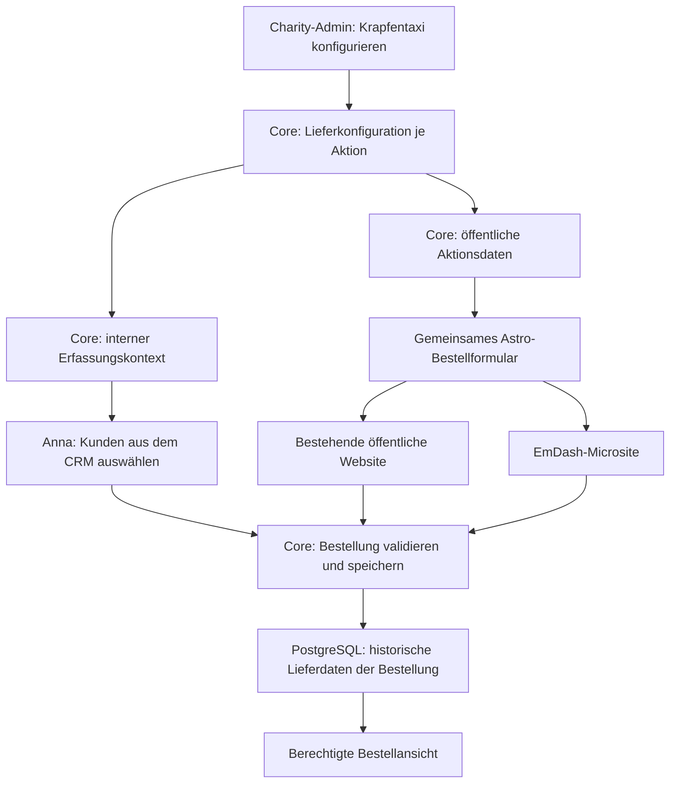

# Krapfentaxi: Lieferadresse, Lieferfenster und Lieferkontakt

Stand: 10.09.2026. Status: Umsetzung begonnen; Abnahme siehe [PROGRESS.md](PROGRESS.md).
Untersuchter Checkout: `80a6/leonaid`, HEAD `adfb9af`.

## 1. Ziel und fachliche Entscheidungen

Bei einer Krapfentaxi-Bestellung sollen Lieferadresse, ein vordefiniertes Lieferzeitfenster und ein gegebenenfalls abweichender Ansprechpartner für die Übergabe erfasst werden. Dessen Telefonnummer ist optional. Dieselben Regeln gelten für die öffentliche Microsite und für Anna in der Akquise-App. Fachliche Klarstellung vom 10.09.2026: Anna bestellt ausschließlich für Kunden und kann bestehende Kunden aus dem CRM auswählen. Eine Eigenbestellung durch Anna gehört nicht zum Umfang.

Der Charity-Admin definiert die Fenster pro Aktion. Es gibt keine fest codierte Anzahl von Tagen oder Fenstern. Die Konfiguration gehört zur Krapfentaxi-Aktion, nicht zu allgemeinen Charity-Stammdaten und nicht zum CMS. Golfaktionen und andere Vorlagen bekommen dadurch keine Lieferpflichten.

Planungsentscheidungen, vorbehaltlich fachlicher Anpassung:

- Für neue verbindliche Krapfentaxi-Bestellungen sind Lieferadresse und genau ein aktives Fenster Pflicht.
- „Ansprechpartner bei der Lieferung (optional)“ und „Telefonnummer für die Lieferung (optional)“ sind getrennte einzeilige Felder. Beide dürfen unabhängig voneinander leer bleiben. Eine Telefonnummer ist keine Voraussetzung für die Bestellung.
- Lieferempfänger bezeichnet die Person/Firma an der Adresse. Der Lieferkontakt bezeichnet die Person für die Übergabe; beide sind nicht automatisch identisch.
- Ohne gesonderten Lieferkontakt bleibt der Bestellkontakt der bekannte Rückfragekontakt. In der Anzeige wird dieser ausdrücklich als Bestellkontakt bezeichnet; es werden keine erfundenen Lieferkontaktdaten gespeichert.
- Ein interner Entwurf darf unvollständig sein. Bei Übergang in `review_ready` müssen die Lieferpflichten erfüllt sein. Öffentliche Bestellungen müssen sofort vollständig sein.
- Eine Bestellung umfasst eine Lieferadresse und ein Fenster. Aufteilung auf mehrere Lieferorte oder Termine ist nicht Teil dieser Erweiterung.
- Kapazitäten, Tourenoptimierung, Fahrerzuordnung, SMS und eine neue Lieferlogistik-Anwendung sind nicht Bestandteil dieses Plans.

**Demo-Konfiguration:** Der Nutzer hat die Aktion „Krapfentaxi 2026“ und zwei frei gewählte Tage im Dezember vorgegeben. Für die synthetische Demo sind deshalb der 04. und 05.12.2026 mit jeweils 08–10, 10–12 und 12–14 Uhr in Europe/Berlin vorgesehen. Diese sechs Fenster sind Beispieldaten, keine technische Begrenzung.

## 2. Befund im aktuellen Code

Die folgende Tabelle beschreibt gelesenen Quellcode, keine Prüfung der laufenden Online-Demo.

| Bereich | Vorhanden | Fehlend beziehungsweise Konsequenz |
| --- | --- | --- |
| Aktionsvorlagen | `src/leonaid/domain/action_templates.py:17` definiert `blank` und `krapfentaxi`; `OrderFormConfiguration` ab Zeile 111 enthält `require_delivery_address`. | Keine typisierten Lieferfenster. Golf ist im untersuchten Enum keine eigene Vorlage; daher keine bereits vorhandene Golfimplementierung unterstellen. |
| Bestellmodell | `src/leonaid/domain/commitments.py:203`: `DeliveryRecipientSnapshot` mit Name, Straße, PLZ, Ort, Land. `Commitment` ab Zeile 404 trägt die Lieferadresse. | Fenster und separater Lieferkontakt fehlen. Adresse erweitern, keine konkurrierende zweite Adressstruktur einführen. |
| Interner API-Eingang | `src/leonaid/entrypoints/fastapi/schemas.py:984`: `CreateCommitmentRequest` enthält Käufer, Rechnungsempfänger und Positionen. | Lieferadresse ist trotz Unterstützung in der Anwendung noch nicht im internen Request verfügbar. Die gesamte Transportkette muss ergänzt werden. |
| Anna | `packages/features/src/commitments/commitment-capture.tsx:227`: Erstellung aus ausgewähltem Sponsor und Rechnungsempfänger. | Lieferfelder ergänzen; bestehende CRM-Kundenauswahl erhalten. |
| Berechtigung | `src/leonaid/adapters/postgres/commitments.py:368`: `_require_assignment` prüft die Zuordnung des Käufers zum Akquisiteur. | Die vorhandene Kundenzuordnung bleibt auch bei Bestellung und Wiederholung wirksam. |
| Öffentliches Formular | `apps/public/src/components/PublicOrder.astro:408`: Lieferanschrift; Rechnung kann aus dieser übernommen werden. Allgemeiner Bestellkontakt und Telefon existieren bereits. | Neuer Lieferkontakt darf den Bestellkontakt nicht ersetzen. Fensterwahl ergänzen. |
| Öffentliche Übertragung | `apps/public/src/actions/index.ts:78`, `src/leonaid/application/public_orders.py:177`: Formularschema, Request-Mapping, Validierung und Request-Hash. | Neue Felder müssen alle Schichten inklusive Fehler-Wiederanzeige und Idempotenz erreichen. |
| EmDash | `apps/campaign-site/src/pages/campaigns/[slug].astro:4` importiert das gemeinsame `PublicOrder`; `apps/campaign-site/src/actions/index.ts` verwendet die öffentliche Action. | Gemeinsame Erweiterung ist möglich. Kanonische Kampagnenroute und Alias benötigen dennoch eigene Integrationsnachweise. |
| Speicherung | `src/leonaid/adapters/postgres/commitments.py` und `public_orders.py` speichern und lesen `delivery_recipient_snapshot`. | Beide Schreib- und Lesepfade sowie Replay-Ergebnisse erweitern. |
| CRM | `src/leonaid/application/public_orders.py:694` übernimmt beim Anlegen einer neuen Firma bislang die Lieferadresse als Firmenadresse. | Diese bestehende Kopplung ausdrücklich berücksichtigen; Lieferkontakt darf nicht zusätzlich als CRM-Stammdatensatz angelegt oder überschrieben werden. |

Ältere lokale Projektnotizen beschreiben bereits eine Lieferfenster-Umsetzung in einem anderen Arbeitsstand. Die relevanten Modelle, Migrationen und Lieferfenster-Dateien sind hier nicht vorhanden. Vor der Umsetzung deshalb Branch-/PR-Stand und Wiederverwendbarkeit vergleichen. Historische Testergebnisse gelten nicht als Nachweis für diesen Checkout. Umgekehrt ist der damals fehlende EmDash-Renderer hier inzwischen vorhanden.

## 3. Zielarchitektur



Core bleibt die einzige Autorität für Aktionszugehörigkeit, Zeitfenster, Buchbarkeit und Bestellungen. EmDash enthält redaktionelle Inhalte und konsumiert die Core-Daten; dort gibt es keinen zweiten Fenstereditor und keine Kopie der Lieferkonfiguration als CMS-Inhalt.

Die vorhandenen öffentlichen und internen Bestellservices bleiben erhalten. Gemeinsame fachliche Regeln für Lieferpflichten und Fensterprüfung werden in einem kleinen Domain-Modul gebündelt; kein neuer allgemeiner Workflow- oder Formularbaukasten.

### 3.1 Aktionskonfiguration und Datenmodell

Neue Tabellen, konkrete Migrationnummer erst bei Umsetzung vergeben:

| Struktur | Inhalt und Regeln |
| --- | --- |
| `action_delivery_configuration` | `action_id` als PK/FK, `enabled`, `timezone` (für Demo `Europe/Berlin`), `revision`. Nur Krapfentaxi-Konfiguration darf aktiviert werden; zusätzlich bestehende Ordering-Fähigkeit prüfen. |
| `action_delivery_window` | UUID `id`, `action_id`, `starts_at`/`ends_at` als `timestamptz`, Status `active`/`retired`. Eindeutiger Schlüssel `(action_id, id)` und Prüfung `starts_at < ends_at`. |
| Erweiterung `commitment` | Nullable `delivery_window_id`, `delivery_window_snapshot` (JSONB), `delivery_contact_snapshot` (JSONB). Bestehendes `delivery_recipient_snapshot` bleibt die Lieferadresse. Composite-FK `(action_id, delivery_window_id)` schützt gegen fremde Aktionen. |

Fenster-Snapshot: ID, Beginn, Ende und IANA-Zeitzone, vollständig serverseitig abgeleitet. Lieferkontakt-Snapshot: `name` und `phone`, beide nullable; ein komplett leerer Kontakt wird als `null` gespeichert. Pro Bestellung bleibt nachvollziehbar, welche Angaben tatsächlich erfasst wurden.

Keine Tabelle für „Liefertage“ nötig: Die Oberfläche gruppiert Fenster nach lokalem Datum. Anzahl und Dauer sind variabel; auch Tage mit unterschiedlich vielen Fenstern sind möglich. Für den ersten Umfang liegt ein Fenster innerhalb eines lokalen Kalendertags. Gleiche beziehungsweise überlappende aktive Fenster werden je Aktion abgelehnt; angrenzende Fenster sind erlaubt. Kapazitätsbasierte Parallelfenster sind nicht gefordert.

Datum und Uhrzeit werden im Admin in der Aktionszeitzone eingegeben. Nicht existente oder mehrdeutige lokale Uhrzeiten bei Zeitumstellung werden mit einer verständlichen Meldung abgelehnt. Speicherung als eindeutige Zeitpunkte, Anzeige ausdrücklich in der Aktionszeitzone, unabhängig vom Browserstandort.

### 3.2 Lebenszyklus und Änderungen

Neue Krapfentaxi-Aktion: Lieferkonfiguration wird mit der Vorlage angelegt, Fenster werden im Entwurf ergänzt. Aktivierung des Bestellangebots setzt mindestens ein gültiges zukünftiges Fenster voraus. Andere Vorlagen erzeugen keine aktive Lieferkonfiguration. Beim Kopieren einer Vorjahresaktion werden keine buchbaren Vorjahresfenster übernommen; neue Termine müssen eingegeben werden.

Die Konfiguration wird mit erwarteter `revision` atomar gespeichert. Veralteter Admin-Stand führt zu `409`, ohne Eingaben zu verlieren. Terminänderungen werden als Stilllegung der bisherigen UUID und Anlage einer neuen UUID umgesetzt. Fenster werden nicht physisch gelöscht; bestehende Bestellungen bleiben unverändert. Eine stillgelegte UUID wird nicht für einen neuen Termin wiederverwendet.

Buchbar sind ausschließlich aktive Fenster derselben Aktion, deren Beginn noch in der Zukunft liegt. Zusätzlich gelten die bereits vorhandenen Aktions-, Angebots- und Bestellregeln. Werden alle Fenster stillgelegt, sind neue verbindliche Bestellungen gesperrt; die Admin-Oberfläche erklärt diese Folge vor dem Speichern. Bestehende Bestellungen bleiben lesbar und bearbeitbar im Rahmen bestehender Rechte.

Fensterstilllegung und neue Bestellung müssen dieselbe Konfigurationszeile in konsistenter Reihenfolge sperren. Nach Erlangen der Sperre wird die aktuelle Buchbarkeit anhand der Serverzeit geprüft, dann werden Bestellung und Snapshot in derselben Datenbanktransaktion gespeichert. So darf keine Bestellung auf Basis einer inzwischen stillgelegten Auswahl durchrutschen. Die öffentliche Pipeline prüft vor CRM-Nebenwirkungen und nochmals verbindlich im geschützten Schreibpfad; bestehende CRM-Recovery-Mechanismen bleiben erhalten.

Implementierungsnachweis: Die bestehende öffentliche Transaktion hält die Aktionssperre bereits während der CRM-Auflösung. Beginnt die Bestellung zuerst, wartet eine parallele Stilllegung bis zu ihrem Abschluss; spätere Bestellungen werden abgewiesen. Die Liefererweiterung behält diese Reihenfolge bei. Ein kürzerer Transaktionsumfang über die externe CRM-Auflösung hinweg wäre eine gesonderte Änderung des vorhandenen Bestellprotokolls.

### 3.3 API-Vertrag

Vorgeschlagene neue Ressource:

- `GET /api/v1/actions/{action_id}/delivery-configuration`: vollständige Konfiguration für berechtigte Aktionsmanager.
- `PUT /api/v1/actions/{action_id}/delivery-configuration`: atomare Änderung mit `expectedRevision` und Fensterliste. Bestehende UUIDs dürfen nur unverändert bleiben oder stillgelegt werden; neue Termine erhalten serverseitige UUIDs.
- Bestehende öffentliche Aktionsantwort und internen `CommitmentCaptureContext` um `deliveryConfiguration` mit Aktivierung, Revision, Zeitzone und aktuell auswählbaren Fenstern ergänzen. Öffentlichkeit sieht keine Kunden- oder Buchungsdaten.
- `GET /api/v1/actions/{action_id}/commitments/{commitment_id}` liest eine berechtigte Bestellung; `POST .../{commitment_id}/complete` übernimmt die vollständigen Lieferangaben und schließt einen internen Entwurf verbindlich ab. Manager dürfen interne Entwürfe der Aktion abschließen, Akquisiteure nur selbst erfasste Akquise-Entwürfe mit weiterhin bestehender Kundenzuordnung. Käufer, Rechnung und bepreiste Positionen bleiben aus dem gespeicherten Entwurf erhalten. Der einmalige Übergang aus `draft` wird unter Zeilensperre ausgeführt; konkurrierende andere Kommandos erhalten `409`. Es gibt keinen zusätzlichen allgemeinen Entwurfseditor. Wiederholungen verwenden einen eigenen Befehlstyp und einen Hash einschließlich Aktion, Bestellung und Akteur.

Bestellrequests werden um folgende Angaben erweitert:

```json
{
  "deliveryRecipient": {
    "recipientName": "Musterfirma",
    "streetLine1": "Beispielstraße 1",
    "postalCode": "12345",
    "city": "Beispielort",
    "countryCode": "DE"
  },
  "deliveryWindowId": "<UUID aus dem Erfassungskontext>",
  "deliveryContact": {
    "name": "Kontakt an der Warenannahme",
    "phone": null
  }
}
```

Der Client übermittelt keine verbindlichen Fensterzeiten. Die Konfigurationsrevision dient Admin-Konflikten; eine Änderung an einem anderen Fenster macht eine weiterhin gültige Auswahl nicht automatisch ungültig. Der Server entscheidet anhand der gewählten ID.

Alle neuen Eingaben gehen normalisiert in die vorhandenen Request-Hashes ein. Gleiches Kommando mit gleichen Eingaben liefert die gespeicherte Bestellung, auch wenn das Fenster inzwischen stillgelegt ist. Gleicher Schlüssel mit geändertem Kontakt oder Fenster ergibt einen Konflikt. Alte Hash-/Replay-Daten bleiben kompatibel: fehlende optionale Felder dürfen nach einem Upgrade nicht allein durch neue `null`-Schlüssel einen abweichenden Hash erzeugen; gezielten Alt-Request-Replay-Test vorsehen.

Vorgeschlagene fachliche Fehler: `delivery_required`, `delivery_window_unavailable`, `delivery_window_action_mismatch`, `delivery_configuration_conflict`, `delivery_not_supported`. Fehler enthalten keine Kontaktwerte. Bei veraltetem Fenster bleiben Adresse und Kontakt erhalten, die Fensterliste wird aktualisiert und eine neue Auswahl verlangt.

Namensfeld: trimmen, maximal 200 Zeichen, keine Zeilenumbrüche. Telefon: trimmen, maximal 40 Zeichen, internationale Präfixe und übliche Trennzeichen zulassen; keine deutsche Mobilfunknummer erzwingen. Bestehende Adressvalidierung weiterverwenden. API und Formulargrenzen abstimmen, einschließlich Body-Limits und erlaubter Formularfelder.

### 3.4 Anna: Bestellung für bestehende CRM-Kunden

Kundenbestellungen behalten die bestehende Zuordnungsprüfung. Der Bestellkontakt und die Rechnung bleiben getrennt von Lieferadresse und Lieferkontakt. „Lieferadresse wie Rechnungsadresse“ übernimmt die Werte ausdrücklich; bei abweichender Lieferadresse wird ein eigener Snapshot erstellt. Ein Wechsel des Kunden oder der Aktion setzt betroffene Auswahlwerte zurück und verhindert die Übernahme eines fremden Fensters.

Anna wählt einen bestehenden, ihr zugeordneten CRM-Kunden als Käufer. Weitere bestehende CRM-Kunden können über die vorhandene Sponsorensuche und den vorhandenen Zuordnungsprozess übernommen werden. Eine Übernahme erzeugt keinen doppelten CRM-Kunden. Die Auswahl unterstützt Firmen und Personen entsprechend dem bestehenden Käufervertrag; eine nicht vorhandene Zuordnung berechtigt nicht zum direkten Bestellaufruf.

Es gibt keine Auswahl „Für mich selbst“, keinen `selfBuyer` und keine zusätzliche Mitglied-zu-CRM-Person-Verknüpfung. Der gesonderte Ansprechpartner bei der Lieferung bleibt ein Kontakt-Snapshot an der Kundenbestellung.

### 3.5 Bestandsdaten, CRM und Datenschutz

Neue Spalten sind nullable, bestehende Bestellungen werden nicht mit erfundenen Fenstern oder Kontakten ergänzt. Historische Ansichten zeigen „Kein Lieferfenster erfasst“. Bestehende Rechnungen und deren Snapshots werden nicht verändert. Für alte unvollständige Bestellungen entsteht durch diese Erweiterung keine automatische nachträgliche Rechnungsblockade.

Bei Alt-Entwürfen gilt die Lieferpflicht beim nächsten verbindlichen Abschluss, sofern die Aktion inzwischen Lieferplanung aktiviert hat. Für neue Entwürfe und Abschlüsse muss diese Prüfung auch bei direkten API-Aufrufen greifen.

Neue Lieferkontakte werden nur an der Bestellung gespeichert. Bestehende CRM-Kontakte oder Firmenadressen werden durch abweichende Lieferung nicht aktualisiert. Die bereits bestehende Firmenanlage aus der Lieferanschrift wird als vorhandenes Verhalten separat getestet und in der Umsetzung ausdrücklich dokumentiert; ihre generelle Neugestaltung gehört nicht stillschweigend in diese Erweiterung.

Kontakt-Snapshots erscheinen nur in berechtigten Bestellansichten. Bestehende Datenschutz-Auskunfts-/Löschpfade sind um die neuen gespeicherten Felder zu ergänzen, entsprechend den dort vorhandenen Regeln. Keine Kontaktwerte in Audit-Events, URLs, Telemetrie oder öffentliche Aktionsantworten aufnehmen. Es werden keine neuen gesetzlichen Aufbewahrungsfristen festgelegt.

## 4. Oberflächen

| Oberfläche | Geplante Änderung |
| --- | --- |
| Aktion erstellen | Bei Krapfentaxi Schritt „Lieferung“: Datum, Beginn, Ende; „Zeitfenster hinzufügen“ und „Weiteren Tag hinzufügen“. Ein Entwurf darf ohne fertige Termine gespeichert werden. |
| Aktion verwalten | Dieselbe Konfiguration bearbeiten; Datum und Fenster chronologisch, Zeitzone sichtbar, Stilllegung erklären, Konflikt mit erneutem Laden behandelbar. Andere Vorlagen zeigen diesen Bereich nicht. |
| Anna/PWA | Bestehenden CRM-Kunden auswählen; separater Lieferblock; Rechnung übernehmen oder abweichende Adresse; Fenster nach Tagen gruppiert; optionaler Kontakt und Telefon. |
| Bestehende Astro-Seite | Gemeinsames `PublicOrder` erweitern, vorhandene Lieferadresse beibehalten, Fenster und Kontakt ergänzen. |
| EmDash-Microsite | Dasselbe Formular und dieselbe Core-Konfiguration unter `/campaigns/[slug]` und den vorgesehenen Aliaswegen; keine CMS-Doppelerfassung. |
| Bestellansicht | Lieferadresse, historisches Zeitfenster und optionalen Kontakt anzeigen, damit die Angaben operativ nutzbar sind; keine neue Tourenplanungsoberfläche. |

Bei sechs Fenstern sind nach Datum gruppierte Radiobuttons mit sichtbaren Uhrzeiten passend. Größere Konfigurationen bleiben nach Tag gegliedert und ohne festes Sechs-Fenster-Layout bedienbar. Keine automatische Vorauswahl des ersten Fensters. Ladefehler bieten Wiederholen; ohne verfügbare Fenster wird die Bestellung verständlich gesperrt. Beschriftungen, Tastaturbedienung, mobile Touch-Ziele und 200-Prozent-Textvergrößerung werden geprüft. Das öffentliche Formular funktioniert weiterhin ohne JavaScript und erhält Eingaben bei Validierungsfehlern.

## 5. Implementierungsschritte und Abnahme

- [x] KLF-010 – Ausgangsstand, Verträge und Demo-Ziel abgeglichen; Kundenablauf und Dezember-Termine festgelegt.
- [x] KLF-020 – Core-Konfiguration und Migration; Datenbanknachweis in `PROGRESS.md`.
- [x] KLF-030 – Bestellung, Speicherung und API-Client; beide Speicherpfade, HTTP, Alt-Replay, Datenschutz und konkurrierende Stilllegung nachgewiesen.
- [x] KLF-040 – Charity-Admin; Erstellung, Liefereditor, Konflikt und Stilllegung in Tests und In-App-Browser nachgewiesen.
- [x] KLF-050 – Annas Kundenbestellungen; CRM-Auswahl, Lieferdaten, Entwurfsabschluss und Verwaltungsanzeige nachgewiesen.
- [ ] KLF-060 – Öffentliche Website und EmDash.
- [ ] KLF-070 – Gesamtnachweis und Demo-Konfiguration.

### KLF-010 – Ausgangsstand abgleichen und Verträge festlegen

Vorhandene Lieferfenster-Arbeit in anderen Branches/PRs read-only vergleichen; erst danach über Wiederverwendung entscheiden. Keine pauschale Übernahme fremder Worktrees. Demo-Aktion und deren tatsächlich eingesetzten Renderer bestimmen. Bestehende CRM-Kundenauswahl und Zuordnungsgrenzen prüfen. Diese Punkte dürfen parallel zur Vorbereitung der Datenverträge geklärt werden.

Ergebnis: kurze dokumentierte Übernahmeentscheidung, finaler API-Vertrag und bestätigte Demo-Eingaben. Abhängigkeit: keine.

### KLF-020 – Core-Konfiguration und Migration

Domain-Modul, additive Migration, Repository und Manager-Endpunkte implementieren. Aktionsvorlage, Erstellen, Kopieren und Aktivieren anbinden. Krapfentaxi-Prüfung serverseitig, Revisionskonflikte und transaktionale Fensteränderung umsetzen.

Abnahme: beliebig variable Tages-/Fensteranzahl, ungültige/überlappende Zeiten und Fremdaktionsänderungen abgelehnt; Vorjahreskopie erzeugt keine buchbaren Alttermine; Altbestellungen bleiben lesbar. Abhängigkeit: KLF-010.

### KLF-030 – Bestellung, Speicherung und API-Client

`domain/commitments.py`, beide Bestellanwendungen und PostgreSQL-Adapter, FastAPI-Schemas/Routes sowie OpenAPI und generierten Client erweitern. Lieferadresse auch im internen Request durchreichen. Gemeinsame Pflichtprüfung, serverseitige Fenster-Snapshots, Kontakt-Normalisierung, Replay und Altbestandsregeln ergänzen. Bestehende Ausgabe- und Datenschutzpfade mitziehen.

Abnahme: interner und öffentlicher Auftrag speichern dieselben Lieferdaten; Fremdfenster, manipulierte Zeiten, stillgelegte Fenster und unvollständige Abschlüsse werden abgelehnt; Replay bleibt stabil; gleichzeitige Stilllegung und Bestellung liefern konsistente Ergebnisse. Abhängigkeit: KLF-020.

### KLF-040 – Charity-Admin

`packages/features/src/action-admin/create-action.tsx`, `manage-action.tsx` und passende Manage-Sections um den Liefereditor ergänzen. Vorhandene UI-Bausteine und Fehlermuster verwenden.

Abnahme: Admin erstellt sechs Fenster, ergänzt einen weiteren Tag, legt ein Fenster still und behandelt einen parallelen Bearbeitungskonflikt. Nicht berechtigte Mitglieder können nichts ändern; andere Vorlagen bleiben ohne Liefereditor. Abhängigkeit: KLF-020/030.

### KLF-050 – Annas Kundenbestellungen

`packages/features/src/commitments/commitment-capture.tsx` und Bestellanzeige um die Lieferfelder erweitern. Bestehende CRM-Kundenauswahl und Sponsorenzuordnung verwenden. Vorhandene Integration in `apps/pwa` und gegebenenfalls Admin-Einstiege prüfen.

Abnahme: Anna wählt bestehende CRM-Kunden und erfasst Kundenbestellungen mit abweichendem Lieferkontakt und unterschiedlichen Fenstern. Keine Eigenbestellungsoption. Direktbestellung für einen nicht zugeordneten Kunden bleibt verboten. Kunde-/Aktionswechsel, Adressübernahme, Entwurf und Abschluss funktionieren. Abhängigkeit: KLF-030.

### KLF-060 – Öffentliche Website und EmDash

`apps/public/src/components/PublicOrder.astro`, `actions/index.ts`, Core-Mapping, `order-redisplay.ts`, `order-presentation.ts` und gegebenenfalls `order-body.ts` erweitern. Gemeinsamen Formularimport im Campaign-Renderer nutzen; kanonische Route und `order_alias`-Zuordnung unverändert korrekt behandeln.

Abnahme: Bestellung auf bestehender öffentlicher Seite sowie EmDash-Kampagnen- und Aliasroute mit und ohne JavaScript. Nicht mehr verfügbares Fenster erhält andere Eingaben; erneutes Absenden erzeugt keine Doppelbestellung. Aliaswechsel beziehungsweise Rücknahme erzeugen keine Bestellung für die falsche Aktion. Abhängigkeit: KLF-030.

### KLF-070 – Gesamtnachweis und Demo-Konfiguration

Alle Oberflächen gegen dieselbe isolierte Testaktion prüfen; angenommene sechs Demo-Fenster erst mit bestätigten Tagen/Uhrzeiten über den normalen Konfigurationsweg anlegen. Seed beziehungsweise Konfigurationsskript idempotent nach Aktions-ID ausführen; vorhandene UUIDs nicht bei jedem Lauf ersetzen. Bestehende synthetische CRM-Kunden und Lieferkontakte verwenden.

Abnahme: Admin-Konfiguration ist unmittelbar in Anna und beiden öffentlichen Renderern sichtbar; drei Bestellwege (Anna für CRM-Kunden, bestehende öffentliche Website, EmDash) persistieren jeweils nachweisbar identische Felder. Nach Neustart bleiben Daten und historische Fenster erhalten. Abhängigkeit: KLF-040/050/060.

## 6. Prüfstrategie

Vorhandene Einstiegspunkte nutzen und um passende Fälle ergänzen: `./leonaid test-unit`, `test-templates`, `test-action-admin`, `test-commitments`, `test-pwa`, `test-public-orders`, `test-invoices` sowie die passenden `test-emdash-spike`-Fälle für Kampagnenbestellungen. Client mit `./leonaid generate-api-client` erzeugen und bestehende OpenAPI-Konsistenzprüfung verwenden. Die exakten EmDash-Fälle bei Umsetzung anhand des dann vorhandenen Runners auswählen.

Zusätzlich gezielte PostgreSQL-Integrationstests für Migration, Composite-FK, Revisionskonflikt und konkurrierende Fensterstilllegung. Browsernachweise decken Annas CRM-Kundenauswahl, beide öffentlichen Renderer, fehlendes JavaScript, Eingabeerhalt und mobile Darstellung ab. Eine reine Build- oder Unit-Test-Freigabe reicht nicht.

Regressionsfälle: `blank` ohne Lieferpflicht, bisherige öffentliche Bestellungen, Rechnungsadresse unabhängig von Lieferung, unveränderte Rechnungssnapshots, CRM-Wiederverwendung, keine zusätzliche CRM-Kontaktänderung, historische Idempotenz, Datenschutz-Ausgabe und fremde Aktionsrechte. Testsysteme verwenden eigene Compose-Projekte, Ports und Netze; keine Bereinigung paralleler Worktrees oder Container.

## 7. Einführung, Rückweg und noch benötigte Angaben

Reihenfolge: additive Datenbankänderung und kompatibles Backend, danach aktualisierte Clients und Renderer, danach Lieferplanung je Aktion aktivieren. Neue Krapfentaxi-Aktionen erhalten die Konfiguration aus der Vorlage; Bestandsaktionen bleiben bis zur bewussten Umstellung deaktiviert. Alte Clients dürfen bei aktivierter Lieferpflicht nicht stillschweigend unvollständige verbindliche Bestellungen erzeugen.

Rückweg: Bei Problemen neue Bestellungen für die betroffene Aktion pausieren. Schema und bereits gespeicherte Snapshots beibehalten. Ein alter Server, der neue Lieferdaten nicht kennt, ist nach Annahme solcher Bestellungen kein sicherer normaler Rollback-Zielstand. Wiederaufnahme erst mit kompatiblem Backend und geprüftem Formular; keine destruktive Down-Migration zur Reparatur.

Die lokale Vorführinstanz ist `https://localhost:28443`, Aktion „Krapfentaxi 2026“ mit ID `20000000-0000-4000-8000-000000000001`. Die bestehende Website liegt unter `/krapfentaxi`, die veröffentlichte EmDash-Kampagne unter `/campaigns/krapfentaxi-2026/`. Beide verwenden das gemeinsame Formular und dieselbe Core-Aktion. Der zusätzliche Alias `/lieferpruefung` führt zur EmDash-Kampagne.

Gemäß Nutzervorgabe „zwei Tage im Dezember nehmen“ wurden der 04. und 05.12.2026 mit jeweils 08–10, 10–12 und 12–14 Uhr in Europe/Berlin gewählt. Die lokale Aktionslaufzeit endet am 31.12.2026. Anna wählt bestehende, ihr zugeordnete CRM-Kunden; eine eigene Käufer-Person oder Eigenbestellungsoption ist nicht erforderlich.

Die Umsetzung und Laufzeitnachweise werden in `PROGRESS.md` fortgeschrieben. Diese Demo läuft im isolierten Compose-Projekt `leonaid-delivery-80a6-visible`. Die frühere Instanz auf Port 19443 sowie externe Deployments werden dadurch nicht geändert.
