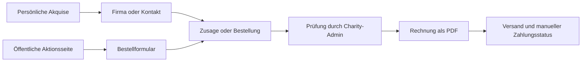
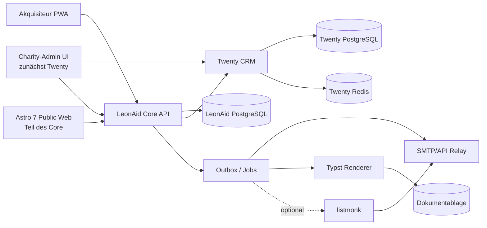

# LeonAid – Produkt- und Architekturvorschlag

> **Status:** Vorschlag zur Diskussion, keine beschlossene Zielarchitektur  
> **Stand:** 2026-07-25  
> **Fokus:** PoC aus CRM, Akquisiteur-Frontend und ERP-light; Ausbaupfad für
> Charity-Administration, öffentliche Aktionsseiten und Kommunikation

## 1. Kurzfassung

### 1.1 Der PoC in einem Satz

Der erste LeonAid-Prototyp unterstützt eine konkrete Charity-Aktion vom
öffentlichen Auftritt über die Sponsorengewinnung bis zur Bestellung und
Ausgangsrechnung.

Als erster realer Anwendungsfall dient **Krapfentaxi**. Dabei soll nachweisbar
werden, dass LeonAid den heute über Webseiten, Excel-Listen, persönliche
Kontakte und manuelle Rechnungen verteilten Ablauf in einer verständlichen
Arbeitsumgebung zusammenführen kann.

### 1.2 Welches Problem wird im PoC gelöst?

Heute entstehen mehrere voneinander getrennte Informationsstände:

- Firmen und Ansprechpartner stehen in persönlichen oder gemeinsamen Listen.
- Lions-Mitglieder wissen nicht immer, wer eine Firma bereits angesprochen hat.
- Zusagen und Bestellungen kommen über Gespräche und öffentliche Kanäle.
- Der Fortschritt der Gesamtaktion ist nur mit manueller Zusammenführung
  erkennbar.
- Rechnungsdaten müssen aus Bestellungen erneut übertragen werden.

Der PoC schafft für genau diesen Ablauf einen gemeinsamen, aktuellen Stand.
Er soll noch nicht alle Vereinsaufgaben lösen.

### 1.3 Wer benutzt den PoC?

#### Charity-Admin

Der Charity-Admin bereitet die Aktion vor und behält den Überblick. Er pflegt
Zeitraum, Ziel und Begünstigte, sieht neue Bestellungen und kann Rechnungen
freigeben. Firmen können vorab Akquisiteuren zugeordnet werden; das ist aber
keine Voraussetzung.

#### Akquisiteur

Der Akquisiteur ist ein Lions-Mitglied, das Firmen oder persönliche Kontakte
als Sponsoren gewinnen möchte. Er verwendet eine einfach bedienbare,
installierbare Web-App auf dem Smartphone.

Er kann:

- vorhandene Firmen und Kontakte sehen,
- neue Firmen und Personen anlegen,
- einen Kontaktversuch und eine Wiedervorlage dokumentieren,
- eine Zusage oder Bestellung aufnehmen,
- Neuigkeiten zu seinen Kontakten sehen,
- den Fortschritt der Charity-Aktion verfolgen.

Ist eine Firma bereits anderen Akquisiteuren zugeordnet, zeigt LeonAid eine
Warnung mit deren Namen. Der Akquisiteur kann abbrechen oder sich bewusst
zusätzlich zuordnen.

#### Öffentlicher Besteller oder Sponsor

Ein externer Besucher öffnet die öffentliche Aktionsseite ohne Anmeldung. Beim
Krapfentaxi kann er dort über ein normales Formular Krapfen bestellen.

LeonAid erkennt, soweit mit den einfachen PoC-Regeln möglich, eine bereits
bekannte Firma oder Person. Existiert der Kontakt noch nicht, wird er angelegt.
Bereits zugeordnete Akquisiteure sehen die neue öffentliche Bestellung in
ihrem Bereich **„Neues/Aktivitäten“**.

#### Finanzverantwortlicher oder Charity-Admin

Aus einer geprüften Bestellung wird eine Ausgangsrechnung erstellt. LeonAid
vergibt die Rechnungsnummer, erzeugt ein PDF und versendet es per E-Mail. Der
Zahlungseingang wird im PoC noch manuell markiert.

### 1.4 Die zwei Wege zu einer Bestellung



Beide Wege landen im selben Bestell- und Rechnungsprozess. Dadurch gibt es
keine getrennte öffentliche Bestellliste und Akquisiteursliste.

### 1.5 Welche sichtbaren Produktteile entstehen?

#### Öffentliche Aktionsseite

- Zweck, Zeitraum und Begünstigte der Charity-Aktion
- aktuelles Angebot, beim Krapfentaxi beispielsweise Krapfenboxen
- normales öffentliches Bestellformular
- Bestätigung nach erfolgreicher Übermittlung

#### PWA für Akquisiteure

- Anmeldung
- Übersicht der aktiven Charity-Aktionen
- motivierende Anzeige des manuell gepflegten Aktionsziels
- eigene und gemeinsam zugeordnete Firmen/Kontakte
- Kontaktdetail mit Status, Notiz und Wiedervorlage
- neuer Sponsor
- Bestellung/Zusage erfassen
- „Neues/Aktivitäten“

#### Arbeitsbereich für Charity-Admins

- Aktion, Zeitraum, Ziel und Begünstigte
- Überblick über Firmen, Kontakte und Akquisiteure
- neue und unzugeordnete öffentliche Bestellungen
- Bestellungen prüfen
- Rechnungen freigeben und erneut versenden
- erzeugte Rechnungen abrufen und herunterladen
- Zahlung manuell markieren
- einfache Auswertung zu Fortschritt, Bestellmenge, Rechnungen und offenen
  Posten

Ein Teil dieses Arbeitsbereichs kann im PoC direkt in Twenty stattfinden. Der
PoC soll praktisch zeigen, wo Twenty ausreicht und wo LeonAid eigene
Admin-Seiten benötigt.

### 1.6 Was gilt als erfolgreiche PoC-Demonstration?

Eine fachliche Vorführung soll ohne technische Erklärung zeigen können:

1. Charity-Admin legt Krapfentaxi mit Zeitraum, Ziel und Begünstigten an.
2. Die öffentliche Aktionsseite mit Bestellformular ist erreichbar.
3. Ein Akquisiteur legt eine neue Firma an und ist ihr automatisch zugeordnet.
4. Ein zweiter Akquisiteur findet dieselbe Firma, sieht die Warnung mit dem
   Namen des ersten und ordnet sich nach Bestätigung ebenfalls zu.
5. Ein Akquisiteur erfasst eine Bestellung im Gespräch.
6. Ein externer Besucher bestellt alternativ über die öffentliche Seite.
7. Die öffentliche Bestellung erscheint bei bereits zugeordneten
   Akquisiteuren als neue Aktivität.
8. Der Charity-Admin prüft die Bestellung und gibt die Rechnung frei.
9. LeonAid erzeugt und versendet das Rechnungs-PDF.
10. Dashboard und PWA zeigen den aktualisierten Fortschritt der Aktion.

### 1.7 Was gehört ausdrücklich noch nicht zum PoC?

- Tourenplanung und Fahrer-App
- Zeitfenster und Etikettendruck
- Verpackungs- oder Lagerbestand
- automatische Herstellerabrechnung
- automatische Bankanbindung und Mahnwesen
- zusätzliche Geldspenden und Spendenbescheinigungen
- Newsletter-System
- allgemeine Mitglieder- und Beitragsverwaltung
- vollständige Vereinsbuchhaltung
- frei konfigurierbarer Formularbaukasten oder allgemeines CMS
- gleichzeitiger Betrieb mehrerer Clubs in einer Installation

Andere Clubs können später jeweils eine eigene LeonAid-Installation betreiben.
Lions Open und Weihnachtsmarkt werden noch nicht umgesetzt; ihr fachliches
Modell wird aber vor dem PoC-Abschluss gegengeprüft, damit der gemeinsame
Charity-Aktionskern nicht nur für Krapfentaxi funktioniert.

### 1.8 Begriffe ohne Technikjargon

| Begriff | Bedeutung in diesem Konzept |
|---|---|
| **PoC** | Ein funktionsfähiger Beweis, dass der wichtigste Ablauf praktisch funktioniert; noch kein vollständiges Produkt |
| **Charity-Aktion** | Eine zeitlich begrenzte Aktion wie Krapfentaxi, Lions Open oder Weihnachtsmarkt |
| **Beneficiary/Begünstigter** | Organisation oder Zweck, dem der Erlös der Aktion zugutekommt |
| **Akquisiteur** | Lions-Mitglied, das Firmen oder Personen als Sponsoren beziehungsweise Besteller gewinnt |
| **PWA** | Installierbare Web-App, die sich auf dem Smartphone weitgehend wie eine App anfühlt |
| **CRM/Twenty** | Gemeinsame Verwaltung der Firmen und Ansprechpartner |
| **ERP-light** | Der kleine LeonAid-Bereich für Ausgangsrechnungen; keine vollständige Buchhaltung |
| **Public Web** | Öffentliche Aktionsseite und Formular für Personen ohne LeonAid-Anmeldung |

### 1.9 Technische Kurzfassung

Die fachliche Aufteilung wird technisch so umgesetzt:

- **Twenty CRM** verwaltet Firmen, Personen, Beziehungen und allgemeine
  Kontaktaktivitäten.
- **LeonAid Core** verwaltet Charity-Aktionen, Rollen und Zuordnungen,
  Sponsor-Pipeline, Bestellungen und Ausgangsrechnungen.
- Eine eigene **PWA/Weboberfläche** dient Akquisiteuren.
- Charity-Admins arbeiten im PoC mit Twenty und ergänzenden
  LeonAid-Admin-Seiten.
- Das öffentliche **Astro-7-Frontend** gehört zum Core.
- Transaktionale E-Mails laufen über einen externen Versanddienst.
- **ERP-light** ist Teil von LeonAid, aber keine vollständige Buchhaltung.
- Docker Compose startet interne Oberfläche, Public Web, LeonAid und Twenty
  gemeinsam; optionale Systeme bleiben getrennt.

## 2. Produktgrenze

### 2.1 Was LeonAid selbst löst

LeonAid verbindet fünf heute meist getrennte Arbeitsbereiche:

1. Charity-Aktionen mit festem Zeitraum und eigenen Verantwortlichen,
2. verteilte Sponsorengewinnung durch Lions-Mitglieder,
3. Bestellungen oder Sponsoringzusagen aus persönlicher Akquise und öffentlichen
   Formularen,
4. Ausgangsrechnungen und deren Versand,
5. aktionsbezogenes Fortschritts- und Finanzreporting.

Der Mehrwert liegt nicht in einer weiteren Kontaktdatenbank. Er liegt in der
nachvollziehbaren Beziehung zwischen:

- Charity-Aktion,
- Firma und Ansprechpartner,
- Akquisiteur,
- Akquisevorgang,
- Bestellung oder Sponsoringzusage,
- Rechnung und Zahlungsstatus.

### 2.2 Was LeonAid nicht selbst werden sollte

Nicht zum PoC und voraussichtlich nicht zum eigenen Produktkern gehören:

- vollständige Mitglieder- und Beitragsverwaltung,
- vollständige Finanzbuchhaltung mit SKR42, EÜR/Bilanz, Kreditoren- und
  Anlagenbuchhaltung,
- eigener Bankzugang oder Zahlungsdienst,
- eigener Mail Transfer Agent,
- allgemeines Dokumentenmanagement für beliebige Vereinsdateien; fachlich
  erzeugte Dokumente wie Rechnungen gehören ausdrücklich zum Core,
- komplexes Event-Ticketing,
- Lohn, Reisekosten oder Personalverwaltung,
- rechtliche und steuerliche Logik für Spendenbescheinigungen ohne fachliche
  Abnahme,
- KI-basiertes Wealth Screening.

Für diese Bereiche sind Integrationen oder spezialisierte Systeme sinnvoller.

## 3. Personas und Rollen

Personas beschreiben Nutzungskontext, Ziele und Bedürfnisse. Rollen beschreiben
technische Berechtigungen. Eine Person kann mehrere Personas beziehungsweise
Rollen haben, beispielsweise Charity-Admin und Akquisiteur.

### 3.1 Personas

Die Persona-Skizzen sind Arbeitshypothesen und sollen mit realen Nutzern weiter
verfeinert werden.

#### Charity-Admin – organisiert eine Aktion

- **Ziel:** Aktion vollständig vorbereiten, steuern und abschließen.
- **Kontext:** Arbeitet überwiegend am Desktop, ehrenamtlich und oft in kurzen
  Zeitfenstern.
- **Kernaufgaben:** Aktion, Ziel und Beneficiaries pflegen; Akquisiteure
  unterstützen; Kontakte und Mehrfachzuordnungen überblicken; Bestellungen
  prüfen; Rechnungen freigeben; Fortschritt berichten.
- **Braucht:** klare Neuigkeiten- und Ausnahmenliste, verständliche
  Massenaktionen, nachvollziehbaren Status und möglichst wenig Systemwechsel.
- **Zu validieren:** Reicht Twenty als primärer Arbeitsplatz oder braucht diese
  Persona eine durchgängige LeonAid-Admin-Oberfläche?

#### Akquisiteur – gewinnt Sponsoren

- **Ziel:** Firmen und Kontakte schnell ansprechen und Zusagen zuverlässig
  dokumentieren.
- **Kontext:** Lions-Mitglied, häufig mobil unterwegs und unterschiedlich
  technikaffin.
- **Kernaufgaben:** vorhandene Kontakte wieder aufnehmen; Firma/Person
  anlegen; Kontaktversuch und Wiedervorlage erfassen; Bestellung/Zusage
  aufnehmen; Neuigkeiten zu eigenen Kontakten sehen.
- **Braucht:** fokussierte PWA, wenige Pflichtfelder, einfache
  Zielvisualisierung und Transparenz über bereits beteiligte Akquisiteure.
- **Zu validieren:** Welche Änderungen eines anderen Akquisiteurs sollen eine
  Benachrichtigung auslösen?

#### Öffentlicher Besteller/Sponsor – reagiert auf die Aktion

- **Ziel:** Aktion verstehen und Bestellung oder Zusage ohne Anmeldung
  abschicken.
- **Kontext:** Öffnet Link oder QR-Code mobil beziehungsweise am Desktop und
  kennt LeonAid nicht.
- **Kernaufgaben:** Zweck und Beneficiaries verstehen; Firma/Kontakt angeben;
  Menge/Angebot wählen; verbindlich absenden; Bestätigung erhalten.
- **Braucht:** kurzes barrierearmes Formular, klare Preise und
  Datenschutzinformation, verständliche Bestätigung und Schutz vor
  Doppelübermittlung.
- **Zu validieren:** Welche Felder unterscheiden sich zwischen Krapfentaxi,
  Lions Open und Weihnachtsmarkt?

#### Finanzverantwortlicher/Schatzmeister – prüft Abrechnung

- **Ziel:** Vollständige Ausgangsrechnungen und offene Posten überblicken.
- **Kontext:** Arbeitet überwiegend am Desktop und benötigt verlässliche
  Exporte für weitere Buchhaltungsprozesse.
- **Kernaufgaben:** Rechnungsdaten prüfen; Freigabe nachvollziehen;
  Zahlungsstatus pflegen; Storno/Korrektur kontrollieren; exportieren.
- **Braucht:** unveränderliche Dokumente, klare Nummern und Beträge,
  Versandnachweis, Audit und aktionsbezogene Summen.
- **Zu validieren:** Nur lesend oder mit Freigabe- und Buchungsrechten?

#### System-Admin – betreibt die Clubinstallation

- **Ziel:** Eine einzelne Clubinstallation sicher, verfügbar und
  wiederherstellbar betreiben.
- **Kontext:** Technisch erfahrene ehrenamtliche oder beauftragte Person.
- **Kernaufgaben:** Deployment, Secrets, Benutzer, Integrationen, Updates,
  Monitoring, Backup und Restore.
- **Braucht:** versionierte Compose-Konfiguration, Runbooks, Healthchecks,
  sichere Defaults und kontrollierte Migrationen.
- **Zu validieren:** Welche Aufgaben übernimmt der Club, welche ein externer
  Betreiber?

#### Ausfahrer – liefert Bestellungen aus (später)

- **Ziel:** Zugewiesene Lieferungen mit wenig Koordinationsaufwand zustellen.
- **Kontext:** Aktionsspezifische mobile Persona; relevant für Krapfentaxi,
  nicht automatisch für andere Aktionen.
- **Kernaufgaben:** spätere Tour übernehmen, Stopps sehen und Zustellung
  dokumentieren.
- **Braucht:** kompakte mobile Ansicht und nur erforderliche Lieferdaten.
- **Status:** Nach PoC/MVP zurückgestellt; vor Umsetzung weiter detaillieren.

#### Beneficiary-Ansprechpartner – liefert Inhalte, nutzt LeonAid zunächst nicht

- **Ziel:** Begünstigte Organisation korrekt darstellen und Informationen zum
  Aktionsergebnis erhalten.
- **Kontext:** Externe Person ohne LeonAid-Account.
- **Kernaufgaben:** Stammdaten, Zweckbeschreibung und gegebenenfalls
  Bildmaterial zuliefern; Ergebnis entgegennehmen.
- **Status:** Zunächst Stakeholder statt Systemrolle.

### 3.2 Technische Rollen

| Rolle | Aufgabe | Zugriff |
|---|---|---|
| **System-Admin** | Betrieb, Konfiguration, Benutzer und Integrationen | systemweit |
| **Charity-Admin** | Aktionen, Akquisiteure, Zuweisungen, Bestellungen, Rechnungsfreigabe und Reporting | nur verantwortete Aktionen; im PoC ggf. Twenty plus LeonAid |
| **Akquisiteur** | Firmen/Kontakte anlegen und ansprechen, Ergebnis, Wiedervorlage und Bestellung/Zusage erfassen | eigene, auch mit anderen geteilte Zuordnungen |
| **Schatzmeister/Finanz-Leser** | Rechnungen, offene Posten und Exporte prüfen | lesend oder mit klar begrenzten Finanzaktionen |
| **Öffentlicher Besucher** | Aktionsseite lesen, Formular absenden | nur veröffentlichte Aktion und explizite Formulare |

Akquisiteure sind Lions-Mitglieder, aber im PoC **keine Twenty-Nutzer**. Die
serverseitige Autorisierung lautet immer:

> Darf dieser Akteur in dieser Rolle auf diese konkrete Charity-Aktion und den
> daran gebundenen Datensatz zugreifen?

Ausgeblendete UI-Elemente oder vom Browser mitgesendete Filter sind keine
Autorisierung.

Neben diesen systemweiten Rollen gibt es **aktionsbezogene Rollen**, die nur
mit der jeweiligen Capability verfügbar sind. Beispiele:

- `acquirer` bei `acquisition`,
- `driver` bei `delivery`,
- `player` oder `tournament_admin` bei `tournament`,
- `booth_operator` bei `booths`,
- `volunteer` bei `volunteer_shifts`.

`Fahrer` ist damit keine globale LeonAid-Rolle und erscheint bei Lions Open
oder einer anderen Aktion ohne `delivery` nicht.

## 4. Fachliche Systemgrenzen

### 4.1 Führende Systeme

| Daten/Funktion | Führendes System | Begründung |
|---|---|---|
| Firma, Person, Kontaktwege | Twenty | klassische CRM-Stammdaten |
| allgemeine Kontaktaktivität und Beziehung | Twenty | 360°-Kontaktsicht |
| Charity-Aktion und Zeitraum | LeonAid Core | eigener Lifecycle, Rollen, Public Site, Reporting |
| Aktionsrolle und Akquisiteur-Zuordnung | LeonAid Core | zentrale Sicherheitsgrenze |
| aktionsbezogene Sponsor-Pipeline | LeonAid Core | Lions-spezifischer Workflow |
| Bestellung/Sponsoringzusage | LeonAid Core | verbindet Formular/Akquise mit Abwicklung und Rechnung |
| Rechnung, Positionen, Nummernkreis, Dokument | LeonAid ERP-light | Unveränderlichkeit und Finanzinvarianten |
| öffentliche Inhalte | LeonAid Core oder angebundenes Content-Modell | an Aktion und Publikationszeitraum gebunden |
| Marketing-Listen und Versandläufe | listmonk, optional | spezialisierte Versandmaschine |
| Consent, Rechtsgrundlage, Suppression | LeonAid Core | darf nicht in Schatten-CRMs divergieren |
| Zustellstatus/Bounces | sendendes System, zurückgespiegelt nach LeonAid | technische Versandwahrheit |

Jedes externe System erhält stabile LeonAid- und Twenty-IDs. Synchronisationen
brauchen Idempotenzschlüssel, Sync-Status und sichtbare Fehler. Es gibt keine
unkontrollierte bidirektionale Synchronisierung zweier gleichberechtigter
Kontakt-Master.

### 4.2 Empfohlenes Kernmodell

Die Begriffe sind absichtlich fachlich und nicht an Twenty-Feldnamen gebunden:

- `CharityAction`
  - Club/Träger, Name, Zweck, Zeitraum
  - Status `draft → scheduled → active → completed → archived`
  - verantwortliche Charity-Admins
  - manuell gepflegtes Aktionsziel, aktueller Ist-Wert und Einheit
  - Public-Slug und Publikationsfenster
  - aktivierte fachliche Capabilities, nicht ein hart codierter Aktionstyp
- `Beneficiary`
  - Organisation, Bezeichnung und öffentliche Beschreibung
  - Beziehung: eine Charity-Aktion hat einen oder mehrere Begünstigte
- `ActionMembership`
  - Person, Charity-Aktion, Rolle
  - Aktivzeitraum und Stellvertretung
- `AcquisitionAssignment`
  - Charity-Aktion, Twenty-Company/Person, Akquisiteur
  - Status, Priorität, nächste Aktion, Fälligkeit
  - Zuweisungs- und Übergabehistorie
  - Eindeutigkeit nur je `Aktion + CRM-Partei + Akquisiteur`; dieselbe
    Firma/Person darf in einer Aktion mehreren Akquisiteuren zugeordnet sein
- `AcquisitionActivity`
  - Kontaktzeitpunkt, Kanal, Ergebnis, Notiz
  - keine frei editierte Überschreibung der Historie
- `Commitment`
  - Sponsoringzusage oder Bestellung
  - Quelle `acquisition | public_form | admin`
  - Besteller, abweichender Rechnungsempfänger, Positionen
  - nachvollziehbare Menge und Einheit, etwa `boxes` oder `pieces`
- `Invoice`
  - Empfänger- und Positions-Snapshot
  - Nummer, Daten, Fälligkeit, Beträge, Steuerhinweis
  - Status und Dokumentversion
- `GeneratedDocument`
  - Dokumenttyp, Dateiformat, Speicherreferenz, Hash und Erstellungszeitpunkt
  - fachliche Zuordnung zu Charity-Aktion, Bestellung/Zusage und Rechnung
  - CRM-Zuordnung zu Firma und/oder Kontakt
  - unveränderliche Version; neue Erzeugung legt eine neue Version an
- `PaymentRecord`
  - im PoC manuell erfasster Zahlungseingang
- `ConsentRecord` und `SuppressionEntry`
  - Zweck, Kanal, Textversion, Quelle, Zeitpunkt und Widerruf
- `AuditEvent`
  - Rollen-/Zuweisungswechsel, fachliche Statuswechsel,
    Rechnungsfreigabe, Versand und Storno
- `ActivityEvent`
  - fachliche Neuigkeit für PWA/Admin, etwa öffentliche Bestellung,
    neuer Kontakt, neue Mitzuordnung oder Statusänderung
  - referenziert Aktion, CRM-Partei und betroffene Akquisiteure

Firmen und Personen werden nicht dupliziert. Fachobjekte speichern eine stabile
Twenty-Referenz und nur dort Snapshots, wo Unveränderlichkeit erforderlich ist,
insbesondere auf ausgestellten Rechnungen.

### 4.3 Aktionsunabhängiger Kern und Capability-Module

`CharityAction` ist kein Synonym für Krapfentaxi. Jede Aktion teilt nur einen
kleinen, stabilen Kern:

- Identität, Träger und verantwortliche Charity-Admins,
- Name, Zweck, Zeitraum und Lifecycle,
- Rollen und Teilnehmer an der internen Durchführung,
- öffentliche Sichtbarkeit und Inhalte,
- Ziele, Audit und Reporting-Kontext,
- Verknüpfungen zu CRM-Kontakten und Finanzvorgängen.

Alles Weitere wird über **fachlich typisierte Capability-Module** ergänzt. Eine
Aktion aktiviert nur die Module, die sie tatsächlich benötigt:

| Capability | Fachliche Objekte | Beispiel |
|---|---|---|
| `acquisition` | Zuweisung, Pipeline, Aktivität, Wiedervorlage | Sponsorenakquise bei allen drei Aktionen |
| `offerings` | Angebot/Paket, Preis, Verfügbarkeit | Krapfenbox oder Sponsoringpaket |
| `ordering` | Bestellung, Positionen, Besteller | Krapfentaxi-Bestellung |
| `invoicing` | Rechnung, Freigabe, Versand, Zahlung | Sponsoring oder Warenbestellung |
| `event_registration` | Anmeldung, Teilnehmer, Begleitpersonen | Lions Open |
| `tournament` | Spieler, Team/Flight, Startzeit, optionale Wertung | Lions Open |
| `booths` | Stand, Standplatz, Betreiber, Buchung | Weihnachtsmarkt |
| `volunteer_shifts` | Aufgabe, Schicht, Helfer, Verfügbarkeit | Weihnachtsmarkt oder Golfturnier |
| `delivery` | später: Tour, Stopp, Ausfahrer, Zustellstatus | Krapfentaxi nach dem MVP |

Die Capability-Liste ist **keine Plugin-Plattform im PoC**. Sie ist zunächst
eine klare Modulgrenze im modularen Monolithen. Aktivierung steuert Navigation,
zulässige Workflows und Reporting; sie erzeugt keine beliebigen Tabellen zur
Laufzeit.

Wichtige Modellierungsregel:

> Gemeinsame Begriffe bleiben im Core. Aktionsspezifische Daten erhalten eigene
> typisierte Tabellen und Regeln – keine immer breiter werdende
> `CharityAction`-Tabelle und kein unvalidierter JSON-/EAV-Feldbaukasten.

#### Beispiel: Krapfentaxi

- Akquise von Firmen,
- Krapfenboxen als `Offering`,
- Bestellungen mit Lieferadresse,
- Rechnung,
- nachvollziehbare Menge in Boxen und/oder Stück.

Touren, Zeitfenster, Fahrerdisposition, Etiketten und Verpackungsbestand sind
für Krapfentaxi plausibel, aber für PoC/MVP zunächst zurückgestellt.

#### Beispiel: Lions Open

Voraussichtlich relevante Module:

- Sponsoringpakete wie Loch-, Turnier- oder Sach-Sponsoring,
- Firmen und Ansprechpartner aus dem CRM,
- Teilnehmeranmeldung getrennt von Sponsoring,
- Spieler, Teams/Flights und Startzeiten,
- optionale Rechnungen für Sponsoring oder Teilnahme,
- Helferschichten und organisatorische Kommunikation.

Sportliche Wertung, Handicap-Regeln und Turnierleitung sollten nur nach
konkreter Anforderung selbst modelliert werden. Falls dafür etablierte
Golfsoftware eingesetzt wird, bleibt LeonAid führend für Charity,
Sponsoring und Finanzen und integriert das Turniersystem.

#### Beispiel: Weihnachtsmarkt

Voraussichtlich relevante Module:

- Stand- oder Sponsorenakquise,
- Standplätze und Betreiber,
- Buchungen, Gebühren und Rechnungen,
- Helferrollen und Schichten,
- Ressourcen wie Strom, Ausstattung oder Zeitslots,
- optional Waren, Vorbestellungen oder Gutscheine.

Welche dieser Fähigkeiten wirklich gebraucht werden, muss vor der
Implementierung mit dem realen Weihnachtsmarkt-Ablauf geprüft werden.

### 4.4 Aktionstemplates

Charity-Admins sollen neue Aktionen nicht technisch konfigurieren müssen.
Stattdessen gibt es versionierte Templates:

- `Krapfentaxi`
- `Lions Open`
- `Weihnachtsmarkt`
- `Leere Charity-Aktion`

Ein Template setzt initial Capabilities, Status-Pipeline, Rollen,
Standardangebote, Formulare und Reporting-Widgets. Nach dem Anlegen ist die
Aktion ein normaler Datensatz; Änderungen am späteren Template verändern
laufende oder historische Aktionen nicht automatisch.

Damit lassen sich jährliche Wiederholungen aus dem Vorjahr kopieren, ohne
operative Datensätze, Teilnehmer, Bestellungen oder Rechnungsnummern zu
duplizieren.

## 5. Twenty CRM – aktueller Capability-Befund

### 5.1 Was Twenty heute gut abdeckt

Twenty bietet Standardobjekte für People, Companies, Opportunities, Tasks und
Notes. Custom Objects sind inzwischen first-class: Sie erhalten Views,
API-Endpunkte, Berechtigungen und Workflow-Trigger. Custom Fields unterstützen
unter anderem Text, Zahl, Boolean, Datum, Währung, Adresse, E-Mail, Telefon,
Select, JSON und Relationen.

Weitere relevante Fähigkeiten:

- eigene Rollen mit Objekt-, Feld-, Settings- und Aktionsrechten,
- REST-, GraphQL- und Metadata-API,
- rollenbeschränkbare API-Keys,
- signierte ausgehende Webhooks,
- Workflows für Record-Events, Zeitpläne und eingehende Webhooks,
- Workflow-Aktionen für CRUD, Branching, HTTP Requests und einfache E-Mails,
- offizielles Self-hosting über Docker Compose.

Damit ist Twenty ein plausibles CRM und ein möglicher erster Arbeitsplatz für
Charity-Admins.

### 5.2 Grenzen, die die Architektur beeinflussen

- **Row-Level Permissions** sind inzwischen vorhanden, aber im
  Organization-Tarif. Das freie Self-hosted Twenty enthält sie nicht.
- Objekt- und Feldrechte isolieren keine einzelnen Datensätze voneinander.
- Custom Fields können derzeit nicht als `required` markiert werden.
- Many-to-many über Junction Objects ist noch als Lab Feature gekennzeichnet.
- Eine Person hat genau eine Twenty-Rolle.
- Workflow-Mail ist laut Twenty nicht für Newsletter oder Sequences gedacht.
- Ausgehende Webhooks senden derzeit alle unterstützten Eventtypen an die
  konfigurierte URL; Filter sind noch nicht verfügbar.
- API-Limit: 100 Requests/Minute, Batches maximal 60.
- Workflow-Search liefert maximal 200 Datensätze.
- Secrets für Inline-Workflow-Code müssen derzeit im Code stehen.
- Twenty kombiniert AGPL-Kern und kommerzielle Bestandteile. Bei Distribution
  eigener Änderungen ist eine gesonderte Lizenzprüfung notwendig.

### 5.3 Konsequenz für Charity-Admins

Im PoC wird **nicht vorab entschieden**, dass alle Charity-Administration
dauerhaft in Twenty stattfindet. Stattdessen gibt es einen kurzen Spike:

1. `CharityAction` und `AcquisitionAssignment` prototypisch modellieren,
2. Aktion anlegen und für Akquisiteure freigeben,
3. Firmen/Personen zuordnen und Zuweisungen massenhaft bearbeiten,
4. Status, Wiedervorlagen und einfache Auswertung bedienen,
5. Datenmodell reproduzierbar über Metadata API aufsetzen,
6. den gesamten Ablauf mit zwei echten Charity-Admins testen.

**Twenty bleibt Charity-Admin-UI**, wenn die Admins den Ablauf ohne störende
CRM-Komplexität und ohne gefährliche Datenlücken bedienen können.

**Ein eigenes Admin-Frontend wird gebaut**, wenn insbesondere Lifecycle,
Pflichtfelder, aktionsbezogene Rollen, Bestellabwicklung oder
Rechnungsfreigabe in Twenty künstlich oder fehleranfällig werden.

Unabhängig vom Ergebnis bleiben Rechnungen und ihre Invarianten außerhalb von
Twenty.

### 5.4 Einmaliger Excel-Import und Twenty Tasks

Twenty unterstützt aktuell CSV, XLSX und XLS für Standard- und Custom Objects
bis 10.000 Datensätze pro Datei. Felder müssen vorher existieren. Relationen
lassen sich über eindeutige Felder importieren; Companies sollten vor People
und darauf bezogene Custom Objects zuletzt importiert werden.

Für die erwartete historische Bestellerdatei wird deshalb **kein allgemeines
LeonAid-Importmodul** gebaut. Der Migrationsweg ist:

1. Originaldatei unverändert sichern.
2. Mit einem Coding-Agent ein reproduzierbares Analyse-/Transformationsskript
   erstellen.
3. Spalten, Datenqualität, Dubletten und mögliche Matches dokumentieren.
4. Companies und People in ein Twenty-Staging beziehungsweise einen
   Test-Workspace importieren.
5. Relationen und aktionsbezogene Zuweisungen getrennt erzeugen.
6. Summen, Stichproben und Dublettenbericht fachlich abnehmen.
7. Erst danach den Produktionsimport wiederholbar ausführen.

Twenty kann bei eindeutigen Matches bestehende Records aktualisieren. Deshalb
werden Matching-Regeln und Unique Fields vor dem Import explizit festgelegt;
ein Coding-Agent darf nicht stillschweigend über unsichere Matches entscheiden.

Twenty Tasks können mit People, Companies, Opportunities und anderen Records
verknüpft werden und besitzen Fälligkeit, Zuständigkeit und Abschlussstatus.
Für leichte Admin-Aufgaben und Wiedervorlagen werden sie im Spike geprüft.
Eine eigene LeonAid-Aufgabenverwaltung wird erst gebaut, wenn aktionsbezogene
Rechte, Abhängigkeiten oder Workflows nachweislich nicht ausreichen.

## 6. Vorgeschlagene Zielarchitektur



### 6.1 LeonAid Core API

Ein modularer Monolith ist für den PoC die bessere Grenze als mehrere eigene
Microservices:

- ein Deployment,
- eine transaktionale Core-Datenbank,
- klare interne Module für Actions, Acquisition, Orders, Invoicing, Auth,
  Consent und Integrations,
- getrennte Worker-Prozesse sind möglich, ohne fachliche Daten voreilig zu
  verteilen,
- spätere Extraktion bleibt möglich, wenn Last oder Teamgrenzen sie rechtfertigen.

Der CRM-Zugriff liegt hinter einem fachlichen Port. Weder PWA noch
ERP-light kennen Twenty-JSON oder Feld-IDs.

### 6.2 Akquisiteur-PWA

Der PoC braucht eine fokussierte, mobil nutzbare Oberfläche:

- Login mit einfacher, widerrufbarer Sitzung,
- Liste der eigenen aktiven Charity-Aktionen,
- je Aktion die eigenen Firmen/Zuweisungen,
- `tel:`- und E-Mail-Aktion,
- Status und Gesprächsergebnis,
- nächste Aktion/Wiedervorlage,
- Bestellung oder Sponsoringzusage aufnehmen,
- neuen Sponsor mit den minimal nötigen Firmen-/Kontaktdaten anlegen,
- bestehende weitere Akquisiteur-Zuordnungen sichtbar anzeigen,
- Bereich **„Neues/Aktivitäten“** für öffentliche Bestellungen und andere
  relevante Änderungen an zugeordneten Kontakten,
- minimales persönliches Dashboard.

Das manuell gepflegte Aktionsziel wird als einfache motivierende Visualisierung
gezeigt, beispielsweise Fortschrittsbalken oder „7.250 von 10.000 Krapfen“.
Der Ist-Wert kann im PoC manuell gepflegt oder aus bestätigten Mengen
aggregiert werden; es wird kein komplexes KPI-System gebaut.

Beim Anlegen eines Sponsors sucht die Core API zunächst in Twenty nach einem
bestehenden fachlichen Match. Die technische Primär-ID bleibt eine UUID; als
bewusst einfache PoC-Matching-Regel gilt zunächst:

1. Ist eine Firma angegeben, wird über den normalisierten Firmennamen
   gematcht. Die Firma ist dann die führende CRM-Partei der Akquise; ein
   Ansprechpartner kann innerhalb dieser Firma ergänzt oder aktualisiert
   werden, ohne eine zweite Sponsorenzuordnung zu erzeugen.
2. Ist keine Firma angegeben, wird über normalisierten Vor- und Nachnamen
   gematcht und die Person ist selbst die führende CRM-Partei.

Domain, Adresse, E-Mail und Telefonnummer können zur Anzeige und späteren
Verbesserung des Matchings dienen, sind im PoC aber nicht der führende
Match-Schlüssel. Ein gefundener Datensatz wird wiederverwendet. Existiert für
diese Aktion bereits eine Zuordnung zu anderen Akquisiteuren, zeigt die PWA
vor dem Anlegen der eigenen Zuordnung eine Warnung mit den Namen der bereits
zugeordneten Akquisiteure. Der eintragende Akquisiteur kann abbrechen oder
explizit **„Trotzdem ebenfalls zuordnen“** wählen. Bestehende Zuordnungen
bleiben unverändert; nach Bestätigung kommt die neue Zuordnung hinzu. Die
Mehrfachzuordnung ist anschließend für alle beteiligten Akquisiteure sichtbar
und wird im PoC nicht als Konflikt blockiert.

Nur wenn kein passender Datensatz existiert, legt die Core API Company/Person
über einen rollenbeschränkten Twenty-API-Key an. In beiden Fällen erzeugt sie
automatisch die aktionsbezogene Zuordnung für den anlegenden Akquisiteur.

Offline-Schreibsynchronisierung, Push-Nachrichten und komplexe Dashboards sind
keine PoC-Voraussetzung.

### 6.3 Charity-Admin-Oberfläche

Der Admin-Arbeitsplatz ist fachlich breiter als die PWA:

- Aktion und Zeitraum verwalten,
- Akquisiteure bei Bedarf proaktiv Firmen/Kontakten zuordnen,
- Firmen importieren und Zuweisungen verteilen,
- Kontakte und Mehrfachzuordnungen überblicken,
- Pipeline und Wiedervorlagen überwachen,
- Bestellungen prüfen,
- Rechnungen freigeben und Zahlungsstatus pflegen,
- Exporte und Audit-Informationen abrufen.

Im PoC darf dieser Arbeitsplatz aus **Twenty plus wenigen LeonAid-Admin-Seiten**
bestehen. Es ist kein Ziel, mit Gewalt alles in eine einzige UI zu pressen.

### 6.4 Öffentliches Frontend mit Astro 7 – bewusst light

Astro 7 ist seit Juni 2026 verfügbar. Es passt gut zu content-lastigen,
zeitlich begrenzten Aktionsseiten mit wenig Client-JavaScript. Astro Actions
können validierte Formulare serverseitig verarbeiten; sie ersetzen jedoch
nicht die fachliche Core API.

Empfohlene Grenze:

- Astro rendert eine schlanke Darstellung der Aktion,
- Public Slug und Publikationszeitraum kommen aus LeonAid,
- pro Aktion definierte Standardformulare senden ausschließlich an klar
  definierte Public-Endpunkte der Core API,
- Core validiert Aktion, Zeitraum, Produkte, Preise und Idempotenz erneut,
- Formulare erzeugen `Commitment`-Datensätze, niemals direkt Rechnungen,
- Bestätigungsmail läuft über die Core-Outbox.

Für den Krapfentaxi-PoC gehört ein normales öffentliches Bestellformular dazu.
Es erhebt die erforderlichen Firmen-/Kontaktdaten, Bestellpositionen und
Mengen. Ein allgemeiner visueller Form-Builder ist dafür nicht erforderlich.

Beim Absenden führt die Core API denselben Matching-Prozess wie die PWA aus:

1. Bestehende Company/Person nach der PoC-Matching-Regel wiederverwenden oder
   neu in Twenty anlegen.
2. `Commitment` mit Quelle `public_form` idempotent erzeugen.
3. Vorhandene Akquisiteur-Zuordnungen unverändert lassen.
4. Allen bereits zugeordneten Akquisiteuren ein `ActivityEvent` wie
   „Neue öffentliche Bestellung“ bereitstellen.
5. Gibt es noch keine Zuordnung, erscheint die Bestellung als neue,
   unzugeordnete Aktivität für Charity-Admins.

Nicht Bestandteil des Kerns sind zunächst Asset-Management, Kampagnenplanung,
komplexe redaktionelle Workflows, ein dynamischer Form-Builder oder ein
allgemeines CMS. Werbemittel können außerhalb von LeonAid, beispielsweise mit
Canva, erstellt werden.

Die Standardformulare brauchen:

- Rate Limits und Bot-/Spam-Schutz,
- CSRF-Schutz und Idempotenz gegen Doppelklicks,
- barrierearme, mobile Bedienung,
- Datenschutzinformation und minimale Datenerhebung,
- serverseitige Preis- und Verfügbarkeitsprüfung,
- Kampagnen-/Quellenparameter,
- definierte Lösch- und Aufbewahrungsregeln.

### 6.5 Frontend-Stack und gemeinsame Shell

Für die internen LeonAid-Oberflächen ist folgender Frontend-Stack vorgeschlagen:

- React und TypeScript,
- shadcn/ui als Open-Code-Komponentenbasis,
- Tailwind CSS und gemeinsame Design Tokens,
- eine installierbare PWA für die operativen Rollen,
- TanStack Query oder eine vergleichbare dünne Server-State-Schicht,
- schema-abgeleitete API-Typen statt handgeschriebener Duplikate.

PWA und allgemeine responsive Web-App sind zwei **App-Einstiegspunkte** auf
gemeinsamen Packages, keine zwei getrennten Produktimplementierungen:

```text
apps/
  web/       responsive Charity-Admin-/Backoffice-Oberfläche
  pwa/       installierbare, fokussierte Oberfläche für operative Rollen
  public/    Astro-7-Aktionsseiten für die Öffentlichkeit
packages/
  ui/        Design Tokens und shadcn/ui-Komponenten
  api-client/ generierter Client, Schemas und Auth-Bausteine
  features/  wiederverwendbare fachliche UI-Funktionen
```

Die PWA verwendet gezielt Packages und Features der allgemeinen Web-App,
bekommt aber eigene Navigation, Offline-/Installationsverhalten und einen
kleineren rollenbezogenen Funktionsumfang. Es gibt keine Einbettung der Web-App
per iframe und kein Copy-and-paste derselben Screens.

shadcn/ui steht unter MIT-Lizenz. Für ein neues Projekt ist seit Juli 2026
Base UI der Standard-Unterbau; die konkrete Primitive-Basis wird zu Beginn
einmal festgelegt und danach nicht beiläufig gewechselt.

Für Icons gilt:

- bevorzugt `@hugeicons/react` mit
  `@hugeicons/core-free-icons`,
- beide aktuell verwendeten freien Pakete sind als MIT lizenziert,
- ausschließlich die freien Pakete verwenden und deren Lizenzhinweise
  beibehalten,
- keine Pro-Assets oder aus dem Hugeicons-Webangebot kopierten SVGs ohne
  separate Lizenz,
- Lucide als unkomplizierter Fallback, falls die Paket- oder Asset-Lizenz vor
  Implementierungsbeginn nicht mehr eindeutig ist.

Die interne Oberfläche erhält eine gemeinsame **App Shell**:

- linke, einklappbare Sidebar auf Desktop,
- kompakter Drawer oder aufgabenzentrierte Navigation auf kleinen Displays,
- Kopfbereich mit aktueller Charity-Aktion, Rolle und Benutzer,
- rollenabhängige, aber zusätzlich serverseitig autorisierte Navigation,
- klar markierte Links auf externe Systeme.

Vorgeschlagene Navigation:

| Bereich | Zielgruppe | Ziel |
|---|---|---|
| **Übersicht** | alle internen Rollen | persönliche Aufgaben und Kennzahlen |
| **Akquise** | Akquisiteure, Charity-Admins | eigene beziehungsweise aktionsweite Pipeline |
| **Aktionen** | Charity-Admins | Aktion, Zeitraum, Rollen und Ziele |
| **Bestellungen** | Charity-Admins | Zusagen, öffentliche Bestellungen und Abwicklung |
| **Rechnungen** | Charity-Admins, Finanzen | Freigabe, Versand und offene Posten |
| **Auslieferung** | Ausfahrer, Charity-Admins | später, nur bei aktivem `delivery` |
| **CRM** | Charity-Admins | Deep Link nach Twenty; als extern kennzeichnen |
| **Mailings** | berechtigte Admins | Deep Link nach listmonk, nur wenn Profil aktiv |

Eine sichtbare Sidebar ist kein Ersatz für Rechteprüfung. API-Endpunkte und
Datensätze werden unabhängig von der Navigation autorisiert.

### 6.6 Krapfentaxi-Auslieferung und Routenansicht

Die Auslieferung ist ein optionales `delivery`-Capability-Modul und keine
Pflichtfunktion jeder Charity-Aktion. Dieses Modul ist **nach PoC/MVP
zurückgestellt**. Die folgenden Punkte sind ein möglicher späterer Ausbau,
keine aktuellen Akzeptanzkriterien.

Für Krapfentaxi ist die Lieferung ein eigener operativer Ablauf:

1. Charity-Admin bildet aus bestätigten Bestellungen Lieferstopps.
2. Stopps werden einem `Ausfahrer` und einem Liefertag/Zeitfenster zugeordnet.
3. Ausfahrer sieht ausschließlich seine Touren.
4. Die Standardliste ist robust und ohne Kartendienst nutzbar:
   nach PLZ, Ort, Straße und optional manueller Sequenz geordnet.
5. Ausfahrer kann einen Stopp als zugestellt, fehlgeschlagen oder übersprungen
   markieren und eine knappe Zustellnotiz erfassen.
6. Charity-Admin sieht den Fortschritt und kann Stopps neu zuweisen.

Die erste Version ist bewusst eine **Routenansicht**, noch kein mathematischer
Tourenoptimierer. PLZ-Sortierung ist nachvollziehbar und ausfallsicher, aber
nicht automatisch die kürzeste Fahrstrecke.

#### Google Maps als optionale spätere Kartenintegration

Die Google Maps Embed API kann per iframe Karten, Orte und Wegbeschreibungen
anzeigen. Sie erfordert einen API-Key; Embed-Nutzung ist aktuell kostenlos und
ohne tägliches Request-Limit, unterliegt aber den Google-Maps-Bedingungen.

Möglicher späterer Minimalumfang:

- Listenansicht bleibt primär,
- Button **„Route in Google Maps anzeigen“** lädt erst auf Wunsch ein iframe
  oder öffnet Google Maps,
- API-Key strikt auf die produktiven Referrer beschränken,
- nur Lieferadressen/Koordinaten übertragen, keine Ansprechpartner,
  Telefonnummern, Bestellwerte oder internen Notizen,
- Karte nicht vor Einwilligungs-/Datenschutzentscheidung automatisch laden,
- bei nicht verfügbarem Google-Dienst bleibt die gesamte Tour bedienbar.

Ein Directions-iframe kann eine überschaubare Folge von Stopps visualisieren.
Es ist kein geeigneter Kern für automatische Flottenplanung, Kapazitäten,
mehrere Fahrzeuge oder belastbare Stoppreihenfolge. Sobald echte
Routenoptimierung verlangt wird, wird ein eigener Provider-Port
`RoutePlanner` eingeführt und Google Routes, GraphHopper,
openrouteservice oder eine vergleichbare Routing-Engine separat evaluiert.

Wichtige spätere Logistikfähigkeiten:

- Geocoding mit Qualitäts-/Fehlerstatus,
- manuelle Reihenfolge und Drag-and-drop,
- Fahrzeugkapazität und Boxenanzahl,
- mehrere Zeitfenster und Depots,
- Navigation zum einzelnen nächsten Stopp,
- Reassign bei Ausfall,
- Offline-lesbare Tour,
- Zustellnachweis nur bei tatsächlichem Bedarf und mit Datenschutzprüfung.

## 7. ERP-light

### 7.1 PoC-Umfang

ERP-light bedeutet ausschließlich Ausgangsrechnungen für Charity-Aktionen:

- Rechnung aus freigegebener Bestellung/Zusage erzeugen,
- unveränderlicher Rechnungsnummernkreis,
- Rechnungsempfänger als Snapshot,
- Positionen, Mengen, Preise, Netto/Steuer/Brutto oder fachlich bestätigter
  Steuerhinweis,
- Rechnungs- und Leistungsdatum, Fälligkeit und Zahlungsreferenz,
- Status `draft → approved → issued → sent → paid | cancelled`,
- PDF-Generierung mit Typst,
- Dokument-Hash und Render-Version,
- dauerhafte, gesicherte Dokumentablage,
- Abruf und Download über Rechnung, Bestellung/Zusage, Charity-Aktion sowie
  zugeordnete Firma beziehungsweise Kontakt,
- Berechtigungsprüfung anhand des zugehörigen Fachobjekts,
- Versand über Outbox und Versandprotokoll,
- erneuter Versand ohne Neuerstellung der Rechnung,
- Storno/Korrektur statt Überschreiben einer ausgestellten Rechnung,
- Zahlung im PoC manuell verbuchen,
- CSV/strukturierter Export für Schatzmeister oder Steuerberatung.

Für Krapfentaxi muss im PoC/MVP die Menge als Boxen und/oder Krapfen
nachvollziehbar sein. Daraus kann ein Abschlag an den Hersteller zunächst
manuell berechnet und dokumentiert werden. Automatische Herstellerabrechnung,
Preisaufteilung in Waren- und Spendenanteil sowie Materialbestand sind
zurückgestellt.

Die Rechnung wird erst nach expliziter Freigabe aus einer Bestellung erzeugt.
`Commitment` und `Invoice` bleiben getrennte Aggregate.

### 7.2 Dokumentablage – fachlich begrenzt

LeonAid benötigt kein allgemeines Dokumentenmanagementsystem, aber eine
verlässliche Ablage für selbst erzeugte fachliche Dokumente.

Im PoC gilt:

- Rechnungs-PDFs werden nach der Erzeugung dauerhaft in einer
  S3-kompatiblen oder vergleichbaren Objektablage gespeichert.
- In der Datenbank liegt ein `GeneratedDocument` mit Typ, Speicherreferenz,
  Dateiformat, Hash, Render-Version und Erstellungszeitpunkt.
- Das Dokument ist mit der Charity-Aktion, Bestellung/Zusage, Rechnung und
  der betroffenen Firma beziehungsweise Person verknüpft.
- Charity-Admins und berechtigte Finanzrollen können es aus diesen
  Fachkontexten abrufen und herunterladen.
- Akquisiteure erhalten nur Zugriff, wenn der konkrete Use-Case dies erlaubt;
  eine Kontaktzuordnung allein gibt nicht automatisch Zugriff auf
  Finanzdokumente.
- Ein versandtes Rechnungs-PDF wird nicht überschrieben. Korrektur oder
  erneutes Rendern erzeugt eine nachvollziehbare neue Dokumentversion.
- Löschung, Aufbewahrung und Backup folgen dem zugehörigen Fachobjekt und den
  rechtlich festgelegten Fristen.

Nicht enthalten sind freie Ordnerstrukturen, beliebige Dateiablage,
Office-Bearbeitung, gemeinsames Kommentieren, Volltextsuche über Vereinsdateien
oder ein allgemeines Dokumentenportal.

### 7.3 Nicht im PoC

- automatische Bankanbindung und Zahlungszuordnung,
- Mahnstufen,
- Teil-/Überzahlungen und Rückerstattungen,
- SEPA-Mandate,
- Kreditoren- und Eingangsrechnungen,
- Kontierung oder Hauptbuch,
- Spendenbescheinigungen,
- Payment Provider.

### 7.4 E-Rechnung als frühes Designkriterium

Seit 2025 gelten in Deutschland neue Anforderungen an E-Rechnungen im
inländischen B2B-Bereich, mit Übergangsfristen bis Ende 2026 beziehungsweise
bei kleineren Rechnungsausstellern bis Ende 2027. Ob und wie sie für den
konkreten Träger und Vorgang gelten, muss fachlich geprüft werden.

Technisch sollte LeonAid deshalb:

- Rechnungsdaten strukturiert und nicht nur als fertiges PDF speichern,
- einen Renderer-Port statt fest verdrahteter PDF-Erzeugung verwenden,
- Dokumentformate versionieren,
- ZUGFeRD/XRechnung nicht im PoC versprechen, aber nicht verbauen.

Typst ist ein guter PDF-Renderer, ersetzt aber weder das strukturierte
E-Rechnungsformat noch steuerliche Fachprüfung.

### 7.5 Build-versus-integrate

**Empfehlung für den PoC:** das eng begrenzte ERP-light selbst bauen, weil
Bestellung, Charity-Aktion und Rechnung zusammengehören und der gewünschte
Umfang klein ist.

**Entscheidungstor später:** Sobald Bankabgleich, Mahnwesen, Payment,
umfangreiche Steuern oder Buchhaltung verlangt werden, wird nicht weiter
inkrementell ein ERP nachgebaut. Dann sind spezialisierte Systeme wie
Invoice Ninja oder deutsche Vereins-/Finanzsoftware gegen Integration,
E-Rechnung und Betriebsaufwand zu evaluieren.

Invoice Ninja unterstützt Self-hosting, API, Rechnungen, Zahlungen,
PDF-Anhänge und Mailversand. Es ist ein sinnvoller Benchmark, aber für den
PoC ein zusätzliches operatives System und keine vollständige deutsche
Vereinsbuchhaltung.

## 8. Kampagnenkommunikation

### 8.1 Grundsatz

Transaktionale Kommunikation und Marketingkommunikation sind getrennte
Use-Cases:

- **transaktional:** Login, Bestellbestätigung, Rechnung, organisatorische
  Rückfrage,
- **Marketing/Broadcast:** Newsletter, Aktionsankündigung, Zielgruppenmailing,
  Wiederansprache.

Rechnungs- und Bestellmails dürfen nicht irrtümlich von einem
Newsletter-Opt-out blockiert werden. Bounces, Complaints und globale
Kontaktsperren müssen trotzdem berücksichtigt werden.

Der PoC betreibt keinen eigenen Mailserver. Versand erfolgt über einen
etablierten SMTP/API-Relay mit SPF, DKIM und DMARC. Marketing und
Transactional sollten getrennte Absender oder Subdomains verwenden.

### 8.2 Aktuelle OSS-Kandidaten

| System | Stärken | Grenzen | Empfehlung |
|---|---|---|---|
| **listmonk** | schlank, AGPL, ein Binary plus PostgreSQL, Listen, DOI, Segmente, Kampagnen, API, Rollen, Tracking konfigurierbar | keine echte Journey-Automation | optionales Profil `mailing`; erste Wahl |
| **Keila** | AGPL, gute Formulare/DOI, Segmente, Templates, JSON:API, Tracking abschaltbar | keine belegte komplexe Journey-Automation | Alternative, wenn Formulare/MJML höher gewichtet werden |
| **Mautic** | visuelle Kampagnen, Bedingungen, Delays, Formulare, Landingpages, Segmente | mehr Betriebsaufwand, Cron/Worker/Queue, Überschneidung mit CRM | erst bei nachgewiesenen Nurture-Journeys |
| **Dittofeed** | eventbasierte, mehrkanalige Journeys und Segmente | Postgres, ClickHouse, Temporal und mehrere Dienste; für PoC überdimensioniert | nur bei echtem Omnichannel-Bedarf |
| **Postal** | eigener SMTP/HTTP-Transport mit API/Webhooks | kein Kampagnen-/Consent-System; hohe Deliverability- und Betriebsverantwortung | nicht selbst betreiben |

### 8.3 Datenfluss mit listmonk

- Twenty bleibt Master für Firmen und Personen.
- LeonAid bleibt Master für Aktion, Rechtsgrundlage, Consent-Snapshot und
  Suppression.
- listmonk erhält nur erforderliche Empfänger-Snapshots, Segmentattribute und
  stabile External IDs.
- Unsubscribe, Bounce und Complaint fließen zurück nach LeonAid.
- Tracking ist standardmäßig aus oder anonym und wird erst nach
  Datenschutzentscheidung personenbezogen aktiviert.
- listmonk wird nicht zum zweiten CRM.

## 9. Docker Compose und Profile

### 9.1 Ziel

Der produktive Minimalstack umfasst die internen Lions-Oberflächen und das
Public Web als eine LeonAid-Einheit. Er soll ohne optionale Marketing-Dienste
starten. Datenbanken werden fachlich getrennt betrieben, auch wenn sie auf
derselben VM laufen.

Mandantenfähigkeit wird nicht innerhalb einer LeonAid-Installation gebaut.
Jeder Club erhält bei Bedarf eine eigene Installation mit eigener Datenbank,
Domain, Twenty-Instanz und Secrets. Gemeinsamer Code und versionierte
Deployment-Konfiguration bleiben wiederverwendbar; Clubdaten und Benutzer
werden nicht installationsübergreifend geteilt.

| Gruppe | Dienste | Start |
|---|---|---|
| **Core** | Reverse Proxy, LeonAid API, Worker, Core-PostgreSQL, interne Web-App/PWA, Astro-7-Public-Web, Twenty Server/Worker, Twenty-PostgreSQL, Twenty-Redis | standardmäßig |
| **mailing** | listmonk und eigene PostgreSQL-DB/Role | `--profile mailing` |
| **dev-mail** | Mailpit | nur lokal mit `--profile dev-mail` |
| **observability** | Metriken, Logs, Fehlertracking nach Betriebsentscheidung | `--profile observability` |

Beispiel:

```bash
# PoC-Kern
docker compose up -d

# Kern plus Newsletter
docker compose --profile mailing up -d

# lokale Entwicklung ohne echten Mailversand
docker compose --profile dev-mail up
```

Core-Dienste sollten kein `profiles`-Attribut erhalten, damit der Standardaufruf
wirklich den PoC startet. Optionale Dienste dürfen keine implizite
Startvoraussetzung für Core werden.

### 9.2 Betriebsregeln

- Images auf feste Versionen oder Digests pinnen,
- nur Reverse Proxy öffentlich exponieren,
- interne APIs, PostgreSQL und Redis nicht auf Host-Ports veröffentlichen,
- pro System eigene DB und DB-Rolle,
- Secrets nicht in Compose-Dateien committen,
- Healthchecks und abhängige Readiness statt reiner Startreihenfolge,
- verschlüsselte Backups und regelmäßig getesteter Restore,
- kontrollierte Upgrades zuerst in Staging,
- Outbox-Jobs idempotent und sichtbar wiederholbar machen.

Ein einzelner VPS und Docker Compose sind für den PoC angemessen. Kubernetes
oder ein verteiltes Event-System sind nicht erforderlich.

## 10. PoC – empfohlener vertikaler Schnitt

### 10.1 Enthalten

Ein einziger realer Ablauf, zunächst Krapfentaxi. Der PoC implementiert dabei
den gemeinsamen Action-Core plus die Capabilities `acquisition`, `offerings`,
`ordering` und `invoicing`:

1. Charity-Admin legt eine Aktion mit Zeitraum an.
2. LeonAid veröffentlicht dafür eine schlanke, zeitgesteuerte Aktionsseite mit
   einem normalen Astro-Bestellformular.
3. Firmen/Personen werden aus Twenty gewählt oder einmalig importiert.
4. Charity-Admin kann Firmen Akquisiteuren zuordnen, muss dies aber nicht.
5. Akquisiteur sieht seine – gegebenenfalls mit anderen geteilten –
   Zuordnungen in der PWA.
6. Akquisiteur dokumentiert Kontakt, Wiedervorlage und Ergebnis.
7. Akquisiteur kann einen neuen Sponsor anlegen. Ein bestehender Match wird
   mit den Namen bereits zugeordneter Akquisiteure als Warnung angezeigt. Nach
   expliziter Bestätigung wird der Akquisiteur zusätzlich zugeordnet. Ist kein
   Match vorhanden, schreibt die Core API Company/Person kontrolliert nach
   Twenty.
8. Akquisiteur erfasst eine Bestellung/Zusage.
9. Alternativ erzeugt das Public-Web-Formular Kontakt/Firma und Bestellung.
   Bereits zugeordnete Akquisiteure sehen dies unter „Neues/Aktivitäten“.
10. Charity-Admin prüft und gibt die Rechnung frei.
11. LeonAid vergibt die Rechnungsnummer und rendert ein Typst-PDF.
12. LeonAid sendet die Rechnung über den Mail-Relay und protokolliert den Versand.
13. Bestellmengen sind als Boxen und/oder Krapfen nachvollziehbar; ein
    Herstellerabschlag kann manuell ermittelt werden.
14. Charity-Admin markiert die Zahlung manuell.
15. Dashboard zeigt Pipeline, Zielerreichung, Bestellungen, fakturierten Betrag
    und offene Posten.

### 10.2 Nicht enthalten

- dynamischer Form-Builder und CMS-Funktionen,
- listmonk,
- Offline-Sync,
- Push-Notifications,
- automatische Zahlungserkennung,
- Mahnwesen,
- Payment Provider,
- zusätzliche Geldspenden, Spendenzahlungen und Spendenbescheinigungen,
- Tourenplanung, Fahrerdisposition, Zeitfenster und Etikettendruck,
- Verpackungs-/Materialbestand und automatische Herstellerabrechnung,
- Asset-Erstellung oder Canva-Integration,
- allgemeine Mitgliederverwaltung,
- vollständige Buchhaltung,
- Mandantenfähigkeit innerhalb einer Installation.

Public Web ist Bestandteil des Core-PoC. listmonk bleibt optional; der
Core-PoC muss ohne Mailing-System vollständig demonstrierbar sein.

Lions Open und Weihnachtsmarkt werden im PoC noch nicht vollständig umgesetzt.
Vor Abschluss des Fachmodells werden aber je ein **Modellierungs- und
Navigations-Walkthrough** durchgeführt. Das Modell gilt nur dann als tragfähig,
wenn beide Aktionen ohne Krapfentaxi-Sonderfelder im `CharityAction`-Core
abbildbar sind.

### 10.3 Harte PoC-Gates

Der PoC ist erst erfolgreich, wenn folgende Belege vorliegen:

- serverseitiger Negativtest: Akquisiteur A sieht/ändert keinen Kontakt, der
  ausschließlich B zugeordnet ist; gemeinsame Zuordnungen sind sichtbar,
- bestehender Match zeigt vor einer weiteren Zuordnung die Namen der bereits
  zugeordneten Akquisiteure und verlangt eine explizite Bestätigung,
- Charity-Admin kann den realen Ablauf ohne direkte Datenbankarbeit bedienen,
- Twenty-Schema lässt sich reproduzierbar aufsetzen,
- API-Limits reichen für den Pilot,
- eine Bestellung erzeugt genau eine freigegebene Rechnung,
- ausgestellte Rechnung bleibt trotz späterer CRM-Adressänderung unverändert,
- erzeugte Rechnung ist über Aktion, Bestellung, Firma/Kontakt und
  Rechnungsansicht abrufbar; unberechtigte Rollen erhalten keinen Download,
- wiederholter Job oder Formular-Request erzeugt weder eine zweite Bestellung
  noch eine zweite identische Zuordnung,
- öffentliche Bestellung bei bestehendem Kontakt erscheint für alle bereits
  zugeordneten Akquisiteure unter „Neues/Aktivitäten“,
- PDF lässt sich in mindestens zwei realen PDF-Viewern öffnen,
- Versandstatus und Fehler sind im Admin-Bereich nachvollziehbar,
- Backup und Restore von Twenty und LeonAid wurden praktisch getestet.

## 11. Capability-Landkarte für einen Lions-Club

Die Recherche zu Vereins- und Nonprofit-Software zeigt zwei typische Welten:

- Deutsche Vereinssoftware bündelt Mitglieder, Beiträge, SEPA,
  Vereinsbuchhaltung, Termine und interne Kommunikation.
- Internationale Nonprofit-CRMs bündeln Unterstützer, Fundraising, Events,
  Freiwillige, Fördermittel, Kommunikation und Wirkungsreporting.

LeonAid sollte daraus Fähigkeiten übernehmen oder integrieren, aber nicht den
gesamten Marktumfang nachbauen.

### 11.1 PoC / Produktkern

1. Charity-Aktionen mit Zeitraum, Status, Verantwortlichen und Zielgrößen
2. schlanke öffentliche Aktionsseite als Teil des Core
3. Sponsor-Akquise und nachvollziehbare Mehrfachzuordnung
4. Wiedervorlagen, Kontaktverlauf und Übergabehistorie
5. Bestellungen/Sponsoringzusagen als eigenes Objekt
6. ERP-light für Ausgangsrechnungen
7. rollenbasierte Autorisierung und Audit
8. manuell pflegbares Aktionsziel mit einfacher PWA-Visualisierung
9. Minimalreporting pro Aktion und Akquisiteur
10. ein oder mehrere `Beneficiary`-Datensätze je Aktion
11. Datenschutzstatus, Kontaktsperren, Export- und Löschprozess

### 11.2 Später integrieren oder ergänzen

- weitere Formulartypen und redaktionelle Komfortfunktionen,
- aktionsspezifische Auslieferung mit Touren, Ausfahrern und Stopps,
- Newsletter, Zielgruppen, DOI, Templates und Automationen,
- Zahlungsabgleich, Mahnwesen und später Payment,
- Geld- und Sachspenden, Zweckbindung und Zuwendungsbestätigungen,
- Helfer, Schichten, Ressourcen und Anwesenheit,
- Eventanmeldung, Tickets und Wartelisten,
- Förderanträge, Fristen und Verwendungsnachweise,
- Output-/Outcome-Kennzahlen und Wirkungsberichte,
- Vier-Augen-Freigaben für Rechnungen, Exporte und Serienkommunikation.

### 11.3 Eher integrieren als bauen

- Mitgliedslebenszyklus, Ausschüsse, Ämter und Ehrungen,
- Mitgliedsbeiträge, Tarife und SEPA,
- vereinsweite Termine, Chat und interne Dokumente,
- vollständige Buchhaltung und Banking,
- umfassendes Spenden- und Bescheinigungswesen.

## 12. Marktvergleich als Capability-Quelle

| Produkt | Relevante Lehre für LeonAid |
|---|---|
| **WISO MeinVerein Web** | Deutsche Vereine erwarten Mitglieder, externe Firmenkontakte, Beiträge, SEPA, Banking, Rechnungen, Spenden, Rollen und Termine aus einer Hand. Das ist Referenzumfang, nicht PoC-Scope. |
| **campai** | Debitoren/Kreditoren, E-Rechnung, GoBD-Festschreibung, SKR42, Kostenstellen, Events und Rechte zeigen, wie schnell „ERP-light“ zu einem vollständigen Finanzprodukt wächst. |
| **Vereinsplaner** | Einfache Mitglieder-Self-Services, Erinnerungen, Anwesenheit und interne Kommunikation sind für ehrenamtliche Nutzer wichtiger als maximale CRM-Flexibilität. |
| **CiviCRM** | Die wichtigste OSS-Referenz vereint Kontakte, Beiträge, Mitgliedschaften, Events, Mailings, Kampagnen, Grants, Cases, ACL und Reporting – funktional stark, aber für den fokussierten Akquisiteur-Workflow schwergewichtig. |
| **Neon CRM** | Ein 360°-Unterstützerprofil verbindet Spenden, Events, Freiwillige, Mitgliedschaften, Grants und Kommunikation. LeonAid sollte relevante Interaktionen verknüpfen, ohne alle Module selbst zu bauen. |
| **Bloomerang** | Fundraising-Systeme denken Unterstützer nicht nur als Spender, sondern als engagierte Personen mit Kommunikations- und Aktivitätshistorie. |

## 13. Entscheidungsfolge

Die nächsten Entscheidungen sollten in dieser Reihenfolge fallen:

1. **Fachmodell bestätigen:** Charity-Aktion liegt verbindlich in LeonAid Core
   und referenziert ein bis mehrere Beneficiaries.
2. **Twenty-Spike durchführen:** Reicht Twenty als Admin-Arbeitsplatz für
   Kontakte, Zuweisungen und Pipeline?
3. **Technischen Core-Stack wählen:** Sprache und Framework erst nach
   Festlegung der Module, Jobs, Auth- und Deployment-Anforderungen.
4. **Auth-Modell festlegen:** Einladung/Magic Link/Passkey, Sitzungsdauer,
   Widerruf und Stellvertretung.
5. **Rechnungsfachlichkeit klären:** Träger, Nummernkreis, Steuerfälle,
   Pflichtangaben, Freigabe, Aufbewahrung und E-Rechnung.
6. **PoC-Vertikalschnitt umsetzen.**
7. Erst danach zusätzliche Public-Web-Formulare und Mailing ergänzen.

## 14. Offene Fragen

### Organisation und Recht

- Wer ist rechtlicher Träger und Rechnungsaussteller?
- Arbeitet ein Club, ein Hilfswerk e.V. oder eine andere Einheit im System?
- Welche Arten werden unterschieden: Verkauf, Sponsoring mit Gegenleistung,
  Spende, Sachspende?
- Welche Aufbewahrungs- und Löschfristen gelten je Objekt?

### Produkt

- Welche Aktionen dürfen Akquisiteure selbst ausführen oder korrigieren?
- Ist Rechnungsfreigabe ein Vier-Augen-Prozess?
- Welche Kennzahlen brauchen Charity-Admin, Schatzmeister und Vorstand?
- Welche konkreten Sponsoringpakete, Teilnehmer-, Flight- und
  Turnierinformationen braucht Lions Open?
- Welche Stand-, Betreiber-, Ressourcen-, Schicht- und Abrechnungsprozesse
  braucht der Weihnachtsmarkt tatsächlich?
- Welche aktionsspezifischen Systeme existieren bereits und sollen integriert
  statt nachgebaut werden?

### Technik

- Reicht Twenty Free Self-hosted mit ausschließlich serverseitigem
  Akquisiteur-Zugriff?
- Soll die eigene Admin-UI dieselbe Web-App wie die PWA sein?
- Wird Public Content im Core gepflegt oder aus Dateien/CMS bezogen?
- Welcher SMTP/API-Relay erfüllt Datenschutz, Zustellbarkeit und Budget?
- Wie werden Dokumente revisionssicher gespeichert und gesichert?
- Reichen Twenty Tasks für leichte Aufgaben und Wiedervorlagen?

## 15. Quellen

### Twenty

- [Objects und Custom Objects](https://docs.twenty.com/user-guide/data-model/capabilities/objects)
- [Data Model](https://docs.twenty.com/getting-started/core-concepts/data-model)
- [Data Migration](https://docs.twenty.com/user-guide/data-migration/overview)
- [Supported Import Formats](https://docs.twenty.com/user-guide/data-migration/capabilities/file-formats)
- [Update Existing Records via Import](https://docs.twenty.com/user-guide/data-migration/how-tos/update-existing-records-via-import)
- [Custom Fields](https://docs.twenty.com/user-guide/data-model/capabilities/fields)
- [Data Model FAQ](https://docs.twenty.com/user-guide/data-model/how-tos/data-model-faq)
- [Relation Fields](https://docs.twenty.com/user-guide/data-model/capabilities/relation-fields)
- [Permissions](https://docs.twenty.com/user-guide/permissions-access/capabilities/permissions)
- [Pricing Plans](https://docs.twenty.com/user-guide/billing/capabilities/pricing-plans)
- [API](https://docs.twenty.com/developers/extend/api)
- [Webhooks](https://docs.twenty.com/developers/extend/webhooks)
- [Workflow Triggers](https://docs.twenty.com/user-guide/workflows/capabilities/workflow-triggers)
- [Workflow Actions](https://docs.twenty.com/user-guide/workflows/capabilities/workflow-actions)
- [Docker Compose Self-hosting](https://docs.twenty.com/developers/self-host/capabilities/docker-compose)
- [Lizenz](https://github.com/twentyhq/twenty/blob/main/LICENSE)

### Public Web, Rechnungen und E-Rechnung

- [Astro 7 Release](https://astro.build/blog/astro-7/)
- [Astro Actions](https://docs.astro.build/en/guides/actions/)
- [shadcn/ui Lizenz](https://github.com/shadcn-ui/ui/blob/main/LICENSE.md)
- [shadcn/ui: Base UI als Standard](https://ui.shadcn.com/docs/changelog/2026-07-base-ui-default)
- [Hugeicons React](https://www.npmjs.com/package/@hugeicons/react)
- [Hugeicons Free Icons](https://www.npmjs.com/package/@hugeicons/core-free-icons)
- [Google Maps Embed API](https://developers.google.com/maps/documentation/embed/embedding-map)
- [Google Maps Embed – Nutzung und Abrechnung](https://developers.google.com/maps/documentation/embed/usage-and-billing)
- [BMF: steuerliche Änderungen 2025 – E-Rechnung](https://www.bundesfinanzministerium.de/Content/DE/Standardartikel/Themen/Steuern/das-aendert-sich-2025.html)
- [Invoice Ninja – Dokumentation](https://invoiceninja.github.io/)
- [Invoice Ninja – Invoice API](https://invoiceninja.github.io/docs/api-reference/invoices)

### Kommunikation

- [listmonk](https://listmonk.app/)
- [listmonk Konzepte und Tracking](https://listmonk.app/docs/concepts/)
- [listmonk API](https://listmonk.app/docs/apis/apis/)
- [listmonk Transactional API](https://listmonk.app/docs/apis/transactional/)
- [Keila](https://www.keila.io/docs/)
- [Keila Analytics und Privacy](https://www.keila.io/analytics-and-privacy/)
- [Mautic Campaign Builder](https://docs.mautic.org/en/7.1/campaigns/campaign_builder.html)
- [Dittofeed Architektur](https://docs.dittofeed.com/contributing/architecture)
- [Postal Voraussetzungen](https://docs.postalserver.io/getting-started/prerequisites/)

### Vereins- und Nonprofit-Software

- [WISO MeinVerein – Funktionen](https://www.meinverein.de/funktionen/alle-funktionen/)
- [WISO MeinVerein – Spenden](https://www.meinverein.de/funktionen/spenden/)
- [campai – Produkt](https://www.campai.com/de/produkt)
- [campai – Finanzen](https://www.campai.com/de/produkt/finanzen)
- [Vereinsplaner](https://vereinsplaner.com/de)
- [CiviCRM User Guide](https://docs.civicrm.org/user/en/latest/)
- [CiviCRM Reporting und ACL](https://docs.civicrm.org/user/en/latest/reporting/set-up/)
- [Neon CRM](https://neonone.com/solutions/neon-crm-overview/)
- [Neon Nonprofit Operations](https://neonone.com/nonprofit-operations/)
- [Bloomerang FAQ](https://bloomerang.com/faq)
