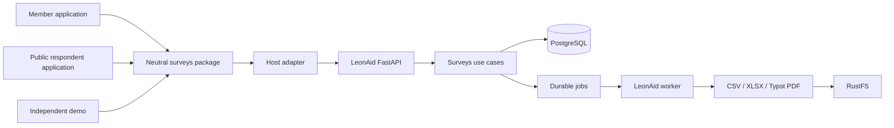
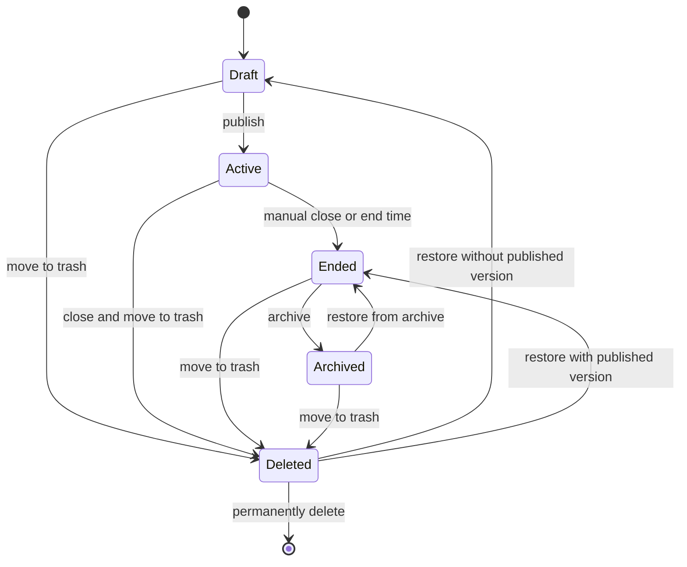
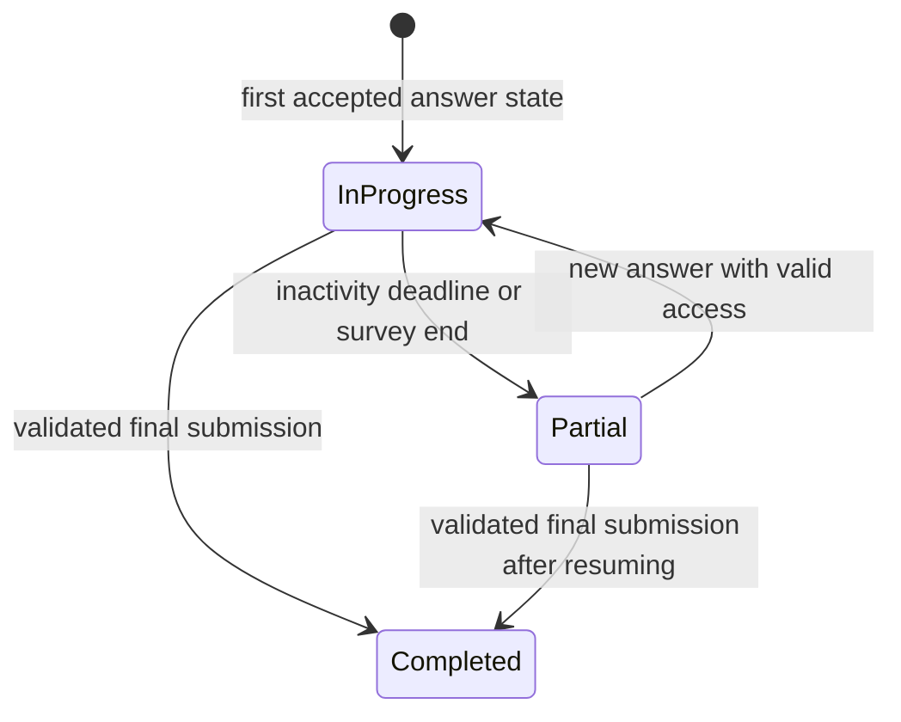

# Surveys — SurveyJS spike and implementation plan

Date: 2026-09-06

Status: implementation in progress; only checked acceptance criteria with linked evidence are proven

Own license decision: **UNDEFINED**, for both LeonAid and the new package

Baseline checkout: `5f5f52cf13d7a8cca84c62107fec438f72bc875b`

Companion documents: [Decisions](DECISIONS.md), [Capability matrix](CAPABILITIES.md),
[Dependency and license review](DEPENDENCIES.md).
Architecture baseline: [ADR-0003](../leonaid-poc/decisions/ADR-0003-core-architecture.md).
The German product navigation label remains **Umfragen**; planning documents,
identifiers and the specification directory use English.

## 1. Objective and scope

Provide a dedicated Surveys module for non-technical LeonAid members. Surveys
can stand alone or optionally belong to a CharityAction. An author creates a
multi-page questionnaire visually, publishes it, collects partial and complete
responses, and analyzes results through charts and CSV, XLSX and PDF exports.

Prove the complete workflow using two synthetic examples:

- Krapfentaxi: ordering and delivery satisfaction, recommendation, conditional
  follow-up for a low rating, and optional comments.
- Golf tournament: organization, course and catering ratings in a matrix,
  multiple-choice improvements, conditional follow-up and free text.

The golf example does not require a golf domain module: it can be a standalone
survey. It does not extend the existing Krapfentaxi pilot approval to a live
golf workflow. An independent demo must prove integration outside LeonAid.
The spike establishes feasibility and remaining effort, not production approval.

### Included

- A neutral React/TypeScript package for the editor, preview, respondent runner,
  save coordination, analytics components and public contracts.
- SurveyJS Form Library **3.x** for rendering and client-side questionnaire logic;
  an independently implemented editor and analytics UI; Typst for reports.
- A LeonAid backend module for lifecycle, versions, authorization, participation
  access, persistence, timeouts, aggregation, export jobs and deletion.
- Public links and personal invitation links for a small synthetic recipient set;
  email integration demonstrated through the existing worker and Mailpit.
- All four layers of the initial capability profile: authoring, rendering,
  server validation, and analysis/export.
- German user interfaces, mobile participation, keyboard operation and accessible
  table alternatives for charts.

### Later phases

Complex expressions, repeated groups, uploads, signatures, quizzes,
randomization, external choices, multilingual questionnaire authoring and
concurrent editor collaboration are extensions, not implicit spike promises.

Newsletter integration, automatic selection of all action participants,
reminder campaigns, full offline operation, multi-club operation and a separately
publishable backend product are outside this spike. Choosing our OSS license
and publishing a package are also outside scope.

## 2. SurveyJS 3 baseline and research findings

The official [3.0.0 release notes](https://surveyjs.io/stay-updated/release-notes/v3.0.0)
date the release to August 11, 2026. Select and pin a tested 3.x patch in
SURV-000; keep `survey-core` and the React renderer aligned. Check actual package
exports and applicable breaking changes rather than copying older examples.

The [2025–2026 overview](https://surveyjs.io/stay-updated/major-updates/2025-2026)
announces SSR support, describes a bundled questionnaire JSON schema, and
highlights expanded choice content. It also covers separate Creator, Dashboard
and PDF products. Those features do not automatically become features of our
custom editor, analytics or Typst reports. Some listed improvements predate 3.0.

Implementation consequences:

- Use a theme adapter boundary based on the documented
  [design tokens](https://surveyjs.io/documentation/design-tokens-css-customization)
  and evaluate the [framework adapters](https://surveyjs.io/themes/theme-adapters)
  against LeonAid's actual styles. Do not assume that a stock shadcn adapter
  matches the existing Base UI/custom styling exactly. Scope styles to avoid leaks.
- Evaluate SSR/hydration in the actual Astro/React host. Browser-only hydration
  remains an acceptable spike baseline; SSR is not a prerequisite for autosave.
  Never cache invitation-specific response HTML as public content. SSR does not
  provide answer persistence or authoritative backend validation.
- Use the version-matched bundled schema for definition diagnostics. Separately
  validate answer values, conditional visibility and completion rules on the server.
- Explicitly test unsupported nested choice content and newer question options
  at import/publish boundaries. Preserve unknown safe data without claiming it
  is supported for execution or analysis.
- Treat upstream accessibility claims as input, not proof for our custom editor,
  host theme and reports. Run our own keyboard, focus, contrast and browser checks.

Saved analytics views and richer choice/slider features are extension candidates
in CAPABILITIES.md. Upstream roadmap items are not implementation dependencies.
Our own license remains UNDEFINED; this document makes no license selection.

### Mandatory dependency boundary

Use only permissively licensed third-party software for the new module/package.
No commercial SurveyJS components, trial dependencies, license keys or copied
Creator/Dashboard/PDF source are allowed, including in the independent demo.
The initial SurveyJS allowlist is `survey-core` and `survey-react-ui` only.
Build the editor and analytics independently; generate reports through Typst.

[DEPENDENCIES.md](DEPENDENCIES.md) records the checked release licenses and
separately licensed font assets. SURV-000 must inspect exact resolved versions
and transitive dependencies; SURV-020 must verify the packed artifact, CSS,
fonts and browser bundles. Unknown or incompatible licenses block inclusion.
OFL-1.1 fonts are explicitly allowed as separately licensed assets; preserve
their notices and inspect bundled fonts and external font requests. This requirement does not select the license of our own
code or change existing LeonAid package metadata.

## 3. Existing integration points and package boundaries

Inspected in the baseline checkout:

| Existing location | Implementation implication |
|---|---|
| `packages/features/README.md` | UI features do not own persistent business or authorization logic. |
| `packages/ui/package.json` | Private LeonAid UI package; not a required dependency of the neutral package. |
| `src/leonaid/domain/policies.py` | Extend existing server-side role and resource scope checks. |
| `src/leonaid/application/outbox.py`, `adapters/postgres/outbox.py` | Durable side effects and retries. |
| `src/leonaid/application/invoice_documents.py` | Pattern for immutable, renderer-neutral document snapshots. |
| `src/leonaid/adapters/typst/invoice_renderer.py` | Existing invoice-specific infrastructure; survey reports need their own adapter/template. |
| `infra/compose/compose.yml` | FastAPI, worker, PostgreSQL, Caddy and RustFS are available building blocks. |
| `apps/web`, `apps/public` | Member administration and public participation hosts. |

### Proposed structure

These are implementation targets, not claims that the paths already exist.

| Component | Proposed location | Responsibility |
|---|---|---|
| Neutral package | `packages/surveys/` | Separate exports: `editor`, `runner`, `analytics`, `contracts`, `styles`; final public name undecided. |
| Independent demo | `apps/surveys-demo/` | Minimal host, example adapter, synthetic data. |
| Domain | `src/leonaid/domain/surveys/` | Lifecycle, invariants, version and response rules. |
| Application | `src/leonaid/application/surveys/` | Authorized use cases and persistence/validation/report ports. |
| Adapters | Existing `adapters` areas | PostgreSQL, aggregation, CSV/XLSX, Typst, object storage. |
| Transport and jobs | Existing `entrypoints` | FastAPI endpoints and worker jobs. |
| LeonAid UI integration | `apps/web`, `apps/public` | Navigation, identity, API adapter, translated text and theme integration. |

The package must not import the LeonAid API client, UI package, Twenty,
CharityAction or LeonAid authorization code. The host supplies narrowly scoped
adapters for definition loading, draft saving, participation, autosave,
completion, aggregate queries and export requests. Public runners receive no
administrative credentials or unnecessary authoring APIs. Editor code must not
be included in the respondent bundle. Styles and translations are configurable.
Typst runs behind a backend export port, not inside the frontend package.



## 4. Domain model and versioning

- **Survey:** identity, title, optional action reference, lifecycle status,
  responsible members, access mode and settings.
- **SurveyDraft:** editable questionnaire JSON, optimistic revision, preview and
  validation diagnostics.
- **SurveyVersion:** immutable published JSON, schema hash, capability profile,
  renderer version and publication timestamp.
- **Participation:** random identity, bound version, status, save revision,
  `last_answer_saved_at`, `completed_at` and progress information.
- **ResponseSnapshot:** latest accepted answer state per participation; only
  necessary visibility metadata, no permanent keystroke history.
- **Invitation:** separately protected recipient association, token hash,
  expiry and revocation.
- **AnalysisSnapshot / ExportJob:** selected filters, data timestamp, versions,
  denominators, permission scope and export state.

Each participation belongs to exactly one published version. The server never
uses a respondent-supplied questionnaire definition as its validation authority.
An active survey may have a separate working draft. Publishing that draft
changes the version for new participations; existing ones keep their version.
Question and choice IDs remain stable for wording-only changes. Semantic changes
must be identified explicitly. Analysis separates versions by default and never
merges them merely because question labels match.

## 5. Survey and participation lifecycles



Archived surveys are read-only but available for authorized analysis. Restoring
never reopens public access automatically. Repeating an ended survey uses a new
draft copied without responses, invitations or recipient associations.
Ending and submission race transactionally: writes arriving after the
server-side cutoff are rejected, while previously saved answers remain.
Ending classifies open participations as partial. Preview only creates test data.



Opening a link alone does not count as a response. A timeout identifies
inactivity, not a reliably detected browser closure. Completed responses are
not editable by respondents in the spike.

### Configurable timeout

- Backend setting `survey_partial_timeout_seconds`, default **1800**.
- Optional survey-level override; snapshot the effective timeout on participation
  creation so changes do not silently alter existing sessions.
- Use server time. Only an accepted actual answer change extends the deadline;
  polling, page views and retrying the same request do not.
- A worker classifies overdue participations idempotently and catches up after
  restarts. Analysis applies the same effective-status rule if the worker lags.
- Inactivity timeout, access-token expiry, survey end and retention are independent.
- Require positive bounded settings; record limits and sweep interval in SURV-010.
  Tests use controlled short deadlines.
- Resuming updates the same participation if access is valid and the survey is
  still active. Timeout neither deletes answers nor permanently locks access.

## 6. Autosave, recovery and validation

```mermaid
sequenceDiagram
    actor T as Respondent
    participant B as Browser with SurveyJS
    participant A as LeonAid API
    participant D as PostgreSQL
    participant W as Worker
    T->>B: Open link
    B->>A: Load definition and existing participation if available
    A-->>B: Bound version, answers and save revision
    T->>B: Answer first question
    B->>A: Save partial state with request ID and expected revision
    A->>A: Validate access and supplied answers
    A->>D: Atomically persist participation and response state
    D-->>A: New revision
    A-->>B: Save acknowledgement
    loop Answer changes and page navigation
        T->>B: Edit answer
        B->>A: Update same participation
        A->>D: Check revision and update snapshot
        A-->>B: Acknowledgement or conflict
    end
    alt Respondent leaves before completion
        Note over B: Browser closes; no final request required
        W->>D: Classify partial after configured inactivity
        Note over D: Saved answers remain available for analysis
    else Respondent completes
        T->>B: Submit
        B->>A: Atomically save final answers and complete
        A->>A: Apply full completion validation
        A->>D: Save final state and completed status
        A-->>B: Completion acknowledgement
    end
```

### Save contract

- SurveyJS events such as `onValueChanged` trigger our adapter. Debounce free
  text; prove the actual text-update mode saves without requiring a blur event.
- Flush pending changes on page navigation. Display saving, saved, unsaved and
  conflict states. Never show saved before a server acknowledgement.
- Order writes per participation. Expected revisions prevent stale requests or
  other tabs overwriting newer answers. Surface conflicts rather than silently
  using last-write-wins.
- Idempotent request IDs and atomic updates prevent duplicate participations.
  Final submission includes the latest answers; late autosave cannot undo completion.
- Retry transient network failures with bounded backoff. Unacknowledged last
  edits can still be lost on abrupt closure; unload events are not a reliable
  persistence guarantee.
- Reload the same version and saved answers when access allows resuming.
- No persistent offline answer cache in the spike; keep pending edits in memory
  while the tab is open. Protect the resume credential, including on shared devices.
- Inform respondents before starting that answers are saved during completion
  and may be analyzed even if they leave early.

### Early server-validation feasibility gate

Separate three concerns:

1. **Definition structure:** use version-matched SurveyJS JSON schema/property
   metadata for import/editor diagnostics.
2. **Supported capability profile:** reject publication of features that our
   backend and analysis do not support, even if structurally valid.
3. **Answer semantics:** types, allowed choices, ranges, conditional relevance,
   required answers and completion rules against the stored published definition.

A definition schema does not implement answer semantics. LeonAid uses Python;
SURV-010 compares an explicit limited Python rule model with an isolated
SurveyJS-Core server-side JS validation adapter. Select using identical browser
and server fixtures before expanding the editor. Document operating cost and
behavioral parity. No arbitrary script execution or unapproved external lookups.
Authorization always stays in LeonAid even if a JS validation adapter is needed.

Partial saving permits missing answers but checks supplied values. Invalid
in-progress input must remain visibly correctable and must not silently enter
statistics as valid data. Final submission enforces all applicable rules.
When earlier edits hide follow-up questions, remove their answers from the
current analyzable snapshot using the same relevance rules on client and server.
Showing those questions again requires a fresh answer, not hidden reuse.

## 7. Editor and compatibility

Provide a question palette, page outline, property forms, drag-and-drop with
keyboard alternatives, duplication, undo/redo, draft autosave and mobile/desktop
preview. Conditions use a guided “When … show …” interface. JSON editing is an
optional advanced import/export path, never a required authoring step.

CAPABILITIES.md defines the supported profile. Preserve unknown safe properties
on import. Make unsafe-to-edit regions read-only with understandable diagnostics.
Unknown executable content must not become publishable simply because the
renderer recognizes it. Test definition roundtrips and real SurveyJS rendering.
Record renderer version and capability profile; do not promise arbitrary
SurveyJS JSON compatibility.

## 8. Analytics and exports

The server computes authorized aggregates. Aggregate-only users must not receive
raw responses for browser-side calculation.

- Participation counts: in progress, partial, completed.
- Filters: date range, version, test/real data and status. Default analysis includes
  partial and completed responses; in-progress responses are shown separately.
- Choice/rating distributions, NPS, fixed matrix summaries, numeric summaries
  and an explicitly authorized free-text list.
- Per-question counts for relevant, answered, unanswered and hidden questions.
  Missing values are never converted into zero ratings.
- Document multi-select denominators; percentages may sum above 100 percent.
  Compute NPS only from valid answered NPS values.
- Last visited page is an abandonment indicator, not proof of the reason.
- Provide accessible data tables and appropriate access to small groups/free text.

| Export product | Contents |
|---|---|
| Response CSV | Documented flat columns, stable question/choice IDs, participation/version metadata, no access tokens. |
| Response XLSX | Data sheet, question/choice catalog, metadata sheet; future repeated data gets separate sheets. |
| Analysis XLSX | Metrics, aggregate tables, charts, filters and denominators. |
| Analysis PDF | Typst report with metrics, charts, filters and data timestamp; dedicated template. |

Use an immutable AnalysisSnapshot for comparable UI results and exports. Protect
CSV/XLSX from formula interpretation of user-controlled text. Test Unicode,
long text, empty values and matrix flattening. Verify PDF content and rendered
pages, including page breaks and font coverage. Generate report charts from
aggregate data, not screenshots of private browser pages.

Export jobs run through durable worker/outbox infrastructure and private object
storage. Recheck current permissions on download. Revocation or deletion must
stop/invalidate active jobs and existing downloads. Do not silently reuse
invoice-domain models as survey report models.

## 9. Access, permissions and deletion

### Access modes

- **Open anonymous link:** no CRM/order association. Random participation ID and
  protected resume access. No claim of one person/one response without identity
  verification; use bounded public endpoint abuse controls.
- **Personal invitation:** separately protected recipient association and
  revocable access. This is attributable, not anonymous. Do not embed contact
  information in aggregate payloads.

Resume credentials are random, protected server-side, excluded from logs and
exports, and scoped to one participation. Exchange invitation links for a
protected session where practical; prevent URL tokens leaking through referrers,
analytics and access logs. Mail belongs to the host adapter, independently of
newsletter tooling.

### Permissions

Define separate capabilities to design, publish/end, archive, view aggregates,
read individual responses/free text, export raw data, export reports, manage
invitations and permanently delete. Map to existing roles and explicitly assigned
survey members; do not build a general role designer in this spike.

Action-linked surveys respect action scope; standalone surveys use explicit
responsibility/assignments. Membership alone grants no automatic access.
Lists, counts, search, aggregate queries, downloads and writes share server-side
policy boundaries. Audit lifecycle, permission, export and deletion operations
without answer texts or credentials.

### Retention and deletion

Trash immediately blocks participation, invitations and ordinary analysis.
Permanent deletion removes definitions, responses, recipient associations and
export objects through a verifiable retryable workflow. Retained deletion status
must contain no deleted content. Database deletion does not erase old backups:
follow the existing backup lifecycle and reapply deletion records during restore.

Real retention/trash periods remain configurable and must be defined before
live use. Synthetic spike fixtures use explicit short test settings. Inactivity
never triggers deletion. Handle concurrent autosave/export and deletion safely.

## 10. Work packages and acceptance evidence

Work-package acceptance is tracked by the checklists below. Each receives a
`proofs/SURV-xxx.md` document with versions, commands, outcomes and limitations.
Build success alone is insufficient. Product runtimes and relevant tests run
in Docker through `./leonaid`; command availability and successful execution
must be recorded separately in the evidence.

| ID | Implementation | Dependencies | Required evidence |
|---|---|---|---|
| SURV-000 | Contracts, data model, role mapping, capability profile, SurveyJS 3 patch and integration baseline | — | Reviewable contracts, migration outline, verified package/API and theme/SSR assumptions; exact dependency license inventory and permissive allowlist; no own license choice. |
| SURV-010 | Vertical autosave/validation proof; select authoritative validation adapter | 000 | Real browser → API → PostgreSQL; text without blur, matrix/conditions, abandon/resume, invalid partial/final input and short timeout. |
| SURV-020 | Neutral package, separate entrypoints, theme boundary and independent demo | 010 | Packed artifact runs outside workspace resolution with no LeonAid imports; styles isolated; packed dependency/asset licenses verified, no commercial components; document SSR/hydration result. |
| SURV-030 | Domain, migrations, immutable versions and lifecycle | 010 | Allowed/forbidden transitions, concurrent publish/edit, close/submit race, restore never reopens automatically. |
| SURV-040 | Visual editor with initial types, conditions, undo/redo, JSON roundtrip | 020, 030 | Both examples authored without JSON input; drag-and-drop and keyboard; unknown fields preserved and unsupported publication blocked. |
| SURV-050 | Public runner, ordered autosave, timeout and recovery | 020, 030, 040 | Reordered/duplicate requests, two tabs, network loss, restart, resumable partial status, idempotent completion. |
| SURV-060 | Module navigation, permissions, action links, access modes and test mode | 030, 050 | Differently authorized members, foreign IDs rejected, actual Mailpit invitation, anonymous response without CRM linkage. |
| SURV-070 | Server aggregates, charts and filters | 040, 050, 060 | Golden denominators, partial/hidden answers, multi-select, NPS and separate versions; no raw-data leak to aggregate-only users. |
| SURV-080 | CSV/XLSX response exports, XLSX/Typst reports and export jobs | 070 | Equal numbers for identical snapshot; readable XLSX charts; rendered PDF review; effective download revocation. |
| SURV-090 | Trash, permanent deletion, retention, backup/restore and operating limits | 050, 060, 080 | Real DB/object-store recovery; safe autosave/export/deletion races; no answers/tokens in logs. |
| SURV-100 | End-to-end acceptance and spike outcome report | 000–090 | Both real browser journeys, isolated package demo, limitations and remaining product effort documented. |

### Execution checklist

The overview above is the dependency map. The following checklists are the
implementation backlog. Existing checked items retain their recorded evidence.
An implementation checkbox records code delivery; it does not imply acceptance.
Each task below names its acceptance criteria. A task is accepted only when all
of those criteria pass; unchecked criteria keep its acceptance open, even when
its implementation checkbox is checked. Check an acceptance item only after the
stated test passes. Test implementation and execution are explicit tasks too.
Each work package records commit, dependency versions, exact commands, exit
codes, fixture IDs and evidence paths in `proofs/SURV-xxx.md`. Failures and
unsupported cases stay explicit. Do not create passing proof placeholders.

**Test contract:** integration tests exercise actual FastAPI, PostgreSQL and,
where relevant, the worker, Mailpit, RustFS and Typst in an isolated Docker
stack. E2E means Playwright through the actual member/public UI and API, with no
mocked survey persistence, authorization or export endpoints. Use deterministic
synthetic fixtures and short injected timeout settings, not production data or
long sleeps. Network fault injection is allowed; it must not replace the server.
Unit/component tests complement these checks and cannot substitute for them.
All scenario tests assert outcomes, including persisted state and negative cases.

### Task completion and test traceability

Use [TASK-ACCEPTANCE.md](TASK-ACCEPTANCE.md) as the task-level acceptance
template inside each work-package proof. Every implementation task must have
its own row; a work-package summary alone is insufficient. Expand each linked
acceptance criterion into named scenarios with prerequisites, actions and
observable expected results before implementing its test. Shared tests may
cover several tasks, but each task must link to the specific relevant assertions.

Use the stable task IDs in implementation commits and test descriptions. Keep
implementation (`xxx.n`), test delivery/execution (`xxx.Tn`) and acceptance
(`xxx.An`) separate. An implemented feature with a failing or missing integration
or E2E test remains unaccepted. A work package is complete only when all its
implementation, test and acceptance checkboxes are checked.

For each test task, turn the listed scenarios into individually named tests;
one successful smoke journey cannot stand in for the other scenarios. Its proof
must contain this checklist, completed with actual results:

- [ ] Link every referenced acceptance ID to its test file and test name.
- [ ] Record the tested commit, exact command, dependency/image versions and exit code.
- [ ] Assert the visible outcome and the authoritative persisted state where applicable.
- [ ] Exercise the specified rejection, concurrency and recovery cases, not just success.
- [ ] Record Docker project isolation and successful cleanup of that run's resources.
- [ ] Link sanitized failure/success artifacts; record manual observations separately.
- [ ] Leave failed, skipped or unimplemented criteria open with a concrete reason.

The following suite allocation is an implementation target. Reuse existing
tests where they already prove a scenario; proposed files are not evidence of
implementation. Integration tests may live in the existing Docker harness, but
their named scenarios and acceptance mapping must be discoverable from the proof.

| Work package | Integration / contract suite responsibility | Browser E2E suite responsibility |
|---|---|---|
| SURV-000 | DTO/error fixtures, persona seeds, clean migration and dependency rejection | `surveys-infrastructure.spec.mjs`: both hosts, member session, diagnostics and cleanup |
| SURV-010 | Shared validation fixtures, real partial/final writes and timeout resumption | `surveys-runner.spec.mjs`: text without blur, fresh-context restore and hidden-answer cleanup |
| SURV-020 | Packed consumer installation, real adapter, bundle/import/license boundaries | Proposed `surveys-package.spec.mjs`: independent host, theme/translation and hydration |
| SURV-030 | Baseline/empty migrations, all lifecycle edges, publication and closing races | Proposed `surveys-lifecycle.spec.mjs`: create through restore, with public access checks |
| SURV-040 | Draft roundtrip, stable IDs, unsupported definitions and stale revisions | `surveys-editor.spec.mjs`, `surveys-authoring.spec.mjs`, `surveys-import-recovery.spec.mjs`, `surveys-accessibility.spec.mjs`: structural editing, both examples, recovery and keyboard authoring |
| SURV-050 | Duplicate/reordered writes, terminal completion, timeout snapshots and worker restart | `surveys-runner.spec.mjs`: offline/reconnect, two tabs, lost acknowledgement, abandon/resume |
| SURV-060 | Persona/resource denial matrix, invitation retries/revocation and identity separation | Proposed `surveys-module.spec.mjs`: navigation, Mailpit invitation, timeout settings and test-data isolation |
| SURV-070 | Hand-calculated aggregate fixtures, version/status filters and raw-data denial | Proposed `surveys-analytics.spec.mjs`: filters, chart/table agreement, empty states and restricted views |
| SURV-080 | Real worker/storage exports, parsed values, formula safety, retry and download revocation | Proposed `surveys-exports.spec.mjs`: all four downloads, job states and permission denial; separate PDF/XLSX render review |
| SURV-090 | Deletion races, interrupted cleanup, real backup restore and limits/log inspection | Proposed `surveys-deletion.spec.mjs`: open respondent during trash, rejected saves and closed restoration |
| SURV-100 | Aggregate gate, repeat clean-stack run, packed consumer and affected regressions | Proposed `surveys-journeys.spec.mjs`: both complete sample journeys on desktop and mobile |

Test filenames may change during implementation; update this mapping and the
proof together. The acceptance IDs and required outcomes remain authoritative.

### Execution gates

- [x] **Validation gate:** accept 010.A1 before treating the initial capability
  profile as authoritative. A working editor or passing happy-path browser test
  does not resolve unproven client/server semantics.
- [ ] **Package gate:** accept 020.A1–020.A4 using the packed independent
  consumer before claiming that the package is reusable outside LeonAid.
- [ ] **Module gate:** complete the deferred 030.A4 lifecycle journey after
  SURV-060 supplies the member UI; backend-only evidence cannot close this item.
- [ ] **Analysis gate:** accept SURV-070 against hand-calculated fixtures before
  using its snapshots as the reference values for SURV-080 export acceptance.
- [ ] **Final gate:** complete SURV-100 only after all required predecessor
  criteria and the exit criteria below pass. Record any missing prerequisite as
  open; do not replace it with a narrower successful test.

Independent implementation may proceed while a gate is open, but dependent
acceptance remains open until its prerequisite evidence exists. These gates
summarize existing criteria and do not replace their individual checkboxes.

### SURV-000 — Contracts, dependency selection and test infrastructure

Dependencies: none.

Implementation tasks:

- [ ] **000.1** Define versioned DTOs and ports for drafts, publication, participation, saves, completion, aggregates and exports; specify errors, revision conflicts and idempotency. Acceptance: **000.A1**.
- [ ] **000.2** Map existing roles and resource scopes to survey capabilities; define database entities, constraints and migration sequence. Acceptance: **000.A1, 000.A2**.
- [ ] **000.3** Pin compatible SurveyJS 3 core/React versions and permissive editor/chart/XLSX dependencies; inventory transitive software and asset licenses, including OFL notices. Acceptance: **000.A4**.
- [ ] **000.4** Build deterministic Krapfentaxi/golf fixtures and persona seeds in the existing testkit; add isolated Docker test entrypoints and artifact collection. Acceptance: **000.A2, 000.A3**.
- [ ] **000.5** Specify the initial capability profile, limits and client/server semantics; record chosen token mapping and SSR/hydration probe strategy. Acceptance: **000.A1**.

Test implementation and verification tasks:

- [ ] **000.T1** Add DTO/error-contract checks, persona/capability fixture coverage, clean-stack migration and database roundtrip tests, plus prohibited/unknown-dependency negative fixtures. Acceptance: **000.A1, 000.A2, 000.A4**. All automated checks exit zero; record explicit review findings for non-executable checks. Link test paths, exact commands, results and sanitized evidence in the work-package proof.
- [ ] **000.T2** Add a Playwright smoke journey through both hosts: authenticate a synthetic member, open a public route, and verify failure diagnostics and cleanup. Acceptance: **000.A3**. Each automated journey passes; record browser/viewport and assertions, and identify manual render/accessibility observations separately. Link test paths, exact commands, results and sanitized evidence in the work-package proof.

Acceptance criteria:

- [ ] **000.A1 — Contract:** every write defines authorization, invalid-input behavior, concurrency behavior and persistence outcome; fixtures cover all C-01–C-15 capabilities.
- [x] **000.A2 — Integration:** a clean test stack migrates/seeds successfully; a test client reaches the real API and verifies a database roundtrip, with isolated teardown. [Evidence](proofs/SURV-000.md).
- [ ] **000.A3 — E2E infrastructure:** Playwright reaches both UI hosts, authenticates a synthetic member and opens a public route; failures retain useful sanitized diagnostics and fail the command.
- [x] **000.A4 — Dependencies:** automated inventory rejects a prohibited or unknown dependency in a negative fixture; no commercial SurveyJS packages are selected and own license remains UNDEFINED. [Evidence](proofs/SURV-000.md).

### SURV-010 — Vertical autosave and authoritative validation proof

Current evidence: [SURV-010](proofs/SURV-010.md). Remaining unchecked items are not yet proven.

Dependencies: SURV-000. Use fixture definitions and a minimal runner before the
full editor exists; carry the proven contracts into later work packages.

Implementation tasks:

- [x] **010.1** Implement minimal definition loading, participation creation, revisioned snapshot saving, restoration and completion through the real API/database. Acceptance: **010.A2, 010.A3, 010.A5**.
- [x] **010.2** Compare the explicit Python rule model with an isolated SurveyJS-Core validation adapter; select and document the option that proves equivalent initial-profile semantics. Acceptance: **010.A1**. [Executable selection evidence](proofs/SURV-010.md#isolated-validation-candidate-selection) and [integrated proof](proofs/SURV-010.md#shared-core-backend-integration).
- [x] **010.3** Implement required/type/bounds/choice/matrix validation, relevance evaluation and hidden-answer cleanup; distinguish incomplete answers from invalid values. Wire the selected shared-Core adapter into the actual save/completion path after host definition approval; bound calls and reject adapter failures without partial writes. Acceptance: **010.A1, 010.A2, 010.A4**. [Evidence](proofs/SURV-010.md#shared-core-backend-integration).
- [x] **010.4** Wire answer events and debounced text updates to persistence; implement a short configurable timeout classification proof. Acceptance: **010.A3, 010.A4, 010.A5**.

Test implementation and verification tasks:

- [x] **010.T1** Run identical supported-definition/answer fixtures through SurveyJS and the server validator; exercise forged values, incomplete saves, atomic completion and short-timeout resumption through the real API/database. Acceptance: **010.A1, 010.A2, 010.A5**. All automated checks exit zero; record explicit review findings for non-executable checks. Link test paths, exact commands, results and sanitized evidence in the work-package proof. [Evidence](proofs/SURV-010.md#shared-core-backend-integration).
- [x] **010.T2** Add browser tests for text saved without blur, closing and restoring a fresh browser context, and conditional follow-up removal across navigation and reload. Acceptance: **010.A3, 010.A4**. Each automated journey passes; record browser/viewport and assertions, and identify manual render/accessibility observations separately. Link test paths, exact commands, results and sanitized evidence in the work-package proof.

Acceptance criteria:

- [x] **010.A1 — Integration:** shared fixtures produce equivalent client/server relevance and validation; unsupported definitions and forged values fail server checks even when client validation is bypassed. [Evidence](proofs/SURV-010.md#shared-core-backend-integration).
- [x] **010.A2 — Integration:** incomplete required fields can be saved; invalid values are rejected or explicitly represented under the documented contract; completion rejects missing relevant required answers atomically.
- [x] **010.A3 — E2E:** enter text without blur, wait for save acknowledgement, close the browser and resume in a fresh context using valid resume access; the server restores the exact accepted text and page.
- [x] **010.A4 — E2E:** change an earlier answer to hide a follow-up, navigate back/forward and reload; obsolete follow-up data is absent from the current analyzable snapshot.
- [x] **010.A5 — Integration:** the configured short timeout classifies the participation as partial; resumption updates the same participation, with no duplicate record.

### SURV-020 — Neutral package and independent demo

Dependencies: SURV-010.

Implementation tasks:

- [ ] **020.1** Create separate editor, runner, analytics, contracts and styles entrypoints with host-supplied adapters and translation/theme configuration. Acceptance: **020.A1, 020.A2, 020.A3**.
- [ ] **020.2** Build a standalone demo consuming a packed artifact outside workspace resolution; provide a minimal real backend adapter for its integration proof. Acceptance: **020.A1, 020.A3**.
- [ ] **020.3** Implement scoped SurveyJS token styling and the chosen browser hydration mode; investigate SSR and record the observed compatibility boundary. Acceptance: **020.A3, 020.A4**.
- [ ] **020.4** Add bundle/import and license checks, third-party notices and explicit OFL asset handling. Acceptance: **020.A2**.

Test implementation and verification tasks:

- [ ] **020.T1** Install the packed artifact into a clean external consumer, save/load through its real adapter, and inspect dependency, bundle and license boundaries including font notices. Acceptance: **020.A1, 020.A2**. All automated checks exit zero; record explicit review findings for non-executable checks. Link test paths, exact commands, results and sanitized evidence in the work-package proof.
- [ ] **020.T2** Exercise the independent demo with host translations/styles; verify adjacent controls, reload/hydration, and absence of restoration-triggered writes or duplicate participations. Acceptance: **020.A3, 020.A4**. Each automated journey passes; record browser/viewport and assertions, and identify manual render/accessibility observations separately. Link test paths, exact commands, results and sanitized evidence in the work-package proof.

Acceptance criteria:

- [ ] **020.A1 — Integration:** a clean external consumer installs the packed artifact and uses its adapter to save/load a real response; no LeonAid internal package imports resolve transitively.
- [ ] **020.A2 — Bundle:** the respondent entrypoint excludes editor code; distribution inspection finds no commercial SurveyJS component and retains all required software/font notices.
- [ ] **020.A3 — E2E:** the standalone demo renders and submits a questionnaire with its own styling/translations; adjacent host controls retain their styles.
- [ ] **020.A4 — E2E:** restoration/hydration creates no unintended save or duplicate participation; browser-only fallback or proven SSR is documented, with no public caching of private state.

### SURV-030 — Lifecycle, migrations and immutable versions

Current backend evidence: [SURV-030](proofs/SURV-030.md). Lifecycle UI acceptance remains open.

Dependencies: SURV-010.

Implementation tasks:

- [ ] **030.1** Implement schema migrations, repositories and lifecycle use cases for draft, active, ended, archived and deleted surveys. Acceptance: **030.A1, 030.A4**.
- [x] **030.2** Implement revisioned draft editing, immutable publication, version-bound participation and duplication without recipients or answers. Acceptance: **030.A2, 030.A3**.
- [ ] **030.3** Enforce allowed transitions, transactional survey-end cutoff and restore behavior in server policies and database transactions. Acceptance: **030.A1, 030.A2, 030.A4**.

Test implementation and verification tasks:

- [ ] **030.T1** Test migrations from empty and baseline databases, all lifecycle edges, simultaneous draft/publish writes, close/submit races, version binding and response-free duplication. Acceptance: **030.A1, 030.A2, 030.A3**. All automated checks exit zero; record explicit review findings for non-executable checks. Link test paths, exact commands, results and sanitized evidence in the work-package proof.
- [ ] **030.T2** Automate create, publish, end, archive, trash and restore through the member UI; compare persisted lifecycle state and verify public access remains closed after restoration. Acceptance: **030.A4**. Each automated journey passes; record browser/viewport and assertions, and identify manual render/accessibility observations separately. Link test paths, exact commands, results and sanitized evidence in the work-package proof.

Acceptance criteria:

- [ ] **030.A1 — Integration:** migrations work on an empty database and an existing baseline fixture; lifecycle transition tests cover every allowed and forbidden edge in section 5.
- [x] **030.A2 — Integration:** simultaneous draft saves/publications cannot lose edits or create inconsistent published versions; close/submit races obey the documented transaction cutoff.
- [x] **030.A3 — Integration:** publishing v2 leaves existing v1 participations bound to v1; new participations use v2, and duplication includes no responses or access credentials.
- [ ] **030.A4 — E2E:** after SURV-060 UI integration, create, publish, end, archive, trash and restore a survey; UI state matches the API and restoration never silently reopens participation.

### SURV-040 — Visual questionnaire editor

Editor implementation and scoped acceptance evidence: [SURV-040](proofs/SURV-040.md). Independent packaging, complete theme/mobile coverage and the overall spike remain open in their respective work packages.

Dependencies: SURV-020, SURV-030.

Implementation tasks:

- [x] **040.1** Implement page/question creation, reordering, movement, duplication and removal with stable IDs and keyboard alternatives to dragging. Acceptance: **040.A1, 040.A3, 040.A4**.
- [x] **040.2** Implement property panels for initial question types, presentation, required flags, bounds and guided conditions; add live preview. Acceptance: **040.A2, 040.A3, 040.A4**.
- [x] **040.3** Implement undo/redo, revision-aware draft autosave, save/conflict indicators and safe JSON import/export with diagnostics. Acceptance: **040.A1, 040.A2, 040.A5**.
- [x] **040.4** Preserve safe unknown regions read-only; enforce capability-profile publication validation without silently discarding unsupported data. Acceptance: **040.A1, 040.A2**.

Test implementation and verification tasks:

- [x] **040.T1** Roundtrip editor definitions through the draft API/database; assert stable IDs, safe unknown-property preservation, stale-save conflicts and field-specific rejection of unsupported or unsafe imports. Acceptance: **040.A1, 040.A2**. All automated checks exit zero; record explicit review findings for non-executable checks. Link test paths, exact commands, results and sanitized evidence in the work-package proof.
- [x] **040.T2** Author both complete sample questionnaires through the UI; cover guided conditions, preview/publication, drag and keyboard reordering, undo/redo, interrupted saves, focus and accessible labels. Acceptance: **040.A3, 040.A4, 040.A5**. Each automated journey passes; record browser/viewport and assertions, and identify manual render/accessibility observations separately. Link test paths, exact commands, results and sanitized evidence in the work-package proof.

Acceptance criteria:

- [x] **040.A1 — Integration:** editor-produced definitions roundtrip through the draft API/database without changing stable IDs or safe unknown properties; stale saves report a conflict.
- [x] **040.A2 — Integration:** structurally valid but unsupported or unsafe imported definitions cannot publish; validation identifies the affected field or question.
- [x] **040.A3 — E2E:** author both complete sample questionnaires without entering JSON; reorder pages/questions, configure conditions, preview, reload and publish the persisted result.
- [x] **040.A4 — E2E:** complete the core authoring journey by keyboard, including reordering and error recovery; verify focus/labels with accessibility checks and document manual observations.
- [x] **040.A5 — E2E:** undo/redo and an interrupted draft save behave visibly and correctly after reconnect; the editor never claims an unacknowledged change is saved.

### SURV-050 — Public runner, ordered saves and recovery

Partial runner evidence: [browser autosave and recovery](proofs/SURV-010.md#browser-autosave-and-recovery-proof).

Dependencies: SURV-020, SURV-030, SURV-040.

Implementation tasks:

- [ ] **050.1** Implement the full multipage runner, page-transition flush, debounced text saves, save status and in-memory retry queue. Acceptance: **050.A3, 050.A5**.
- [ ] **050.2** Implement revision checks, idempotency, response ordering, multi-tab conflicts and atomic completion, including retry after a lost completion acknowledgement. Acceptance: **050.A1, 050.A4**.
- [ ] **050.3** Implement backend timeout default/override settings, effective per-participation configuration, classification worker and consistent read-time classification. Acceptance: **050.A2, 050.A5**.
- [ ] **050.4** Implement protected resume access and restoration; suppress save events caused solely by restoring existing data. Acceptance: **050.A3, 050.A4, 050.A5**.

Test implementation and verification tasks:

- [ ] **050.T1** Inject duplicate/reordered writes and API/worker restarts; test terminal idempotent completion, default/override timeout snapshots, unchanged writes and delayed classification without data loss. Acceptance: **050.A1, 050.A2**. All automated checks exit zero; record explicit review findings for non-executable checks. Link test paths, exact commands, results and sanitized evidence in the work-package proof.
- [ ] **050.T2** Exercise offline typing/reconnect, two-tab conflicts, delayed requests, lost completion acknowledgements, and abandon/timeout/resume; inspect saved state and visible save/error indicators. Acceptance: **050.A3, 050.A4, 050.A5**. Each automated journey passes; record browser/viewport and assertions, and identify manual render/accessibility observations separately. Link test paths, exact commands, results and sanitized evidence in the work-package proof.

Acceptance criteria:

- [ ] **050.A1 — Integration:** duplicate and reordered writes cannot overwrite newer answers; completion is idempotent and terminal, even across API/worker restarts.
- [ ] **050.A2 — Integration:** default and survey override timeouts use server-observed answer changes; unchanged requests do not extend inactivity, worker delay does not misclassify analysis, and timeout never deletes data.
- [ ] **050.A3 — E2E:** disconnect mid-page, continue typing, reconnect and verify accepted answers after reload; pending data is never shown as saved and lost unsent edits are not claimed recoverable after tab closure.
- [ ] **050.A4 — E2E:** edit from two tabs, deliberately reorder requests and retry completion; conflicts are visible and exactly one completed participation exists.
- [x] **050.A5 — E2E:** abandon halfway, expire the short timeout and resume; partial answers remain available and the same participation can complete while access remains valid.

### SURV-060 — LeonAid module, permissions and invitations

Dependencies: SURV-030, SURV-050. Supplies the lifecycle UI needed to finish 030.A4.

Implementation tasks:

- [ ] **060.1** Add Umfragen navigation, lifecycle screens, action linking, explicit standalone ownership and backend timeout controls. Acceptance: **060.A4, 060.A5**.
- [ ] **060.2** Enforce distinct design/publish/read/aggregate/export/invite/delete capabilities across API routes, lists, counts and UI actions. Acceptance: **060.A1, 060.A4**.
- [ ] **060.3** Implement anonymous links, revocable attributable invitations, secure resume sessions and synthetic invitation delivery through outbox/worker/Mailpit. Acceptance: **060.A2, 060.A3**.
- [ ] **060.4** Add preview/test participation isolation so author testing does not contaminate collected responses or analysis. Acceptance: **060.A5**.

Test implementation and verification tasks:

- [ ] **060.T1** Exercise every persona/resource capability against lists, counts and direct endpoints; test foreign IDs, anonymous identity separation, invitation retries, expiry/revocation and token-free logs/exports. Acceptance: **060.A1, 060.A2**. All automated checks exit zero; record explicit review findings for non-executable checks. Link test paths, exact commands, results and sanitized evidence in the work-package proof.
- [ ] **060.T2** Send an invitation through the UI and worker, retrieve it from Mailpit and participate; test revocation, action/standalone permissions, timeout settings and exclusion of preview/test data. Acceptance: **060.A3, 060.A4, 060.A5**. Each automated journey passes; record browser/viewport and assertions, and identify manual render/accessibility observations separately. Link test paths, exact commands, results and sanitized evidence in the work-package proof.

Acceptance criteria:

- [ ] **060.A1 — Integration:** persona/resource matrix rejects foreign survey IDs, unauthorized transitions and unauthorized list/count/data access; anonymous responses have no CRM/order association.
- [ ] **060.A2 — Integration:** invitation retries do not create duplicate logical invitations; revoked/expired access is rejected, and credentials are absent from response exports and captured application logs.
- [ ] **060.A3 — E2E:** authorized member sends a test invitation, retrieves it from Mailpit and completes the real linked survey; a revoked invitation no longer grants access.
- [ ] **060.A4 — E2E:** action-scoped and standalone personas see only permitted operations; direct navigation and direct API calls cannot bypass hidden controls.
- [ ] **060.A5 — E2E:** change the timeout through the backend UI and verify its effect on a new participation; existing participations retain their effective setting and test responses remain excluded from production analysis.

### SURV-070 — Aggregates, charts and filters

Dependencies: SURV-040, SURV-050, SURV-060.

Implementation tasks:

- [ ] **070.1** Implement immutable analysis snapshots, status/version filters and per-question relevance/answer denominators. Acceptance: **070.A1, 070.A2, 070.A3**.
- [ ] **070.2** Implement distributions, rating summaries, NPS and matrix aggregates with explicit handling of missing, hidden and invalid values. Acceptance: **070.A1, 070.A3**.
- [ ] **070.3** Build custom charts and accessible tables, plus separately authorized free-text/individual-response views. Acceptance: **070.A2, 070.A3, 070.A4**.

Test implementation and verification tasks:

- [ ] **070.T1** Seed hand-calculated golden results for all supported aggregates, statuses and versions; assert denominators, empty data, hidden/missing answers and aggregate-only payload authorization. Acceptance: **070.A1, 070.A2**. All automated checks exit zero; record explicit review findings for non-executable checks. Link test paths, exact commands, results and sanitized evidence in the work-package proof.
- [ ] **070.T2** Switch status/version/date filters and compare chart labels with snapshot tables; exercise empty states, keyboard table access and denial of raw/free-text routes. Acceptance: **070.A3, 070.A4**. Each automated journey passes; record browser/viewport and assertions, and identify manual render/accessibility observations separately. Link test paths, exact commands, results and sanitized evidence in the work-package proof.

Acceptance criteria:

- [ ] **070.A1 — Integration:** seeded golden data matches hand-calculated counts, percentages and NPS, including empty results, multiselect and partial responses; versions never merge implicitly.
- [ ] **070.A2 — Integration:** aggregate-only users receive no raw answer texts or recipient identities in any aggregate payload; unauthorized filters/resources are rejected.
- [ ] **070.A3 — E2E:** switch completed/partial/version filters and verify chart labels and tables against the same snapshot; empty states and zero denominators remain meaningful.
- [ ] **070.A4 — E2E:** keyboard users can access equivalent table data; an aggregate-only persona cannot open individual response/free-text routes.

### SURV-080 — CSV, XLSX and Typst exports

Dependencies: SURV-070.

Implementation tasks:

- [ ] **080.1** Implement response CSV/XLSX and analysis XLSX from a shared AnalysisSnapshot, with stable columns, metadata, denominators and formula-safe text. Acceptance: **080.A1, 080.A2, 080.A4, 080.A6**.
- [ ] **080.2** Implement server chart rendering and a dedicated Typst analysis template; support Unicode, long text and pagination. Acceptance: **080.A1, 080.A4, 080.A5**.
- [ ] **080.3** Implement durable export jobs, private object storage, retry/error states, authorized downloads and revocation/deletion invalidation. Acceptance: **080.A3, 080.A4, 080.A6**.

Test implementation and verification tasks:

- [ ] **080.T1** Generate all four export products through real worker/storage adapters; parse values and metadata, test formula injection and renderer retries, and revoke permissions/delete surveys before jobs and downloads. Acceptance: **080.A1, 080.A2, 080.A3**. All automated checks exit zero; record explicit review findings for non-executable checks. Link test paths, exact commands, results and sanitized evidence in the work-package proof.
- [ ] **080.T2** Request and download each export through the UI, compare snapshot values, test denied raw exports, and render PDF pages/XLSX charts for recorded clipping, font, legend and pagination review. Acceptance: **080.A4, 080.A5, 080.A6**. Each automated journey passes; record browser/viewport and assertions, and identify manual render/accessibility observations separately. Link test paths, exact commands, results and sanitized evidence in the work-package proof.

Acceptance criteria:

- [ ] **080.A1 — Integration:** real worker jobs generate all four export products; parse CSV/XLSX and extract PDF text to verify golden snapshot values, filter metadata and absence of access tokens.
- [ ] **080.A2 — Integration:** malicious formula-like text remains inert in CSV/XLSX; Unicode, empty cells and matrices survive parsing, and report generation failures are retryable without false success.
- [ ] **080.A3 — Integration:** permission revocation and survey deletion block queued jobs and downloads, including previously created artifacts; object access is not public.
- [ ] **080.A4 — E2E:** request each export from the analysis UI, observe job completion and download through the authenticated route; exported numbers match the displayed snapshot.
- [ ] **080.A5 — Render review:** inspect rendered PDF pages and XLSX charts for clipping, legends, fonts and pagination; retain synthetic visual evidence and record any manual checks separately from automated tests.
- [ ] **080.A6 — E2E:** a user without raw-export permission cannot request or download raw files even when aggregate-report export is allowed.

### SURV-090 — Deletion, recovery and operational limits

Dependencies: SURV-050, SURV-060, SURV-080.

Implementation tasks:

- [ ] **090.1** Implement trash/restore, configurable retention and retryable permanent deletion of definitions, responses, invitations and export objects. Acceptance: **090.A1, 090.A2, 090.A5**.
- [ ] **090.2** Implement content-free deletion records and restore-time reapplication; integrate the existing backup/recovery workflow using isolated synthetic data. Acceptance: **090.A3**.
- [ ] **090.3** Enforce documented payload, public-request and export limits; audit operations without answer content or resume credentials. Acceptance: **090.A4**.

Test implementation and verification tasks:

- [ ] **090.T1** Race deletion with saves/completion/export, interrupt and retry database/object cleanup, restore a real synthetic backup and reapply deletion records; verify limits and scan logs for seeded sensitive markers. Acceptance: **090.A1, 090.A2, 090.A3, 090.A4**. All automated checks exit zero; record explicit review findings for non-executable checks. Link test paths, exact commands, results and sanitized evidence in the work-package proof.
- [ ] **090.T2** Trash a survey while its public page is open; verify visible save rejection, blocked invitations/downloads, and restoration without automatic public reopening. Acceptance: **090.A5**. Each automated journey passes; record browser/viewport and assertions, and identify manual render/accessibility observations separately. Link test paths, exact commands, results and sanitized evidence in the work-package proof.

Acceptance criteria:

- [ ] **090.A1 — Integration:** race deletion against autosave, completion and export workers; no late write recreates deleted data or leaves a downloadable export.
- [ ] **090.A2 — Integration:** crash/retry permanent deletion across PostgreSQL and RustFS; all targeted content is removed and repeated processing remains safe.
- [ ] **090.A3 — Integration:** restore a real test backup, reapply deletion records and verify previously deleted survey data is inaccessible and removed; demonstrate that inactivity alone deletes nothing.
- [ ] **090.A4 — Integration:** over-limit requests fail predictably without partial writes; inspect captured logs for seeded sensitive markers and credentials.
- [ ] **090.A5 — E2E:** trash a survey while its public page is open; subsequent saves fail visibly, invitations/downloads stop working, and restore keeps participation closed until the permitted lifecycle action.

### SURV-100 — Full acceptance and spike outcome

Dependencies: SURV-000–090, including deferred lifecycle E2E acceptance.

Implementation tasks:

- [ ] **100.1** Wire the aggregate survey test command and CI lane, deterministic isolation/cleanup and failure artifact handling. Acceptance: **100.A1, 100.A2, 100.A3, 100.A5**.
- [ ] **100.2** Execute complete author → invite/public participation → abandon/resume → analyze → export → archive/delete journeys for both sample surveys. Acceptance: **100.A2, 100.A4**.
- [ ] **100.3** Verify the packed independent consumer and run affected existing identity, policy, public and integration regression suites. Acceptance: **100.A3, 100.A5**.
- [ ] **100.4** Produce the outcome report with observed capability coverage, open defects, performance/size observations and remaining production work; keep publication and own license undecided. Acceptance: **100.A4, 100.A5**.

Test implementation and verification tasks:

- [ ] **100.T1** Run the aggregate gate from empty volumes and again, including worker/storage recovery, packed-consumer and affected regression checks; audit capability-to-proof links and sanitized delivery artifacts. Acceptance: **100.A1, 100.A3, 100.A4, 100.A5**. All automated checks exit zero; record explicit review findings for non-executable checks. Link test paths, exact commands, results and sanitized evidence in the work-package proof.
- [ ] **100.T2** Run both complete author-to-deletion journeys on desktop and mobile against real services, including invitation, partial response/resumption, version isolation, permissions, analysis and every export. Acceptance: **100.A2**. Each automated journey passes; record browser/viewport and assertions, and identify manual render/accessibility observations separately. Link test paths, exact commands, results and sanitized evidence in the work-package proof.

Acceptance criteria:

- [ ] **100.A1 — Integration:** the entire survey suite passes from empty test volumes and on a repeat run; migrations, worker restart, object storage and recovery evidence are recorded.
- [ ] **100.A2 — E2E:** both browser journeys pass on desktop and a mobile viewport against real services, including partial response persistence, version isolation, role boundaries and all exports.
- [ ] **100.A3 — Regression:** affected `./leonaid test-identity`, `test-policy`, `test-public-actions`, `test-public-orders` and `test-integration` checks pass; justify any excluded suite by untouched boundaries.
- [ ] **100.A4 — Traceability:** each C-01–C-15 capability links to actual test/proof evidence; every task is either completed with evidence or explicitly open and prevents a claim of full spike completion.
- [ ] **100.A5 — Delivery:** packed-package checks, permissive software/OFL asset review and sanitized evidence review pass; the final report separates proven behavior from remaining work.

### Test entrypoints to implement

This table defines the target command contract, not a claim that every command
is already available or passes. Record implemented entrypoints and actual runs
in the work-package proofs. SURV-100 wires the final aggregate/CI gate.

| Proposed command | Required coverage |
|---|---|
| `./leonaid test-surveys-core` | Domain, contracts, validation parity and capability checks. |
| `./leonaid test-surveys-validation-candidate` | Executable Python versus isolated shared-Core feasibility comparison; explicitly reports known production differences and cannot satisfy full integration acceptance. |
| `./leonaid test-surveys-integration` | Real API/database/worker migrations, lifecycle, policies, aggregates and deletion/recovery. |
| `./leonaid test-surveys-editor` | Editor components plus real persisted browser authoring and accessibility. |
| `./leonaid test-surveys-responses` | Real persistence, ordering, timeout, fault and resume scenarios. |
| `./leonaid test-surveys-exports` | Real worker/object storage/Typst pipeline, content assertions and render artifacts. |
| `./leonaid test-surveys-package` | Isolated packed consumer, import/bundle boundaries and license inventory. |
| `./leonaid test-surveys-e2e` | Complete Playwright member/public journeys with real services. |
| `./leonaid test-surveys` | All survey gates, nonzero exit on any failure; links to required manual render evidence. |

### Exit criteria

- [ ] Exact dependencies and shipped assets pass the license policy; no commercial SurveyJS components.
- [ ] Non-technical authors create and publish both sample questionnaires.
- [ ] Every initial capability is proven across all four matrix layers.
- [ ] Closing the browser mid-page preserves acknowledged answers.
- [ ] Configurable backend inactivity produces resumable partial responses.
- [ ] Retries/conflicts neither duplicate responses nor overwrite newer data.
- [ ] Charts and every export agree on the same AnalysisSnapshot.
- [ ] Policies protect aggregates, free text and export downloads.
- [ ] A new questionnaire version cannot reinterpret old responses.
- [ ] Package works independently; respondent bundle excludes editor code.
- [ ] SurveyJS 3 theme integration and chosen hydration strategy are verified.
- [ ] Deletion and recovery are proven with the real DB and object store.
- [ ] Remaining capabilities, compatibility boundaries and product decision are documented.

## 11. Sources and follow-up

Sources inspected during September 2026 research. Recheck exact APIs, schema
artifacts and behavior against the pinned release during SURV-000/010.

- [SurveyJS Form Library](https://surveyjs.io/form-library/documentation/overview)
- [Server-side progress saving and recovery](https://surveyjs.io/form-library/documentation/how-to-save-and-restore-incomplete-survey)
- [Saving and validating results](https://surveyjs.io/form-library/documentation/how-to-store-survey-results)
- [Conditional logic](https://surveyjs.io/form-library/documentation/design-survey/conditional-logic)
- [SurveyJS 3 overview](https://surveyjs.io/stay-updated/major-updates/2025-2026)
- [3.0.0 release and migration notes](https://surveyjs.io/stay-updated/release-notes/v3.0.0)
- [Design tokens](https://surveyjs.io/documentation/design-tokens-css-customization)
- [Theme adapters](https://surveyjs.io/themes/theme-adapters)

This specification does not modify the existing product/pilot plan. Product
readiness depends on actual spike evidence. Final package name, publication and
our OSS license are separate later decisions.
