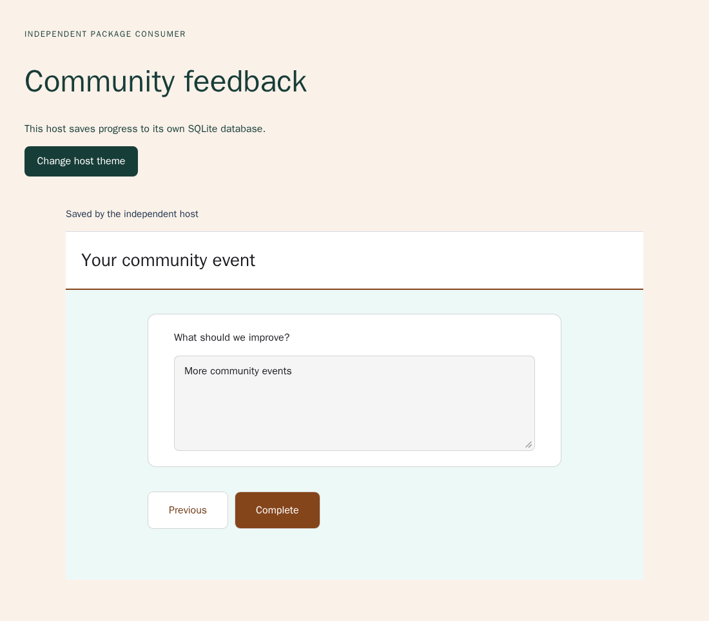
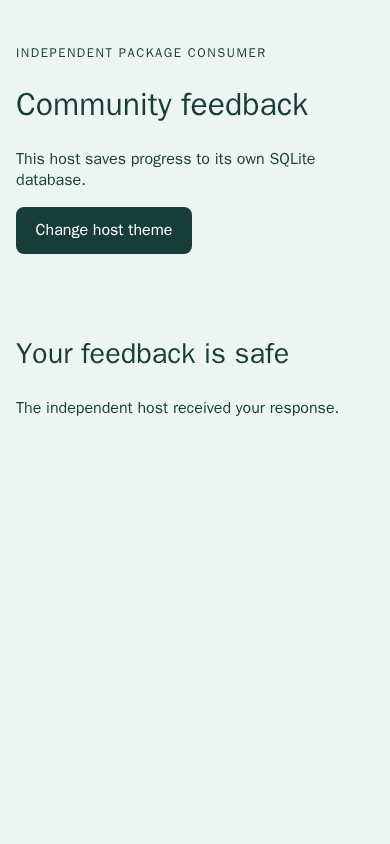

# SURV-020 — Independent packed consumer

Status: **accepted** for SURV-020. The host-translated editor proof below closes
020.1; analytics entrypoints are also exercised by the current packed inspector.
Earlier sections retain the evidence and limitations at their execution time.
The complete spike remains open.

## Delivery and acceptance

| Task | Required criteria | Evidence | Status |
|---|---|---|---|
| 020.1 | A1, A2, A3 | Packed editor/runner/analytics/contracts/styles; host translation and SQLite persistence below | Delivered and accepted |
| 020.2 | A1, A3 | Actual tarball installed in clean `/consumer`; real SQLite adapter; two browser phases | Delivered and accepted |
| 020.3 | A3, A4 | Host token overrides, English runner, browser mounting/restoration; T-07 disposition below | Delivered and accepted |
| 020.4 | A2 | Packed file allowlist, MIT inventory, retained software/OFL notices, bundle source-map inspection | Delivered and accepted for current shipped entrypoints |
| 020.T1 | A1, A2 | `apps/surveys-demo/inspect.mjs` and actual persisted external consumer | Passed |
| 020.T2 | A3, A4 | `tests/e2e/surveys-package.spec.mjs` and Astro reload assertions below | Passed for the selected browser-mounted path |

## Reproducible isolated command

`./leonaid test-surveys-package` builds the package in a `/package` stage with
`bun pm pack --ignore-scripts`. Only the resulting tarball crosses into a fresh
`/consumer` stage. There is no `/workspace`, original package directory, LeonAid
source or shared node_modules in that consumer. Installation uses the committed
consumer lockfile and `--frozen-lockfile --ignore-scripts`.

The template manifest is deliberately not a workspace `package.json`. All
consumer imports use exported package paths. Bun builds the actual packed runner
and fontless styles into browser assets. The backend uses Bun's SQLite adapter
and its own fixed two-page questionnaire validation, not LeonAid code or API.
It persists version/response snapshots, revisioned/idempotent writes and terminal
completion. This minimal synthetic backend is not an arbitrary survey service.

Final package run: project `surveys-package-833458328-76478`, exit **0**. The first
Chromium phase passed in 4.1s and the second in 2.4s. Between phases, Docker
restarted the actual backend process while retaining its private SQLite volume.
The browser used a fresh context with the same credential after restart.
The unique network used one currently unused explicit subnet; no host ports
were published. Browser and consumer shared the private network namespace so
`localhost` supplied the secure browser context required by cryptographic
operation IDs. The command removed its container, volume and network and its
temporary image tag; other worktrees were untouched.

## Named browser assertions

`packed consumer saves a multipage response in its own host` checks an English
required-answer error, fills a name and second-page comment, waits for the host's
custom saved acknowledgement and reads the exact persisted response through the
real API. Changing the host theme updates the SurveyJS brand token while the
adjacent host button retains its background styling. There is one participation.

`packed consumer restores after backend restart without an extra save` runs at
390 × 844 after process restart. It restores the second page and saved text,
compares the entire response plus server write counter to the pre-restart state,
and records zero POST/PUT/PATCH requests during restoration. Completion and a
subsequent reload show the host's translated thank-you screen, with the same
participation ID and exact answers. First-phase viewport: 1100 × 850.

Visual inspection of the synthetic desktop and mobile completion captures found
readable controls/text and no clipping in these states. This is not complete
mobile authoring or accessibility acceptance.




## Package and license evidence

[Machine-readable inventory](assets/SURV-020-package.json) records the actual
installed versions and bundle measurements. The inspector requires exactly the
own package plus SurveyJS core/React 3.0.3, React/React DOM 19.2.8 and scheduler
0.27.0. All five third-party packages declare MIT and match the previously
reviewed dependencies. The own package remains private/UNLICENSED in metadata;
its future license decision is UNDEFINED.

Realpath checks ensure resolution remains under `/consumer`. The respondent
bundle's source map contains the packed runner but no editor, condition-builder
or server-validation candidate module. Its 17 source entries produce a
3,049,790-byte unminified browser JS file; this is a measured baseline, not a
performance acceptance claim. The tarball contains only its manifest, README,
third-party notice and package sources. Third-party font licensing stays
separate: the installed core retains `fonts/LICENSE.txt`, while the actual
fontless browser CSS contains no `@font-face` block.

The first build attempt used a constant output filename that also applied to
CSS and failed; default extension-aware naming fixed it. The first browser
attempt used the nonsecure `consumer` hostname and failed before creation at
`crypto.randomUUID`; the private localhost namespace fixed that host requirement.
Neither failed attempt is counted as acceptance. Traces and credential-bearing
browser state remain ignored local artifacts; only synthetic screenshots and
the dependency/bundle summary are retained here.

## Remaining boundaries

Both the independent host and the existing Astro participation page mount in
the browser. No SSR capability is claimed by this proof. The Astro route sets
`Cache-Control: no-store` and renders a loading shell; private response data is
loaded later through the authorized API. Full 020.A4 disposition and the
remaining theme/SSR task stay open until their host-specific checks are recorded.

Current package TypeScript and `test-surveys-core` passed (168 comparison cases,
23 Python tests and three coordinator tests / 17 assertions); the network helper
passed Ruff.

The final LeonAid regression `./leonaid test-surveys-runner`, project
`leonaid-surveys-833458328-76619`, exited zero: seven Chromium scenarios passed
in 24.6 seconds after real migrations, response contracts, all 192 API/database
cases and stopped/paused-validator recovery. It retained German default text,
no-blur persistence, numeric-text conditions, hidden-page cleanup, offline retry,
matrix correction and completion. The command verified isolated teardown with
no host ports. Existing defaults remain compatible while the independent host
uses explicit English locale/messages. This is not full editor translation or
SSR acceptance.

## Browser rendering and restoration disposition

Revision: `e9ec59f` plus this commit's browser assertions, rendering probe and
decision record. No product runtime code changed in this increment.

`./leonaid test-surveys-package` ran as `surveys-package-833458328-80870` and
exited **0**. Its two Chromium phases passed in 3.0s and 1.3s at the desktop/mobile
viewports recorded above, with an actual backend restart between phases. The
restoration test additionally inspected the original HTML response: the empty
mount point was present and both synthetic saved answer strings were absent.
An authenticated response fetch returned HTTP 200 and `Cache-Control: no-store`.
The restored snapshot and server write counter matched the pre-restart values;
the browser recorded no POST/PUT/PATCH while restoring. Completion and subsequent
reload retained the same identity and answers. Existing host-theme and English
validation/message assertions passed in the first phase.

`./leonaid test-surveys-runner` ran as `leonaid-surveys-833458328-80893` and exited **0**.
All seven Chromium scenarios passed in 24.9s. The named
`acknowledged text survives closing mid-page and hidden follow-up is removed`
scenario now inspects the real Astro reload response: HTTP HTML has `no-store`,
contains the loading shell and omits the persisted second-page note. The browser
then displays that exact note from the authorized API, whose response also has
`no-store`. Reload records no POST/PUT/PATCH. The same scenario also verifies
fresh-context restoration, a 650ms observation without autosave, timeout
resumption and hidden-answer cleanup against persisted state. The harness again
passed its real migrations, response contracts, all 192 API/PostgreSQL cases and
stopped/paused-validator rejection and recovery checks.

The independent run published no host ports, used its own explicit subnet and
removed its container, volume and network. The LeonAid harness used seven
currently unused explicit subnets and no host ports; it verified complete
container, volume and network teardown before exiting successfully.

The standalone investigation command was:

```sh
rtk proxy docker run --rm \
  -v "$PWD:/workspace" -w /workspace \
  docker.io/oven/bun:1.2.19-alpine@sha256:7dc0e33a62cbc1606d14b07706c3a00ae66e8e9d0e81b83241ed609763e66d55 \
  sh -c 'bun tools/surveys/rendering-probe.ts .artifacts/surveys-package/rendering-probe.json > .artifacts/surveys-package/rendering-probe.log 2>&1'
```

It exited **0** and reported `rendered: true`, `bytes: 3091`,
`questionPresent: true`, `privateAnswerPresent: false`, `adapterCalls: 0`.
The probe uses only synthetic data and the installed pinned React 19.2.8 /
SurveyJS 3.0.3. A successful `renderToString` invocation does not establish
SSR answer fidelity or framework hydration. T-07 therefore selects the tested
browser-mounted path in both hosts; SSR remains outside the chosen spike path.
No new visual review or broader authoring accessibility claim is made here.

Scenario reconciliation:

| Scenario | Named evidence | Result |
|---|---|---|
| 020.S1 | Packed install/inspection plus both `surveys-package.spec.mjs` tests and real SQLite writes/restart | Passed |
| 020.S2 | `apps/surveys-demo/inspect.mjs`, packed inventory and retained notice checks documented above | Passed |
| 020.S3 | `packed consumer saves a multipage response in its own host` and completion in the second phase | Passed |
| 020.S4 | `packed consumer restores after backend restart without an extra save`, Astro reload assertions, and T-07 probe/disposition | Passed, including verified harness teardown |

This closes 020.3, 020.T2 and 020.A4 with verified cleanup. The package gate's
four acceptance criteria now pass. The editor-wide translation and analytics entrypoint work in
020.1 remains open; the overall work package and spike are not complete.


## Host-translated editor and entrypoint acceptance

This increment adds optional `SurveyEditor.translate` and `locale` props, exported
`EditorTranslator`/`formatEditorMessage`, translated condition-builder controls and
translated defaults in `EditorHistory`. All toolbar, property, condition, recovery,
status/error and accessible labels cross the host callback. Numbered labels use
named placeholders so hosts can reorder wording. Existing questionnaire titles,
choices, IDs and expressions are not translated or rewritten. The history reads
the current callback through a ref: changing its identity does not discard edits,
undo history or the draft coordinator. Preview locale is applied on opening.

The default formatter retains existing German messages. Additional languages are
host catalogues; the package does not claim to ship complete translations for all
languages. The demo translates selected messages to English and prefixes remaining
source messages with `Host ·`, deliberately showing the callback boundary. Its
SurveyJS preview uses English. Existing emitted notices retain their rendered
wording; locale changes do not rewrite author content. React renders translations
as text, not HTML. Adapter diagnostics remain the host's responsibility and pass
through the callback at display time.

### Packed browser and persistence proof

```sh
rtk proxy sh tools/surveys/package.sh "$PWD"
```

Final project `surveys-package-833458328-18930`, exit **0**. Only the real packed
artifact enters the clean `/consumer` build; the new `/editor` route imports its
public editor/contracts/styles entrypoints. The consumer has no LeonAid source
or API client. Its independent SQLite fixture adapter implements revisioned draft
load/save, identical-operation replay and a minimal validation response. Publishing
is explicitly disabled. This private synthetic fixture is not a production
authentication or arbitrary-schema validation service.

Both first-phase Chromium tests passed in 6.5 s; after restarting the actual
SQLite backend, both second-phase tests passed in 2.1 s. The two new named tests:

- `editor host translates controls without changing author content or resetting history`:
  checks translated accessible names and numbered condition labels; changes a title,
  forces a new host callback identity and verifies undo remains enabled and the edit
  persists; creates translated page/question defaults; shows a translated JSON
  syntax error without corrupting the accepted draft; reads the actual SQLite-backed
  API snapshot to verify original author wording and the original condition remain;
  opens the actual SurveyJS preview and checks its English Next control.
- `editor restores translated host draft after backend restart`:
  at 390 × 844, reloads the saved title, new page and question from the restarted
  backend and checks the persisted definition. The existing respondent restart,
  zero-restoration-write, host-theme, translated runner and export journeys also pass.

The first attempt (`...18557`) failed when `getByLabel` did not match the translated
select despite its correct accessible combobox name in the captured page snapshot.
The final test uses `getByRole("combobox", { name: "Previous question 1", exact: true })`.
No product behavior was relaxed. Raw traces remain private ignored artifacts.
No new visual design or broad cross-language clipping review is claimed.

The current packed inspector additionally renders `SurveyAnalytics` with host
messages and locale, verifies numerical output and absence of synthetic raw text,
and checks analytics styles. It retains the exact permissive dependency inventory,
OFL notices and respondent/editor bundle separation checks. Current inventory:
[SURV-020-editor-package.json](assets/SURV-020-editor-package.json).
No software dependencies or license decisions changed; own license stays UNDEFINED.

### LeonAid regression and core gate

```sh
rtk proxy sh tools/surveys/infrastructure.sh "$PWD" editor
rtk proxy ./leonaid test-surveys-core
```

The real LeonAid editor run `leonaid-surveys-833458328-18801` exited **0**. All seven
Chromium tests passed (1.1 min), including keyboard/focus/recovery/preview checks,
Krapfentaxi and Golf authoring/publication, stable identities, unknown JSON import,
unsafe-publication rejection and lost-save/undo/two-tab conflicts. Default German
controls remain compatible. Real API/PostgreSQL foundation checks passed.

The core gate now includes both editor test files: 168 SurveyJS/Python comparisons,
23 Python tests, and 15 Bun tests with 141 assertions passed. The new unit cases
cover placeholder reordering/own-key handling, literal non-recursive substitution,
new localized defaults, stable IDs/history and preserved authored content. Web
TypeScript, scoped Prettier checks, shell syntax and `git diff --check` passed.

Both Docker harnesses used fresh private volumes and currently unused explicit
subnets, published no host ports and removed owned resources before successful
exit. Runtime and test source remained unchanged during the final accepted runs;
README/proof documentation and core-test wiring were completed afterwards.

This closes 020.1 with the existing A1–A4 evidence and accepts SURV-020. It does
not claim SSR hydration support, a production standalone editor backend, a full
language catalogue or completion of the remaining SURV-000/060/090/100 work.

## Bounded host logo integration

**020.1a / 020.S6 accepted.** Runtime baseline `41fc4c1` plus this change.
The runner now accepts optional host-owned `logo` configuration independently of
questionnaire JSON. The image has bounded dimensions, host-supplied alt text and
no-referrer policy. Only bounded root-relative static image paths are admitted;
asset serving and avoiding external redirects remain the host's responsibility.

The packed consumer command `rtk proxy sh tools/surveys/package.sh "$PWD"`
exited **0**, project `surveys-package-833458328-8804`. Two Chromium tests passed
before restart (**6.6s**) and two after (**1.8s**). The real separately installed
package loaded the original and changed local SVG asset; six invalid URL/path
forms produced no image element or external image request. Answer values and page
survived configuration changes. The mobile screenshot was inspected; the logo
fit within the viewport. Real SQLite persistence, restored revision/answers,
completion and translated editor regression passed across the backend restart.
The tarball dependency/bundle/notice inspector passed, and owned resources were
removed without publishing host ports.

The initial LeonAid branding run reached both logo assets, but its new test tried
to click SurveyJS's visually hidden native radio input. The rendered rating label
intercepted that click. This is a test interaction defect; the existing runner
suite uses keyboard selection. The corrected run and final acceptance follow
below once verified. No acceptance checkbox is closed by this failed attempt.

The corrected command `rtk proxy sh tools/surveys/infrastructure.sh "$PWD" branding`
exited **0**, fresh project `leonaid-surveys-833458328-10462`. All **three Chromium
tests passed (5.0s)**: the existing real-identity/member/public foundation plus
LeonAid logo/response restoration at 1440 and 390 pixels. Each survey test loaded
the actual `/favicon.svg` asset (`naturalWidth > 0`), selected a rating via
keyboard, checked its value through the real API, reloaded and compared the entire
response including revision. There was no horizontal document overflow. The
normal harness also proved the PostgreSQL snapshot roundtrip and immutable
version/cascade boundaries. Both the earlier failed project and this successful
project removed their owned resources; no host ports or shared stack were used.

Inspected evidence: [LeonAid desktop](assets/SURV-020-logo-desktop.png),
[LeonAid mobile](assets/SURV-020-logo-mobile.png), and the
[independent host mobile](assets/SURV-020-logo-consumer.png). The existing SurveyJS
mobile progress strip partly clips its last step; the logo and answer controls
remain within bounds. This was retained as a SURV-100 visual audit issue; the responsive-progress
proof below resolves this specific defect.

Package TypeScript and Linux-container Astro checks passed (22 Astro files,
zero errors/warnings/hints). The initial macOS Astro invocation could not load
the Darwin native binding from the Linux dependency installation; the pinned
Linux check completed successfully without reinstalling dependencies. Prettier,
shell syntax and diff whitespace checks passed. No dependency or license choice
changed; own license remains **UNDEFINED**.

## Responsive progress navigation

**020.3a / 020.S7 accepted.** Baseline `1319be2` plus this change.
The actual SurveyJS 3 stylesheet gives every progress column a minimum width;
the resulting internal horizontal overflow clipped the last step at 390px.
Scoped CSS now wraps the progress grid in narrow containers, enlarges controls
to at least 2.75rem, and omits connector lines in that wrapped layout. Wide
containers retain upstream presentation. CSS size containment is confined to the
progress region; it must not contain the question popups.

`rtk proxy sh tools/surveys/infrastructure.sh "$PWD" branding` exited **0**,
project `leonaid-surveys-833458328-14298`, with **four Chromium tests passed (8.0s)**.
Three real respondent journeys ran at 1440x900, 390x900 and 320x900. Each checks
that all three step controls stay inside both their scroll container and viewport
on every page, restores an unchanged saved response after reload, navigates
forward/back, and completes through the real API. The final server response has
status `completed` and exactly `delivery_rating: 5`, `freshness: "fresh"`, `nps: 10`.
The fourth test covers the real member/public identity foundation. The harness
also verifies PostgreSQL persistence and removes its owned volumes, containers
and networks without publishing ports.

Two preceding attempts exposed useful boundaries. Project `12255` passed desktop
but the test incorrectly assumed mobile ratings were always radio controls.
Project `13561` exercised the actual dropdowns and found that applying CSS
containment to the entire runner displaced a long popup at 320px. Moving
containment to the progress region fixed that behavior; the final run selects
the last option by a normal pointer click, without forced clicks or bypassing
hit-testing. Both failed projects were separately checked for full owned cleanup.

[320px evidence](assets/SURV-020-progress-320.png) shows the formerly clipped steps
fully visible and was visually inspected. The browser test retains desktop and
390px images locally as well. Prettier and diff whitespace checks passed. This
accepts the responsive navigation defect and its three-page regression, not the
remaining full SURV-100 aggregate/CI or author-to-deletion acceptance. No dependency
or license choice changed.
