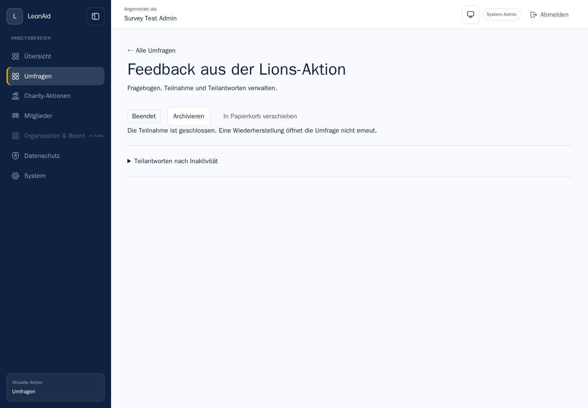
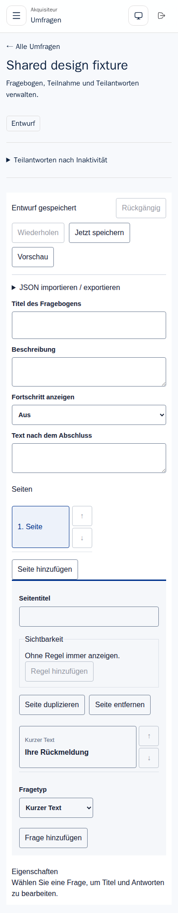
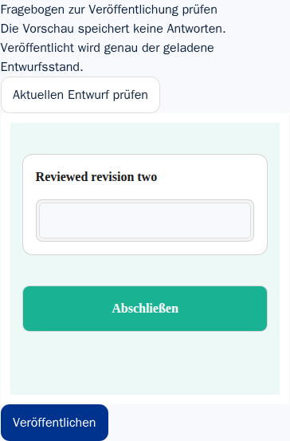

# SURV-060 — Member module and scoped management

Baseline `c75b8c7` plus this commit's module, API/client and browser changes.
The initial increment delivered member navigation, lifecycle and timeout UI.
The personal invitation increment below adds live evidence for 060.A3;
preview isolation and timeout snapshot behavior are now accepted below. Complete
capability coverage remains open; invitation credentials and expired resume access are accepted in the final section.

## Task ledger

| Task | Criteria | Delivery / named evidence | Remaining acceptance |
|---|---|---|---|
| 060.1 | A4, A5 | `apps/web/src/surveys.tsx`, generated client, scoped list/summary and action creation; `surveys-module.spec.mjs` | Delivered; A5 accepted below; complete persona coverage remains open |
| 060.2 | A1, A4 | Existing policies now govern lists/counts, summary capabilities, action linking and hidden publish controls; `module.py seed` | Aggregate/export/invitation/deletion capability matrix is not complete |
| 060.3 | A2, A3 | Anonymous runner plus personal invitation API, member UI, worker/Mailpit delivery and PostgreSQL verification | A2/A3 accepted; final credential and expired-resume evidence below |
| 060.4 | A5 | Actual preview completion, backend timeout change, public participation and separate persisted analysis snapshots below | Accepted |
| 060.T1 | A1, A2 | Real member list/count/search/pagination and action-scope negative scenarios | Full capability and invitation coverage remain open |
| 060.T2 | A3, A4, A5 | Admin lifecycle/settings, mobile designer and personal invitation browser scenarios | A5 accepted below; full persona coverage remains open |

## Behavior and boundaries

Authenticated members receive an Umfragen navigation entry. This does not give
access to other backoffice areas or anyone else's survey. The existing default
redirect for purely operational members remains in place outside survey routes.
A unit test verifies their only web navigation entry is surveys.

GET `/api/v1/surveys` supports status, literal title search and offset pagination
(50 results per page). Authorization is applied in SQL before count/pagination;
returned rows are also checked against the domain capability function. A
repeatable-read transaction keeps the count and page consistent. The response
includes only actions the member can manage as creation choices. GET summary
returns current capabilities and rejects inaccessible resources. The host uses
GET/list capabilities for controls and refreshes summary after mutations.

Creating a standalone survey assigns its creator as owner. Creating an
action-linked survey checks actual action management rights and action existence
before writing. Explicit survey grants do not bypass membership scope on an
action-linked survey. A design-only member can open the editor, but its publish
control is absent and the server independently rejects publication.

The neutral editor's optional `canPublish` flag controls presentation only; it
defaults to true for existing hosts. Optional `onSaveStateChange` reports its
save state. LeonAid uses that signal to disable lifecycle/settings actions while
the draft has unacknowledged changes. Backend authorization remains mandatory.

The member UI provides search/status filters, creation/action selection,
publication through the editor, end/archive/unarchive/trash/restore controls,
survey timeout override/inheritance and administrator-only global timeout forms.
Trash uses an inline consequence/confirmation step. Closed surveys do not mount
an editable draft, and restoration explicitly remains closed.

## Integration and browser evidence

`./leonaid test-surveys-lifecycle` succeeded as
`leonaid-surveys-833458328-88804`, exit **0**. The real stack passed its database
foundation, response contract and existing 25 lifecycle/action pair checks,
including publication/closing races, immutable versions and duplication.

`tools/surveys/module.py seed` created a real member, session, action and three
synthetic surveys. It proved:

- A standalone design grant exposes exactly one survey and only the design
  capability; private title search returns zero authorized results.
- A grant on an action-linked survey initially exposes nothing without action
  membership. After adding actual membership, the list contains exactly the two
  authorized surveys, while action-creation options remain empty for an acquirer.
- Counts remain authorization-filtered across offsets/status filters; negative
  offsets fail validation. A forbidden action-linked creation writes nothing.
- Global settings, foreign summaries, publication and trash are rejected for
  the unauthorized member through actual API calls.

Three Chromium scenarios passed through the real services: the infrastructure
journey plus these two tests in `tests/e2e/surveys-module.spec.mjs`:

1. `member manages lifecycle and timeout through the real module` (1440 × 1000)
   navigates from the main sidebar, changes/restores the global timeout, creates
   an action-linked survey, saves its override as three seconds, publishes, ends,
   archives, trashes and restores it. Reload retains ended status and no editor;
   the public API rejects access and the public page has no start control.
   Search/status filtering then finds the correct ended survey.
2. `designer sees scoped surveys without publish or delete controls on mobile`
   (390 × 844) sees only the two granted surveys, no global settings and no
   publish/trash controls. A direct publication request is rejected, and direct
   navigation to a foreign survey renders an error without an editor.

`module.py verify` then inspected PostgreSQL: the browser-created survey was
ended, retained the selected action ID and three-second override, and the global
default was restored to 1800. The successful harness verified cleanup of its
own containers/volumes/networks; seven unused explicit subnets and no host ports
kept it separate from other worktrees.

The first run (`…-88260`) passed backend checks and the mobile designer journey
but failed selecting the action with an exact label locator. Its trace confirmed
the intended UUID and the rendered combobox. Selecting by accessible combobox
role/name fixed the test; the repeated full run passed. The failed run is not
acceptance evidence.

## Visual review

Inspected the actual synthetic desktop lifecycle and mobile designer captures.
The lifecycle status/actions and closed-state explanation were readable; the
mobile controls wrapped without clipping in the captured state. This is not a
claim of every mobile/dark-mode/editor state or full accessibility acceptance.




## Supporting checks

Web TypeScript and Mypy on the four changed application source files passed.
Ruff passed on changed Python source and fixture files. The identity, policy and
migration unit selection passed 32 tests; the OpenAPI policy suite passed four.
The generated OpenAPI/client includes the previously delivered timeout APIs.

The frontend transport check initially rejected the independent demo's own
backend fetch. The corrected check exempts only its two fixed local routes in
the exact demo client file; negative fixtures still reject LeonAid API calls,
other routes and the same direct fetch from a regular web client. The independent
demo must not acquire a LeonAid-client dependency merely to satisfy this check.

`./leonaid test-surveys-package`, project `surveys-package-833458328-88872`, exited
zero: actual packed installation, permissive bundle/notice inspection and both
browser phases passed (2.9s and 893ms) with real restart and cleanup. The new
optional editor props do not enter the respondent bundle.

`./leonaid test-surveys-editor`, project `leonaid-surveys-833458328-89326`, exited
zero: all seven Chromium scenarios passed in 1.2 minutes, including both complete
sample authoring journeys, keyboard/accessibility checks, JSON import and
interrupted-save/two-tab draft recovery. Its isolated resources were removed.
The complete SURV-060 work package remains open.

## Personal invitations

Verified on 2026-09-07 against baseline `c19278d` plus this commit's invitation
implementation. **060.A3 and 060.S3 are accepted.** Task 060.3 remains open
because its additional 060.A2 / 060.S2 checks are not complete.

### Delivered behavior

The draft's access mode can be anonymous or personal invitation. Publication
fixes that choice. A member with `manage_invitations` can create, paginate and
revoke personal invitations through the member UI and generated API client.
Creation validates the recipient and a 1–90 day lifetime, checks the survey
revision and atomically writes one invitation, one outbox event and a durable
operation result. The browser retains the exact operation after an uncertain
response so retry cannot create a second logical invitation.

Migration `0029_survey_invitations` stores the recipient separately from response
answers. Only a SHA-256 token digest is stored as the credential; the queued mail
body is encrypted with the existing mail-payload adapter. The outbox event has
an empty payload. The worker checks current survey status, deadline, revocation
and expiry before SMTP delivery, uses the existing delivery ledger and stable
Message-ID, and clears the encrypted body after confirmed delivery.

The mail's personal URL carries its credential in the fragment. The public UI
explains that answers are attributable before the recipient starts. Redemption
creates or restores the one participation attached to that invitation, sets its
Secure/HttpOnly/SameSite=Lax resume cookie and removes the fragment. The server
checks invitation revocation and expiry on redemption, restoration, saves and
completion. Revoking an invitation therefore also removes resume access.

### Integration and E2E acceptance

`./leonaid test-surveys-invitations` passed as
`leonaid-surveys-833458328-5320`, exit **0**. The test harness used real API,
PostgreSQL, outbox worker, SMTP/Mailpit, member UI and public UI, with no host
ports. Its isolated containers, networks and volumes were removed successfully.

`tools/surveys/invitations.py prepare` runs while the real worker is stopped:

- Creates four synthetic invitation-only surveys and checks idempotent access
  selection, immutable access mode after publication and anonymous-start denial.
- Checks authentication, malformed recipient/expiry rejection, exact creation
  replay and changed-payload rejection without a second invitation.
- Confirms listings expose neither token nor mail payload nor participation ID;
  inspects digest/encrypted payload separation and the empty outbox payload.
- Revokes one invitation, expires another and closes a third survey before
  restarting the worker.

The `recover` phase waits for actual outbox processing and verifies Mailpit
received only the valid fixture invitation. Invalid redemption is denied.
Repeated valid redemption returns the same participation. Saving a real answer
and then revoking access makes restoration, subsequent writes and redemption
fail; PostgreSQL retains the one separately attributable participation.

Two Chromium tests passed in **3.9 seconds**, including the infrastructure test
and `tests/e2e/surveys-invitations.spec.mjs`:

1. The administrator creates and publishes an invitation-only questionnaire
   through the real member UI at 1440 × 1000, then submits a personal invitation.
2. After the server commits, the test first loses the response, then substitutes
   a synthetic 500 response for a successful retry. A third attempt succeeds.
   All three request bodies are identical; only one invitation and one Mailpit
   message exist.
3. A recipient at 390 × 844 opens the actual message's link (only its origin is
   mapped to the isolated proxy), sees the attribution notice, starts, saves an
   answer and completes. The URL fragment is removed and the secure resume
   cookie exists. Recorded request URLs contain no invitation credential.
4. The administrator revokes the invitation. Reloading the recipient's resume
   URL and opening the original invitation both fail to grant access.

`invitations.py verify` independently checks PostgreSQL: exactly one completed
participation contains the submitted answer, its invitation retains the intended
synthetic recipient and `revoked_at` is set. Ephemeral credential-bearing fixture
state is removed; committed proof contains no credentials.

### Migration and regression checks

`./leonaid test-surveys-migrations` passed as
`surveys-migrations-833458328-4549`, exit **0**. Both an empty database and upgrade
from revision 0026 reach 0029. All 46 existing table fingerprints remain unchanged
in the upgrade path. Fourteen database invariants pass, including the new
same-survey invitation/participation foreign key and matching redemption state:
[empty database](assets/SURV-060-migrations-empty.json),
[upgrade](assets/SURV-060-migrations-upgrade.json),
[baseline](assets/SURV-060-migrations-baseline.json).

`./leonaid test-surveys-runner` passed as
`leonaid-surveys-833458328-5855`, exit **0**, including the existing anonymous
runner and recovery checks, with successful isolated-resource teardown.
`./leonaid test-surveys-lifecycle` also passed as
`leonaid-surveys-833458328-6899`, exit **0**, covering the existing lifecycle,
scheduled closure and member-module journey, with successful cleanup.
Final web TypeScript, changed-file Ruff and `tools/openapi/check_frontend.py`
checks passed. The generated OpenAPI/client includes the access and invitation
routes. Changed application-source Mypy and runtime imports also passed.

### Failed attempts and remaining boundaries

The first invitation run (`…-4102`) failed because the new SMTP handler evaluated
an asyncpg generic annotation at import time. Postponed annotations fixed the
runtime import. The second (`…-4748`) passed the backend checks but its browser
test failed locating the access-mode select. Selecting the actual accessible
combobox by role/name fixed the locator. Both failed runs cleaned up; only the
complete repeated run supplies acceptance evidence.

This proves one logical invitation under the tested request retries. SMTP cannot
guarantee physical exactly-once delivery across a crash after remote acceptance
and before the local delivery ledger is committed. That crash window has not
been fault-injected here.

060.A2 / 060.S2 remain open for complete retry/failure coverage and seeded
credential scans of application logs and exports. Export implementation is still
pending. Full persona/capability coverage and preview/test isolation also remain
open. At this increment, delivery failure/cancellation status still needed
follow-up; the subsequent delivery-state increment below resolves the queued
display and skipped-payload cleanup. No full production retention, visual or
accessibility acceptance is claimed.

## Invitation delivery states and SMTP recovery

Baseline `e01d4d1` plus this increment, verified on 2026-09-07. The list API now
derives `retrying` and `failed` from the existing outbox state, without exposing
error details or mail content. A skipped unsent message whose encrypted payload
has been cleared is `cancelled`. Revocation, expiry, redemption and confirmed
delivery retain their existing precedence. The member UI names these states in
German and provides an explicit status-refresh action. An exhausted automatic
retry directs the member to administration; this increment does not add a second
retry mechanism outside the existing outbox administration.

Before skipping an expired/revoked invitation or a closed/deadline-expired survey,
the worker removes its encrypted mail body in the same locked transaction.
Transient delivery failure rolls that transaction back so a subsequent attempt
can still deliver. A dead-letter message retains the protected body for existing
administrative retry; revocation clears it. Global expiry/retention cleanup for
dead-letter messages remains a SURV-090 obligation.

The live fixture now creates five invitations with the actual worker stopped.
It seeds one event at four prior attempts to exercise the final configured
attempt without waiting through the earlier backoff intervals. The harness then
stops the actual SMTP/Mailpit service and starts the worker. The failure phase
requires these real API list states:

| Fixture | Expected status | Persisted outcome |
|---|---|---|
| Valid, temporary SMTP failure | `retrying` | One invitation/event, protected mail retained for automatic retry |
| Final attempt, SMTP failure | `failed` | Actual dead-letter transition after the worker's failed send |
| Survey closed before processing | `cancelled` | No SMTP delivery; protected body cleared |
| Invitation expired | `expired` | No SMTP delivery; protected body cleared |
| Invitation revoked | `revoked` | No SMTP delivery; protected body cleared |

After SMTP restarts, only the temporary-failure fixture is delivered. The
dead-letter fixture remains failed and absent from Mailpit; revoking it clears
its protected body and prevents redemption. The original exact-redemption,
saved-answer, revoke and database-association checks still pass. The browser
journey also explicitly refreshes the delivery status and sees `Versendet` before
opening the delivered questionnaire.

The first expanded run, `leonaid-surveys-833458328-7947`, passed the real outage,
recovery, two Chromium tests (4.0s), SQL verification and isolated cleanup, exit
zero. A parallel TypeScript check found a missing success-message argument on
the refresh action. It was corrected after that run ended; final TypeScript and
Mypy on the three changed application files then passed. Ruff passed the changed
Python files.

The final-source command `./leonaid test-surveys-invitations` passed as
`leonaid-surveys-833458328-8538`, exit **0**: actual SMTP outage/recovery, all five
delivery-state fixtures, two Chromium tests (4.0s), database verification and
successful isolated teardown. Seven unused explicit subnets and no host ports
kept the run separate from parallel worktrees. This repeated run includes the
corrected status-refresh success message.

This adds concrete coverage to 060.S2, but does not close 060.A2 / 060.S2: seeded
credential scans in exports and captured application logs are still missing.
The SMTP acknowledgement/local-ledger crash window described above is unchanged.


## Preview isolation and timeout snapshot acceptance

Production source: `a5ed129`, unchanged for this increment. New test paths:
`tests/e2e/surveys-preview.spec.mjs` and `tools/surveys/preview_live.py`, wired
through the isolated harness's `preview` mode.

```sh
rtk proxy sh tools/surveys/infrastructure.sh "$PWD" preview
```

Final project `leonaid-surveys-833458328-21306` completed with exit **0**. Both
Chromium tests passed in 5.5 s, followed by independent PostgreSQL verification.
The named scenario `backend timeout changes preserve existing participation and
preview stays outside real analysis` runs at 1440 × 1000 against actual services.

1. The seed creates and publishes a real single-question survey through the API,
   with a 60-second override. It inserts exactly one completed synthetic response
   with `is_test=true` directly into PostgreSQL, explicitly as test setup.
2. The browser opens the actual editor preview, enters a unique preview marker,
   completes it and returns to editing. No public participation POST/PUT is sent.
3. It starts and saves an ordinary response through the public API, obtaining a
   60-second participation timeout. Through the real backend UI it changes the
   survey override to one second, then starts and saves another ordinary response.
4. The new participation becomes partial under its one-second snapshot. Restoring
   the first participation still reports 60 seconds, in-progress status and its
   exact answer. The test then completes that older participation normally.
5. After reload, it opens **Antworten auswerten** and submits the default real-data
   analysis through the UI: its actual returned snapshot contains exactly two
   participations. Selecting **Nur Testteilnahmen** and submitting again yields
   exactly one participation and `isTest=true`.
6. The SQL verifier waits, with a bounded deadline, for the real worker's durable
   partial mark. It confirms exactly three stored participation rows, two real
   timeout snapshots (60 and 1), completed/partial statuses, no preview marker,
   and two stored analysis snapshots with the expected distinct sources/counts.

The preview intentionally remains an in-browser simulation; it does not persist
an author test participation. The separate seeded `is_test` row proves the existing
analysis exclusion boundary and is not described as a browser-created test response.
This acceptance does not introduce or claim a persisted test-response authoring UI.

The initial run `...20657` reached the analysis step but failed because the test
had not expanded the collapsed analysis panel. The corrected final run performs
that actual UI navigation. No production validation, timing or access rule was
relaxed. Raw failure artifacts remain ignored locally; the retained result is
[SURV-060-preview-timeout.json](assets/SURV-060-preview-timeout.json), containing
only counts, configured synthetic intervals and boolean assertions.

The final run used fresh volumes and currently unused explicit subnets, published
no host ports and verified owned-resource teardown. Probe Ruff, browser formatting,
shell syntax and `git diff --check` passed. No new visual/a11y review is claimed.

060.A5, its 060.S5 scenario and implementation task 060.4 are accepted. The parent
060.T2 remains open for full persona/resource E2E coverage (A4); the whole module
also retains its A1/A2 permission and credential-log acceptance work.


## Invitation credential and expired-resume acceptance

**060.3 / 060.A2 / 060.S2 are accepted.** Production baseline: `7b86291`,
unchanged. This increment extends actual-service test coverage without changing
runtime dependencies, migrations or the UNDEFINED license decision. The full
persona matrix (060.A1/A4) still prevents completion of 060.T1/T2 and SURV-060.
Earlier open-status statements describe their historical increments.

```sh
rtk proxy sh tools/surveys/infrastructure.sh "$PWD" invitations
```

Project `leonaid-surveys-833458328-37251` exited **0**. The existing API creation,
exact replay and changed-payload conflict checks passed. The worker processed
six synthetic invitations with actual Mailpit stopped: two retryable deliveries,
one seeded final-attempt failure and revoked/expired/closed cancellation cases.
After Mailpit restarted, exactly the two eligible fixture recipients received
messages; the dead-letter case remained undelivered until revoked. Protected
payload removal checks passed for skipped/revoked and delivered messages.

The added `expired-resume` case redeems the real invitation twice, verifies the
same participation, and saves an answer through HTTP before moving only its
synthetic expiry timestamp into the past. GET restore, PUT save, POST complete
and POST redemption then return 404. The same four operations are rejected after
actual revocation in the existing valid case. SQL verifies one participation and
its separate invitation association. This tests expiry selection deterministically;
it does not claim a month-long wall-clock wait. Existing SMTP acknowledgement
ambiguity does not become an exactly-once physical delivery guarantee.

Both Chromium scenarios passed in **4.9 s**: the foundation test and
`surveys-invitations.spec.mjs` at the existing desktop member/mobile respondent
viewports. The member creates and publishes an invitation-only survey, retries
lost/synthetic error acknowledgements with the same operation, receives one
Mailpit message, and revokes access after the recipient completes. PostgreSQL
independently verifies exactly one completed, attributable response. Direct URL
capture still proves the fragment credential does not enter request URLs.

`tools/surveys/invitation_privacy_live.py` then creates real immutable analysis
snapshots for the API-created and browser-created participations, explicitly
including all three statuses and asserting one response per snapshot. The actual
worker generates eight private objects: CSV, raw XLSX, analysis XLSX and Typst PDF
for each participation. Authenticated downloads are parsed using csv, every
uncompressed XLSX ZIP member (including metadata), and pypdf text extraction.
Raw bytes and parsed content contain none of the admin session, browser invitation
credential or six backend fixture credentials. Each expected answer remains in
its raw products and is absent from the aggregate products; these are populated
exports, not an empty-selection proof.

The harness captures actual API, worker and validator logs after both browser and
export execution. It requires actual HTTP diagnostic records and scans for all
the credential values plus the two answer markers. No marker is present. SMTP
message bodies intentionally contain their invitation links and are not treated
as application diagnostics. All credential-bearing state and unrestricted logs
stay in the temporary proof directory and are deleted with it; they are never
copied into committed artifacts. The retained
[SURV-060-invitation-privacy.json](assets/SURV-060-invitation-privacy.json)
contains only product names, counts and boolean results.

Scoped Ruff checks/format, shell syntax and diff whitespace checks passed. The
run used fresh volumes, seven currently unused explicit subnets and no published
host ports. The harness verified complete owned-resource teardown. No runtime or
test file was edited during execution, and no new manual visual/a11y inspection
or exhaustive SMTP crash-instruction coverage is claimed.


## Persona-resource API matrix

**060.2a / 060.S1a are accepted.** Production baseline `92ec679` is unchanged.
This supplies the static API matrix portion of 060.A1; it does not close 060.2,
060.A1/A4, 060.T1/T2 or the full module. Own license remains UNDEFINED.

```sh
rtk proxy sh tools/surveys/infrastructure.sh "$PWD" permissions
```

Final project `leonaid-surveys-833458328-41183` exited **0**. The test
`tools/surveys/permissions_live.py` defines its expected capability sets explicitly,
without calling the production permission function. It seeds real accounts,
sessions, action memberships and survey grants. Four surveys are created and
published through HTTP; each receives a real anonymous start/save/completion and
an immutable analysis snapshot. SQL confirms none of the four participations has
an invitation association. This is not a claim of an exhaustive CRM/order table
association audit.

| Persona | Standalone owned/shared survey | Action with membership | Foreign action without membership | Unrelated standalone |
|---|---|---|---|---|
| Each of nine single-grant users | Exactly its single capability | Exactly its single capability | None, despite a grant | None |
| Owner | All nine | All nine | None, despite ownership | None |
| Charity administrator of the joined action | None | All nine | None | None |
| Ordinary action member without grant | None | None | None | None |
| Outsider | None | None | None | None |
| System administrator | All nine | All nine | All nine | All nine |

Across **56 persona/resource pairs**, the run accepted **118 positive reads**,
**676 denied reads** and **891 denied writes**, plus the separately asserted
summary/list queries. Lists, total counts, literal search, active-status filter
and offset pagination reveal exactly the authorized fixture resources. Available
action-creation choices match management rights. Summary capability sets match
the table exactly.

Read routes cover drafts, analysis versions/snapshots, response-selection
versions/metadata/lists/individual answers/free text, export-selection versions,
invitations and export jobs. Snapshots have real completed responses. Each
eligible requester creates its own raw/report job and can read it. Existing
admin-created jobs are rejected for all other accounts even with matching export
rights; their download routes also reject those accounts. This preserves the
existing requester-specific export contract in SURV-080.

Negative writes use structurally valid DTOs for draft save/validation, timeout,
duplication, publishing, schedule, access mode, all five lifecycle actions,
permanent deletion, analysis/response/export selections, invitation creation and
raw/report job creation. Every unauthorized request returns 404. Before and after
the matrix, ordered row-JSON fingerprints are identical for survey, draft,
version, participation, operation receipt, analysis snapshot, invitation, export
job, deletion and outbox tables. The worker is deliberately stopped during this
comparison, then restarted and checked healthy before the browser phase.

The foundation Chromium scenario passed **1 test in 2.0 s**. It proves the actual
member/public hosts remain reachable; it is not the pending persona UI matrix.
The final run used fresh volumes, seven currently unused explicit subnets and no
published host ports, and verified complete owned-resource teardown. Ruff
check/format, shell syntax and diff whitespace checks passed. The retained
[SURV-060-permissions-api.json](assets/SURV-060-permissions-api.json)
contains only persona/resource names, counts and booleans. No account IDs,
sessions, answer content or raw diagnostics are committed.

Three earlier runs exited 1 and cleaned up before test edits: `...39126` used a
wrong deletion table name in the fingerprint; `...39872` used an invitation email
under `.invalid`, rejected during DTO validation before authorization;
`...40491` incorrectly expected a single-grant exporter to read an admin's job.
The corrected fixture uses the actual deletion table, a valid synthetic email,
and separately exercises own-job access and foreign-job denial. No production
permission, validation or persistence rule was relaxed to make the tests pass.

Remaining 060.A1/A4 coverage includes successful single-capability mutations and
UI controls, cross-survey child-ID substitution, invitation-revoke and deletion
status special scopes, changing/expired memberships or disabled accounts, and the
complete anonymous identity association audit. These remain part of the original
parent work package and prevent a claim of full role/capability acceptance.


## Publisher-only review and publication

**060.2b / 060.S4a are accepted.** Baseline `6c3fca7` plus this commit's runtime,
generated contract and test changes. While preparing the browser role matrix,
source inspection showed that publication was available only inside a mounted
editor. A member with `publish` but no `design` could end a survey but could not
publish its draft through the UI. This increment fixes that concrete gap; the
remaining full persona/resource/state matrix stays open under 060.2/A1/A4.

GET `/publication` now authorizes the publish capability, validates the current
candidate and returns its definition plus draft revision. The original draft
routes retain design authorization. A new member review section is available for
publish-only members in draft/active states. Its neutral `SurveyPublicationPreview`
uses the existing MIT SurveyJS renderer and no persistence adapter. The host
supplies the definition and orchestrates publication with a stable operation ID.
The preview offers optional `de`/`en` locale without a LeonAid backend dependency.
No package/dependency/license selection changed; own license remains UNDEFINED.

```sh
rtk proxy sh tools/surveys/infrastructure.sh "$PWD" permissions
rtk proxy sh tools/surveys/package.sh "$PWD"
```

Final full-stack project `leonaid-surveys-833458328-43237` exited **0**. The
extended 56-pair API matrix includes the publication route and passed **127
positive reads, 723 denied reads and 891 denied writes**, with the unchanged SQL
fingerprint assertion before the browser fixture is created. The sanitized
[SURV-060-publication-api.json](assets/SURV-060-publication-api.json)
records these counts separately from the previous matrix baseline.

Two Chromium tests passed in **3.5 s**, including
`surveys-publisher.spec.mjs` at **390 × 844**:

1. A publish-only member directly opens its granted survey. The review is visible;
   the editor and design-time timeout controls are absent.
2. Loading and completing the preview sends no public participation writes. A
   direct draft-save request is rejected with 404.
3. A separate design-only session saves revision two and is denied the publication
   read route. Publishing the already reviewed revision one fails visibly, and
   the survey remains draft.
4. The publisher reloads the candidate and sees revision two's question title.
   The test lets the publish request commit, then drops its acknowledgement.
   Loading another candidate is disabled while that result is uncertain.
5. Retrying sends exactly the same operation ID and expected revision two. The
   server replays the result; the UI confirms publication and active status, and
   reload retains the end-participation control without an editor.
6. `publisher_verify.py` independently checks PostgreSQL: one version contains
   exactly the reviewed question title, draft revision is three, survey is active
   and no preview participation exists. The sanitized result is
   [SURV-060-publisher.json](assets/SURV-060-publisher.json).

The captured review region was manually inspected at the mobile viewport: the
explanation, question/input and publication button are legible without clipping.
This is a scoped visual observation, not the full theme/a11y matrix.



The independent packed-consumer regression completed as
`surveys-package-833458328-43496`, exit **0**. Dependency/font-notice and respondent
bundle checks passed. Both initial consumer/editor tests passed (2 tests, 7.0 s),
and both response/editor restoration tests passed after a real SQLite host restart
(2 tests, 2.2 s). This validates existing independent consumers after the added
export; it does not claim that the separate demo now exposes the new review UI.
Both harnesses used separate owned resources, unused explicit subnets and no host
ports, and verified teardown.

Final web TypeScript, Mypy on both changed backend files, scoped Ruff/format,
Prettier, shell syntax and diff whitespace checks passed. OpenAPI/client generation
completed with the existing unrelated Pydantic alias warnings. The first runtime
run (`...42584`) had already passed the matrix, two browsers (3.0 s) and SQL checks,
but TypeScript rejected using the neutral `Draft` type for a generated API DTO.
The state now uses `SurveyDraftResponse`; the final repeated run above includes
that correction and the optional preview locale. All executing runs were terminal
before source/test edits; unrestricted artifacts and private session fixtures were
not committed.


## Active-survey browser permission matrix

**060.2c / 060.S4b are accepted.** Production baseline `1584a79` is unchanged.
The new `tests/e2e/surveys-permissions.spec.mjs` consumes the independent expected
capabilities already specified by the API fixture; it does not derive expectations
from the UI's returned capabilities. Private actor/session/resource fixture data
stays in the temporary proof directory and is never copied to retained artifacts.

```sh
rtk proxy sh tools/surveys/infrastructure.sh "$PWD" permissions
```

Project `leonaid-surveys-833458328-44658` exited **0**. The existing full API
matrix again passed 127 positive reads, 723 denied reads and 891 denied writes,
including unchanged persisted state. The browser phase passed **30 Chromium
tests in 34.2 s**: foundation, publisher-only review/retry and 28 new persona tests.
The publisher's independent SQL verifier also passed.

Each of 14 personas runs on both **1440 × 1000** and **390 × 844**, traversing
four resources: standalone owned/shared, action with membership, foreign action
without membership and unrelated standalone. This gives **112 combinations**.
The personas are nine separate single-grant accounts, owner, charity administrator,
ordinary member, outsider and system administrator.

- Searching the actual module yields exactly the permitted fixture links. Global
  timeout settings are visible only to the system administrator.
- Direct navigation includes a real `responseSelection` ID. A foreign survey
  displays the not-found error and no management/editor region. Access to a
  permitted survey without response-reading rights displays an explicit denial
  instead of mounting the individual-response panel.
- End, trash and editor-publication buttons match their respective capabilities.
  Schedule, inactivity, aggregate-analysis, export-only and individual-response
  panels match independent expectations. The design editor and publisher-only
  review are mutually scoped as intended.
- The same browser session directly requests the draft API and attempts
  publication when forbidden; API responses independently enforce the expected
  access, without relying on hidden controls.

The harness requires exactly 28 sanitized result files totalling 112 pairs before
writing [SURV-060-permissions-browser.json](assets/SURV-060-permissions-browser.json).
That artifact contains only persona/viewport labels, counts and booleans. Raw
session fixtures are excluded from the glob and deleted during cleanup. No new
manual screenshot/a11y review is claimed; this is automated controls/navigation
acceptance for active anonymous surveys.

Scoped Ruff, Prettier, shell syntax and diff whitespace checks passed. The fresh
project used seven unused explicit subnets and no host ports, and verified full
owned-resource teardown. No runtime/test files changed during execution.

The full 060.A4/060.2 matrix remains open for other lifecycle states, attributable
invitation management with single grants and successful role-specific mutations.
Remaining 060.A1 scope and recovery/final-gate work are unchanged; these tests do
not narrow or complete those parent requirements.


## Separate-role lifecycle journeys

**060.2d / 060.S4c are accepted.** Production baseline `2c1fd30` is unchanged.
The new test `tests/e2e/surveys-role-lifecycle.spec.mjs` exercises successful writes
by four different accounts, each with exactly one grant: design, publish, archive
or delete. None owns the fixture or is an administrator. For action-linked cases,
all four have ordinary acquirer membership, which supplies scope but not action
management rights. Fixture creation/grants occur before the browser starts.

```sh
rtk proxy sh tools/surveys/infrastructure.sh "$PWD" permissions
```

Project `leonaid-surveys-833458328-45902` exited **0**. The API matrix again passed
127 positive reads, 723 denied reads and 891 denied writes with unchanged SQL.
The browser phase passed **34 Chromium tests in 55.5 s**, including the existing
28-persona/viewport tests, foundation and publisher retry, plus four new journeys:
standalone and action-linked surveys, each at **1440 × 1000** and **390 × 844**.

Each journey performs these real browser actions:

1. The design-only member changes the question title through the editor, flushes
   it and verifies the persisted draft through its authenticated API. It sets a
   90-second timeout through the settings form and has no publication button.
2. A separate publish-only member reviews that question and publishes it. It has
   neither editor nor trash control. An anonymous respondent then opens the public
   UI, starts, saves an answer and completes the questionnaire.
3. The publisher ends participation and has no archive control. An archive-only
   member archives and unarchives the survey, with no trash control.
4. A delete-only member has no archive control, moves the survey to trash and
   restores it. Reload still shows ended status; the public definition remains
   closed with HTTP 409.
5. Both mobile cases trash again and request permanent erasure. The irreversible
   action remains disabled until the explicit checkbox is selected. The browser
   waits for the actual completed-erasure status from the worker.

`tools/surveys/role_lifecycle_verify.py` independently verifies PostgreSQL after
all browser tests. The two desktop surveys remain ended with the correct action
association (or none), 90-second timeout, exactly one published version bearing
the edited question title and one completed response with its preserved answer.
For the two mobile surveys, survey/draft/version/participation/operation rows are
absent, and the durable deletion record has a completion timestamp and the exact
delete-only requester's account ID. The separate publisher-retry verifier also
passes. Only the sanitized
[SURV-060-role-lifecycle.json](assets/SURV-060-role-lifecycle.json)
is retained; session and identifier-bearing fixtures are removed with the private
temporary directory.

Scoped Ruff/Prettier, shell syntax and diff whitespace checks passed. The first
run passed without test/runtime corrections. It used fresh volumes, seven unused
explicit subnets and no published host ports; full owned-resource teardown was
verified. No manual visual or new accessibility review is claimed.

These journeys establish successful single-role lifecycle mutations, including
preservation and erasure of real responses. They do not close the original parent
060.A1/A4 requirements: single-grant invitation management, remaining child-ID and
dynamic membership/account boundaries and final consolidated permission acceptance
still require evidence. Recovery and full spike gates remain open.

## Changed authority and child-resource boundaries

**060.2e / 060.S1b are accepted.** Production baseline `d7ecba0` is unchanged.
`tools/surveys/permission_boundaries_live.py` extends the existing live HTTP matrix.
The worker remains stopped during its database fingerprint comparison; all identity
fixture changes are restored before the browser regression starts.

```sh
rtk proxy sh tools/surveys/infrastructure.sh "$PWD" permissions
```

Project `leonaid-surveys-833458328-47809` exited **0** on the first run. The probe
uses the same session cookie throughout each authority change:

- Revoke each of nine single grants on the standalone survey. Summary and the
  capability-specific route return 404; lists/counts retain only the still-authorized
  action survey. Raw/report exporters also lose their own job metadata/download
  access. Reinserting the grant restores the exact single capability.
- Expire eleven memberships: the nine single-grant accounts, the owner and the
  action administrator. The linked survey disappears from lists/counts, action
  choices disappear, and summary/capability/job requests return 404 despite retained
  ownership or grants. Restoring membership restores summary access.
- Suspend thirteen non-admin accounts directly in the fixture database. Existing
  cookies receive 401 for module list, summary and draft requests, plus their own
  export job/download routes where applicable. Reactivating each fixture restores
  list access. This tests request-time account status enforcement, not the account
  administration UI or session-revocation side effects of its commands.
- Make fifteen requests as an administrator authorized for both surveys, substituting
  the other survey's snapshot, participation, version or job ID. Analysis and response
  reads, response/free-text lists, an individual response under a valid local snapshot,
  job/download reads, three selection-creation routes and two export products all
  return 404. Invalid selection/export creation leaves no receipt or queued work.

The fingerprint of the ten survey/outbox tables used by the existing matrix remains
unchanged. Identity/session/grant tables are intentionally outside that fingerprint;
authority restoration is checked through subsequent requests and the browser suite.
The sanitized output is retained as
[SURV-060-permission-boundaries.json](assets/SURV-060-permission-boundaries.json).
No cookies, survey IDs, account IDs or answer payloads are retained in that artifact.

The original API matrix again passed **127 positive reads, 723 denied reads and
891 denied writes** across 56 persona/resource pairs. **34 Chromium tests passed
in 53.2 s**, including desktop/mobile active permissions, publisher retry and all
four separate-role lifecycle journeys. Both post-browser SQL verifiers passed.
Scoped Ruff format/check, shell syntax and diff whitespace checks passed. Fresh
volumes, seven unused explicit subnets and no host ports were used; full owned
resource teardown was verified. No new visual or accessibility review is claimed.

This closes the tested dynamic authority and analysis/response/export child-ID
boundaries. Single-grant invitation management, invitation/deletion special routes,
the consolidated anonymous identity-association audit and full parent 060.A1/A4
acceptance remain open, along with recovery continuity and full spike gates.
